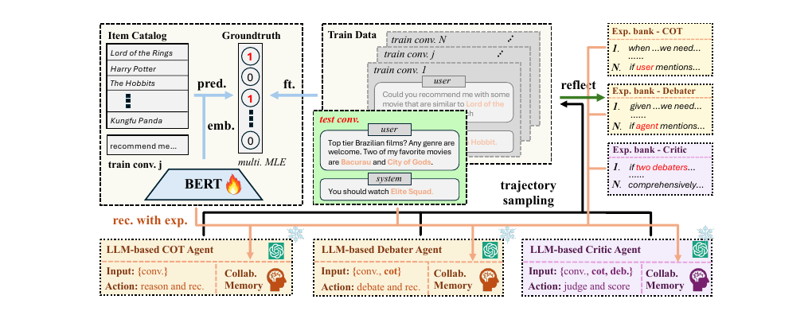

# Recommend-EMNLP-2025-LLM-based Conversational Recommendation Agents with Collaborative Verbalized Experience
> 说明：本文档内容默认使用中文生成（论文标题与必要专有名词除外）。

*论文下载地址：未提及*

*代码是否开源：是 https://github.com/yaochenzhu/CRAVE*

*分享人：马明晖*

## 一句话总结内容
> CRAVE通过构建可检索的口头经验库并结合辩论者-评论家代理系统，有效增强了基于大语言模型的对话推荐个性化能力。

## 一句话总结创新贡献
> 首创将协作式口头经验与辩论机制融合，突破了隐性偏好捕捉难及单一模型思维收敛的瓶颈。

## 举一个例子说明这篇文章的创新点
> 提出基于项目内容参数化的多项似然函数微调协同检索网络，在语义相似性之外精准捕捉用户隐式偏好。

## 框架图

**框架工作流描述**：
> 系统先对历史对话采样反思生成口头经验存入记忆库，再利用微调检索网络匹配新查询，最终经多智能体开放辩论输出推荐列表。

## 本文挑战及已有工作不足
> 1. 现有方法难以有效利用历史对话中的隐含偏好知识
> 2. 直接检索对话反馈存在显著的语义鸿沟
> 3. 全局规则无法适配不同用户的个性化查询
> 4. 单一链式思考导致思维收敛且缺乏多样性

## 印象最深刻的点
> 1. DCA系统通过开放辩论显著提升了推荐的覆盖率与准确性
> 2. 零样本设置下性能全面超越现有基线模型
> 3. 验证了口头强化学习思想在单次尝试场景下的有效性
> 4. 协同检索网络成功融合了用户偏好相似度与项目内容信息

## 对我们的启发
> 1. 口头强化学习中的自我反思机制
> 2. 多智能体辩论促进发散性思维
> 3. 利用历史交互数据构建动态记忆库

## Idea是否好想
> 核心创新在于将‘经验’从静态检索升级为经过反思总结的‘口头经验’，并通过专用网络确保其基于用户偏好；同时引入辩论机制打破单一模型局限，模拟人类多角度决策过程。

## 是否有开创性
> 区别于传统RAG或全局规则，该方法专为对话推荐系统的模糊性与个性化特性优化，实现了协作式口头经验库与辩论架构的深度结合。

## 是否属于热点
> LLM Agent, Conversational Recommender Systems, Verbal Reinforcement Learning, Multi-Agent Debate

## 其他需要补充的点（可选）
> 1. 证明系统在提升准确率的同时显著增加了推荐多样性
> 2. 以GPT-4o为基础模型并引入内容多样性分析
> 3. 在Redial和Reddit-v2真实数据集上验证效果

## 与其他论文的关联（可选）
> 1. MemoCRS (Xi et al., 2024) - 对比了全局规则与个性化经验库差异
> 2. Zero-shot LLM (He et al., 2023) - 作为最强基线进行对比
> 3. Reflexion (Shinn et al., 2024) - 借鉴自我反思机制并适配CRS场景

## 还有哪些不足的地方（未来工作）
> 1. 研究复杂辩论轮次与多辩手配置下的性能优化
> 2. 探索CRAVE在小型预训练语言模型上的迁移应用
> 3. 进一步缓解训练数据与检索网络可能继承的社会偏见
