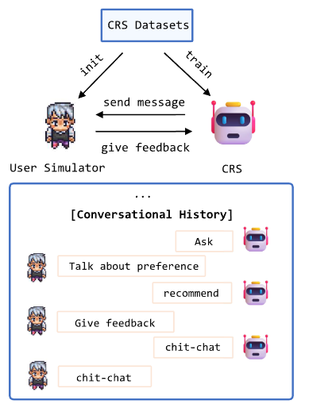

# Recommend-WWW-2024-How Reliable is Your Simulator- Analysis on the Limitations of Current LLM-based User Simulators for Conversational Recommendation
> 说明：本文档内容默认使用中文生成（论文标题与必要专有名词除外）。

*论文下载地址：https://doi.org/10.1145/3589335.3651955*

*代码是否开源：是 https://github.com/RUCAIBox/iEvaLM-CRS/*

*分享人：马明晖*

## 一句话总结内容
> 本文揭示了现有LLM用户模拟器存在数据泄露及控制困难等局限，并提出SimpleUserSim策略以提升评估可靠性。

## 一句话总结创新贡献
> 提出区分交互意图的多提示词控制框架SimpleUserSim，有效缓解数据泄露并提升对话推荐系统评估的准确性。

## 举一个例子说明这篇文章的创新点
> SimpleUserSim在推荐成功前仅暴露物品属性而非标题，并依据闲聊、询问或推荐等不同意图动态调整提示策略。

## 框架图

**框架工作流描述**：
> 基于历史对话与CRS构建多轮交互流程，先验证iEvaLM的数据泄露问题，再引入SimpleUserSim进行对比评估。

## 本文挑战及已有工作不足
> 1. 单一提示词模板难以精准控制复杂场景下的输出行为
> 2. 现有LLM模拟器存在严重数据泄露，导致评估指标虚高
> 3. 系统表现过度依赖对话历史质量，而非模拟器的真实反馈

## 印象最深刻的点
> 1. 量化证实了数据泄露对评估指标的显著负面影响
> 2. 发现ChatGPT在利用上下文信息进行推荐时优于其他基线
> 3. SimpleUserSim大幅降低了由模拟器自身引发的数据泄露比例

## 对我们的启发
> 1. 应针对不同对话意图设计差异化的提示生成策略
> 2. 评估机制必须严格隔离历史数据与回复中的信息泄露
> 3. 构建真实用户模拟器需模拟人类认知过程，避免直接暴露答案

## Idea是否好想
> 文章批判性分析了LLM用户模拟器的可靠性缺陷，通过改进提示工程（SimpleUserSim）解决评估偏差，为CRS建立更可靠的基准。

## 是否有开创性
> 首次系统剖析LLM驱动的用户模拟器失效模式，并提出基于意图感知的多提示词模拟新框架。

## 是否属于热点
> 大语言模型在推荐系统中的应用、对话推荐系统评估、用户模拟器构建

## 其他需要补充的点（可选）
> 1. 实验采用ReDial和OpenDialKG两个经典数据集
> 2. 对比基线涵盖KBRD、BARCOR、UniCRS及ChatGPT

## 与其他论文的关联（可选）
> 1. ChatGPT：作为强性能对比基线
> 2. iEvaLM：本文分析改进的基础工作
> 3. KBRD/BARCOR/UniCRS：用于评估模拟器性能的CRS基线模型

## 还有哪些不足的地方（未来工作）
> 1. 研究跨场景下对话推荐系统性能的全面评估方法
> 2. 优化模拟器对复杂交互场景的动态适应能力
> 3. 探索构建更具真实性与可信度的LLM用户模拟器
