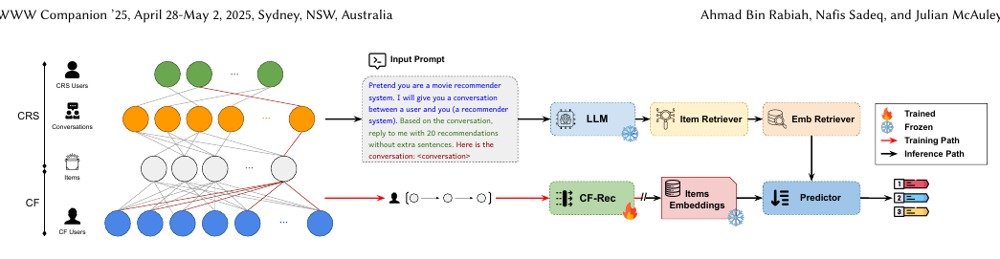

# Recommend-WWW-2025-Bridging Conversational and Collaborative Signals for Conversational Recommendation
> 说明：本文档内容默认使用中文生成（论文标题与必要专有名词除外）。

*论文下载地址：https://doi.org/10.1145/3701716.3715486*

*代码是否开源：未提及*

*分享人：马明晖*

## 一句话总结内容
> 该论文提出BridgeCRS框架与Reddit-ML32M数据集，通过结构化ID对齐对话与协同过滤数据，有效缓解对话推荐中的稀疏性难题。

## 一句话总结创新贡献
> 构建超3000万交互的新数据集并设计非微调混合框架，显著提升了推荐系统的准确率与覆盖率。

## 举一个例子说明这篇文章的创新点
> 利用IMDb ID跨域对齐稀疏对话与密集CF数据，并采用预训练SASRec模型对LLM生成的初始列表进行重排校准。

## 框架图

**框架工作流描述**：
> 零样本生成初始推荐后映射至物品ID，再利用SASRec计算相似度矩阵并通过最大池化聚合分数完成最终重排序。

## 本文挑战及已有工作不足
> 1. 传统融合方法未能充分挖掘对话上下文的语义价值
> 2. 对话数据交互稀疏阻碍了鲁棒项目表示的构建
> 3. 现有系统缺乏协同信号导致难以捕捉用户 - 物品深层交互模式

## 印象最深刻的点
> 1. 将交互数量从5万级扩充至3000万级，密度提升逾50倍
> 2. 无需微调大模型即可结合其语义能力与外部协同信号
> 3. Hit Rate与NDCG分别超越最佳基线12.32%和9.91%

## 对我们的启发
> 1. 大语言模型的语义理解与传统协同过滤的统计规律可形成互补
> 2. 利用结构化标识符（如IMDb ID）实现跨域数据对齐具有普适性

## Idea是否好想
> 核心在于解决‘有语境无交互’困境：以LLM为生成器，利用SASRec的密集嵌入空间校准输出，兼顾对话灵活性与推荐准确性。

## 是否有开创性
> 首创连接对话与大规模CF数据的Reddit-ML32M数据集，并提出非微调、基于嵌入重排的混合推荐范式。

## 是否属于热点
> 大模型推荐应用、对话式推荐系统、LLM与协同过滤融合

## 其他需要补充的点（可选）
> 1. 全面对比了纯CF、传统CRS及无CF信号的LLM基线表现
> 2. 验证了该方法在电商（ASIN）与图书（ISBN）领域的泛化潜力

## 与其他论文的关联（可选）
> 1. UniCRS: 基于提示调优的传统CRS方法
> 2. ReDIAL: 传统对话推荐基准
> 3. CoLLM: 将CF嵌入映射至Token空间的尝试

## 还有哪些不足的地方（未来工作）
> 1. 进一步优化稀疏交互条件下的冷启动问题
> 2. 将该对齐策略扩展至更多具备结构化标识符的垂直领域
> 3. 探索更复杂的动态对话场景下的推荐适应性
