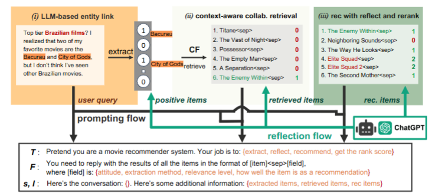

# 对话推荐系统-WWW-2025-Collaborative Retrieval for Large Language Model-based Conversational Recommender Systems
*论文下载地址（可选）：https://dl.acm.org/doi/10.1145/3696410.3714908*

*代码是否开源：是 https://github.com/yaochenzhu/CRAG*

*分享人：马明晖*

## 一句话总结内容
> 提出CRAG框架，将协同过滤与黑盒大模型结合，通过协同检索增强生成的方式解决对话推荐系统中LLM无法利用用户行为数据的问题。

## 一句话总结创新贡献
> 首次将协同检索与上下文感知反思、重排结合，实现黑盒LLM对话推荐系统有效融合协同过滤信息，显著提升新物品推荐效果与整体性能。

## 框架图
`

> **框架工作流描述**：1. LLM实体链接：从对话中抽取物品并做态度分析，通过字符+词级双层匹配+LLM反思完成标准化映射；2. 上下文感知协同检索：基于对话正向提及物品做协同召回，再用LLM过滤上下文无关项；3. 反思重排推荐：将协同信息注入prompt生成候选，再通过LLM打分重排，消除LLM对检索项的偏置，输出最终推荐。

## 本文挑战及已有工作不足
1. 现有LLM对话推荐难以利用协同过滤行为数据，黑盒模型无法微调注入CF知识。
2. 传统RAG引入内容知识易带来噪声，无法精准匹配对话意图。
3. 物品抽取存在缩写、错别字、歧义，导致实体链接噪声大。
4. LLM对新上映物品推荐能力弱，泛化性不足。
5. 直接检索增强会让LLM优先复制检索结果，破坏合理排序。

## 印象最深刻的点
用**两次LLM反思**解决协同检索与上下文不匹配、LLM偏置重排两大核心问题，不微调黑盒模型就能把协同过滤能力注入对话推荐。

## 对我们的启发
1. 黑盒LLM+外部检索+反思机制是低成本增强推荐能力的有效路径。
2. 协同过滤不一定要进模型，可通过检索+prompt注入发挥作用。
3. 物品抽取与链接质量直接决定对话推荐效果。
4. 新物品推荐短板可通过协同检索显著弥补。

## Idea是否好想
Idea非常直观且工程友好：**LLM对话理解 + 协同检索 + 双阶段反思纠错**，模块解耦、可插拔、易复现，符合当前RAG+LLM主流范式。

## 是否有开创性
是开创性工作：**首次在黑盒LLM对话推荐系统中正式融合协同过滤**，并建立完整的检索-反思-重排 pipeline，为LLM+CF提供新范式。

## 是否属于热点
属于顶级热点：对话推荐系统、LLM+推荐、RAG增强生成、协同过滤、冷启动/新物品推荐均是WWW/RecSys/KDD主流方向。

## 其他需要补充的点（可选）
1. 构建并开源更干净的Reddit-v2电影对话推荐数据集，物品抽取精度大幅提升。
2. 适配黑盒LLM（GPT-4/GPT-4o），无需权重访问，落地性强。
3. 核心改进集中在新上映电影，对冷启动场景增益最明显。
4. 采用EASE做协同检索模型，简单高效。

## 与其他论文的关联（可选）
1. 基于零样本LLM对话推荐（He et al., CIKM 2023）扩展，弥补其无CF的缺陷。
2. 延续RAG思想，但区别于传统内容检索，使用协同检索。
3. 对比Redial、KBRD、KGSF、UniCRS等传统CRS模型。
4. 与CoRAL、LLMRec等同为LLM+CF，但聚焦对话场景与黑盒模型。

## 还有哪些不足的地方（未来工作）
1. 仅验证电影领域，未在电商、音乐等多领域泛化验证。
2. 只利用正向交互，未有效利用负反馈与用户隐式偏好。
3. 反思机制依赖LLM指令遵循能力，在弱模型上效果会下降。
4. 未建模多轮对话的长期意图与动态偏好迁移。
5. 检索数量K人工设定，缺乏自适应策略。
6. 未考虑用户隐私问题，协同数据直接使用存在合规风险。