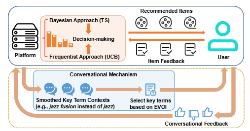

# Recommend-WWW-2025-Towards Efficient Conversational Recommendations- Expected Value of Information Meets Bandit Learning
> 说明：本文档内容默认使用中文生成（论文标题与必要专有名词除外）。

*论文下载地址：https://doi.org/10.1145/3696410.3714773*

*代码是否开源：未提及*

*分享人：马明晖*

## 一句话总结内容
> 本文将期望信息价值（EVOI）与会话式多臂老虎机结合，提出更高效的对话式推荐方法，以更少交互获得更好的推荐效果并给出更强的遗憾界。

## 一句话总结创新贡献
> 本文提出梯度化EVOI和平滑关键词上下文两项机制，并据此设计ConTS-EVOI与ConUCB-EVOI，在理论上显著改进了遗憾界。

## 举一个例子说明这篇文章的创新点
> 例如，在询问“jazz”时，不再使用静态关键词，而是对其随机扰动得到“smooth jazz”“jazz fusion”等更细粒度上下文，用于更高效地探索用户偏好。

## 框架图

**框架工作流描述**：
> 系统在每轮先根据会话频率决定是否发起对话；若发起对话，则生成平滑后的关键词上下文，使用梯度化EVOI选择最优关键词提问并更新用户偏好估计；随后在推荐阶段分别用Thompson Sampling或LinUCB选择物品，并结合反馈迭代更新参数。

## 本文挑战及已有工作不足
> 1. 现有会话式bandit的查询策略对遗憾改善有限，难以明显优于非会话方法
> 2. EVOI原本偏向单步贪心，缺少长期性能的理论保证
> 3. 传统EVOI依赖复杂的贝叶斯后验更新，计算代价高，难以扩展到高维场景

## 印象最深刻的点
> 1. 在合成数据和真实数据上均验证了方法有效性
> 2. ConTS-EVOI和ConUCB-EVOI相较已有方法获得了√d级改进
> 3. 给出了将EVOI融入bandit学习后的理论遗憾分析

## 对我们的启发
> 1. 受到EVOI在偏好引导查询中的思想启发
> 2. 借鉴了随机梯度下降的增量更新思想来替代贝叶斯后验计算
> 3. 受到smoothed analysis与带扰动探索思想启发

## Idea是否好想
> 本文的核心思路是把“高价值提问”的EVOI准则与“有理论保证的长期学习”bandit框架统一起来。其创新点不只是把两者简单拼接，而是通过梯度化近似将EVOI改写为可高效计算、可分析的更新形式，并通过对关键词上下文加入随机平滑扰动来增强探索，从而让查询选择真正服务于遗憾最小化。整体上，这是一种兼顾实践效率与理论可证性的推荐交互设计。

## 是否有开创性
> 相较于传统EVOI，本文用梯度更新替代贝叶斯后验推断；相较于已有会话式bandit，本文引入平滑关键词上下文并显著改善理论遗憾界，体现了查询策略与在线学习理论的结合式创新。

## 是否属于热点
> 会话式推荐、偏好引导、期望信息价值、在线学习、上下文多臂老虎机、遗憾界分析

## 其他需要补充的点（可选）
> 1. 该方法同时适用于Bayesian和frequentist两类会话bandit
> 2. 文章强调对话频率函数b(t)会影响整体性能

## 与其他论文的关联（可选）
> 1. 与经典EVOI偏好引导查询研究相关
> 2. 与LinTS、LinUCB等非会话bandit基线相关
> 3. 与ConTS、ConUCB、ConLinUCB等会话式bandit工作相关

## 还有哪些不足的地方（未来工作）
> 1. 未提及
