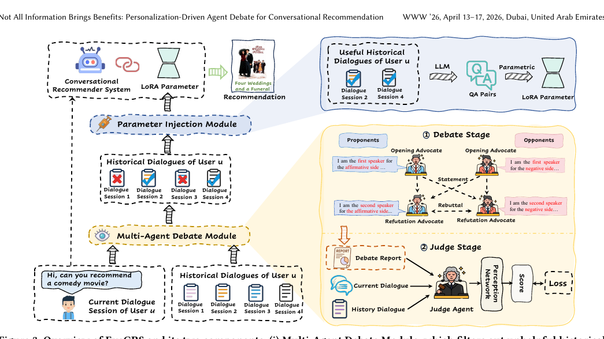

# Recommend-WWW-2026-Not All Information Brings Benefits- Personalization-Driven Agent Debate for Conversational Recommendation
> 说明：本文档内容默认使用中文生成（论文标题与必要专有名词除外）。

*论文下载地址：https://doi.org/10.1145/3774904.3792152*

*代码是否开源：未提及*

*分享人：马明晖*

## 一句话总结内容
> 本文提出EyeCRS，通过多智能体辩论筛除可能引发认知负迁移的历史对话，并将有益历史信息参数化注入推荐模型，以提升对话推荐性能。

## 一句话总结创新贡献
> 本文首次系统指出对话推荐中的认知负迁移问题，并提出“辩论筛选 + 参数注入”的个性化框架来缓解该问题。

## 举一个例子说明这篇文章的创新点
> 面对“推荐一部喜剧电影”的当前对话，模型不再直接使用全部历史对话，而是先由支持者、反对者和裁判代理判断某条历史会话是否有助于当前意图，再仅将被判定为有益的历史会话转为QA对并通过LoRA注入推荐器。

## 框架图

**框架工作流描述**：
> 首先对每条历史对话与当前对话进行多智能体辩论，判断其是否有助于推荐或造成认知干扰；随后由判别器筛选出有益历史会话；接着将这些会话自动生成QA对并用于训练用户级LoRA适配器；最后在推荐阶段激活对应用户适配器完成个性化推荐，并结合筛选出的历史会话生成回复。

## 本文挑战及已有工作不足
> 1. 现有方法往往直接利用全部历史信息，容易引发认知负迁移
> 2. 历史对话缺少认知影响标注，需要依赖弱监督训练筛选器
> 3. 如何将被判定为有益的历史对话有效转化为可内化的用户知识
> 4. 如何区分历史会话中真正有用的个性化信息与会干扰当前意图的噪声

## 印象最深刻的点
> 1. 提出了对话推荐中的认知负迁移概念，并通过实验验证其普遍存在
> 2. 将多智能体辩论机制引入对话推荐，用对抗性视角评估历史会话价值
> 3. 结合弱监督判别与历史筛选，避免盲目使用全部个性化信息
> 4. 通过QA生成与LoRA适配将个性化知识注入参数空间，增强模型对用户偏好的内化能力

## 对我们的启发
> 1. 结合多智能体辩论与参数高效微调思路，把筛选机制和知识注入机制统一起来
> 2. 受行为决策理论启发，强调历史知识是否适用于当前情境需要先判断
> 3. 借鉴“真理在辩论中更清晰”的思想，用支持者与反对者代理评估信息价值

## Idea是否好想
> 本文的核心不是简单增加历史信息，而是先做“信息筛选”再做“知识注入”。其关键贡献在于把个性化历史对话视为可能同时包含正负作用的信号源，并通过辩论式判断机制识别有效信息，再用参数化方式沉淀为用户特定知识。这样既减少历史对话噪声对当前意图的干扰，也保留长期偏好对推荐的增益，形成面向个性化推荐的选择性记忆与注入框架。

## 是否有开创性
> 新颖点主要体现在：1）提出认知负迁移在对话推荐中的系统性问题；2）用多智能体辩论而非传统检索或注意力机制来判断历史会话价值；3）把筛选出的历史会话转成QA监督，并用LoRA注入模型参数实现个性化内化。

## 是否属于热点
> 大语言模型推荐、多智能体辩论、个性化推荐、对话推荐、参数高效微调、历史记忆筛选

## 其他需要补充的点（可选）
> 1. 实验使用TGReDial和ReDial两个真实数据集
> 2. 论文发表于WWW 2026，面向电影推荐场景的对话推荐任务
> 3. 推荐任务指标包括HR@K、NDCG@K、MRR@K，回复生成还结合GPT-4与人工评测

## 与其他论文的关联（可选）
> 1. 与MemoCRS相关：都涉及记忆增强和历史对话利用，但本文引入辩论筛选机制以缓解负迁移
> 2. 与UCCR相关：都利用个性化历史对话，但本文强调筛除无效历史而非直接使用

## 还有哪些不足的地方（未来工作）
> 1. 未提及
