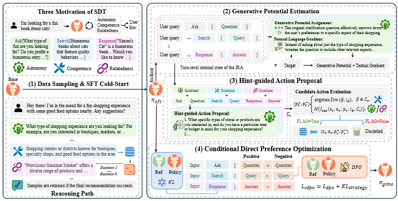

# Recommend-WWW-2026-Optimizing Multi-Turn Interactive Recommendation Agents via Generative Intrinsic Motivation
> 说明：本文档内容默认使用中文生成（论文标题与必要专有名词除外）。

*论文下载地址：https://doi.org/10.1145/3774904.3792209*

*代码是否开源：是 https://github.com/XueyangFeng/GIMO*

*分享人：马明晖*

## 一句话总结内容
> 本文提出GIMO，一种面向多轮交互推荐智能体的生成式内在动机优化框架，旨在稀疏反馈环境中同时缓解信用分配、探索效率和多技能协同学习问题。

## 一句话总结创新贡献
> 本文从内在动机视角重构交互推荐智能体训练流程，并通过生成式潜势估计、提示引导动作提议和条件DPO实现更稳定高效的多轮优化。

## 举一个例子说明这篇文章的创新点
> GIMO不直接依赖终局奖励，而是用LLM评估相邻状态之间的潜势差，生成“自然语言梯度”和改进建议，再据此构造正负偏好样本训练策略。

## 框架图

**框架工作流描述**：
> 先用专家模型采样并进行SFT冷启动；再通过生成式潜势估计将多轮对话的终局反馈拆解为轮级内在奖励和改进提示；随后利用提示引导动作提议生成候选动作并筛选偏好样本；最后在条件KL约束下进行DPO式偏好优化，以保持全局策略结构并提升局部交互能力。

## 本文挑战及已有工作不足
> 1. 多种交互技能联合训练时容易出现策略塌缩或全局结构漂移
> 2. 多轮交互中的稀疏奖励导致信用分配困难
> 3. 自然语言动作空间大，探索效率低且样本利用率差

## 印象最深刻的点
> 1. 在三个交互推荐环境中取得稳定提升，并给出策略一致性的理论保证
> 2. 通过条件KL正则约束动作选择阶段，兼顾全局策略一致性与局部优化
> 3. 提出生成式潜势函数，可用LLM直接生成轮级奖励与改进建议，增强可解释性
> 4. 将自我决定理论中的自主性、胜任感和关系性映射到推荐智能体能力结构中，建模较为清晰

## 对我们的启发
> 1. 可借鉴分阶段训练与显式一致性约束结合的方式，缓解多技能联合训练的不稳定问题
> 2. 可借鉴内在动机驱动的奖励塑形思想，用于其他稀疏反馈的多轮决策任务
> 3. 可借鉴把“文本梯度”作为探索引导信号的做法，减少大动作空间中的盲目搜索

## Idea是否好想
> 文章将交互推荐中的学习过程重述为内在动机的持续满足：先用生成式潜势估计把难以分解的终局信号转化为轮级可学习信号，再将这些信号用于候选动作生成与偏好构造，形成“奖励分解—引导探索—偏好优化”的闭环。相比只做终局监督或普通偏好优化的方法，该框架更适合多轮、稀疏反馈且自然语言动作空间较大的场景；同时通过条件KL保留专家级全局策略，降低多技能训练中的结构退化风险。整体上，方法将心理学动机理论、LLM生成能力与偏好优化机制结合，形成较完整的训练范式。

## 是否有开创性
> 较高：不仅提出新的优化框架，还把内在动机、自然语言潜势估计、提示驱动探索和条件DPO整合为统一方法，并提供理论证明。

## 是否属于热点
> 多轮交互推荐、LLM智能体、内在动机、偏好优化、稀疏奖励、提示引导探索

## 其他需要补充的点（可选）
> 1. 实验环境基于Amazon-Book、Amazon-Game和Yelp构建的交互推荐模拟器
> 2. 指标包括SR、RR和UR，兼顾推荐成功率、召回率和用户满意度
> 3. 作者匿名公开了代码仓库

## 与其他论文的关联（可选）
> 1. 与SPO/KTO相比，GIMO补足了信用分配和探索机制不足的问题
> 2. 与ECPO相比，GIMO更强调全局策略一致性而不仅是用户满意度
> 3. 与SFT相比，GIMO利用环境反馈实现更细粒度的改进

## 还有哪些不足的地方（未来工作）
> 1. 可进一步验证该框架在更大规模真实在线推荐系统中的泛化能力
> 2. 可研究在更低成本的模型或更少人工提示下保持偏好优化效果的方法
> 3. 可探索将生成式潜势估计推广到更复杂的多目标交互任务中
