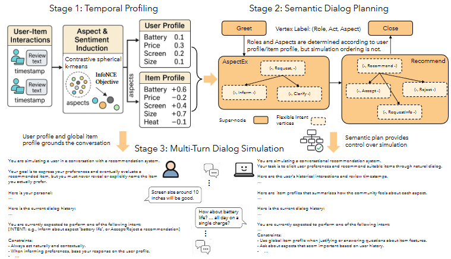

# Recommend-arXiv-2025-A Framework for Generating Conversational Recommendation Datasets from Behavioral Interactions
> 说明：本文档内容默认使用中文生成（论文标题与必要专有名词除外）。

*论文下载地址：https://arxiv.org/abs/2506.17285*

*代码是否开源：是*

*分享人：马明晖*

## 一句话总结内容
> 提出ConvRecStudio框架，利用大模型从用户行为交互中自动生成真实多轮对话推荐数据集，并构建融合协同信号与对话上下文的交叉注意力Transformer模型。

## 一句话总结创新贡献
> 提出三阶段合成框架生成基于时间戳交互与评论的真实数据，构建包含历史交互的新基准，并开发显著优于单模态基线的融合模型。

## 举一个例子说明这篇文章的创新点
> ['时序画像：构建带时间衰减的用户画像与全局物品情感轨迹。', '语义规划：基于DAG生成涵盖问候、询问及推荐的灵活对话计划。', '多轮模拟：利用双LLM代理在严格约束下生成自然且符合事实的对话。']

## 框架图

**框架工作流描述**：
> 首先通过无监督方法诱导细粒度方面并计算带时间衰减的画像；其次基于画像与采样策略生成有向无环图（DAG）对话计划；最后使用双专用LLM代理在遵循计划前提下进行多轮模拟与一致性检查。

## 本文挑战及已有工作不足
> 1. 现有系统常因缺失协同过滤信号导致泛化或个性化不足
> 2. 传统系统难以交互式即时挖掘用户需求
> 3. 缺乏基于真实行为的大规模对话推荐数据集
> 4. 直接调用大模型易产生幻觉并偏离实际用户行为

## 印象最深刻的点
> 1. 能同时融合长期行为模式与动态偏好引导进行精准推荐
> 2. 生成的数据集在自然性、连贯性及行为接地性上获人工与自动评估验证
> 3. 在MobileRec、Yelp及Amazon Electronics多领域均表现鲁棒
> 4. 跨注意力Transformer模型在Yelp数据集Hit@1指标上超越最强基线10.9%

## 对我们的启发
> 1. 利用大模型生成能力解决对话推荐中的数据稀缺瓶颈
> 2. 结合协同过滤长周期建模与对话系统短周期上下文理解
> 3. 通过结构化DAG规划约束生成过程以保障逻辑一致性与真实性

## Idea是否好想
> 核心创新在于将冷启动数据生成转化为受控模拟过程，引入时序感知画像作为条件确保内容相关性与时间演化一致性；利用DAG结构平衡高层意图控制与底层语言多样性，有效兼顾真实感与生成丰富度。

## 是否有开创性
> 首次提出从纯行为交互数据端到端自动生成大规模、多轮、接地气的对话推荐数据集框架，填补了现有数据集无法同时提供历史交互与对话上下文的空白。

## 是否属于热点
> Conversational Recommendation Systems, Dataset Generation, Large Language Models, Collaborative Filtering Fusion

## 其他需要补充的点（可选）
> 1. 应用对比球形k-means聚类自动诱导细粒度方面
> 2. 采用GPT-4o作为对话生成基础模型
> 3. 引入InfoNCE目标函数优化方面聚类的语义一致性

## 与其他论文的关联（可选）
> 1. ReDial: 早期人机对话电影推荐数据集
> 2. DuRecDial: 中文多领域对话推荐数据集
> 3. TG-ReDial: 引入主题驱动的半自动生成对话

## 还有哪些不足的地方（未来工作）
> 1. 扩展框架以支持更多样化领域及复杂交互场景
> 2. 优化对话生成过程的实时性与计算效率
> 3. 探索利用生成数据训练更具适应性的多模态推荐模型
> 4. 研究如何在生成中更精准捕捉用户情感变化与潜在需求
