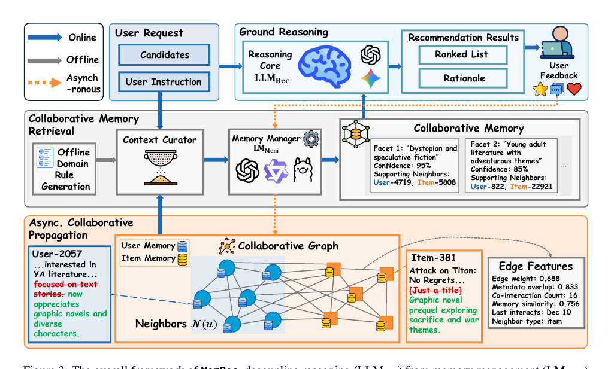

# Recommend-arXiv-2026-MemRec- Collaborative Memory-Augmented Agentic Recommender System
*论文下载地址：https://arxiv.org/abs/2601.08816*

*代码是否开源：是 https://github.com/rutgerswiselab/memrec*

*分享人：自动生成*

## 一句话总结内容
> 本文提出 MemRec，一个在统一用户–物品协作记忆图上由记忆管理 LLM 与推理 LLM 协同工作的代理式推荐框架，在降低上下文成本与认知负担的同时显著提升推荐效果。

## 一句话总结创新贡献
> 本文将推荐推理与记忆管理架构解耦，提出 LLM 驱动的协作记忆检索与异步协作传播机制，将高阶协同信号转化为可被 LLM 高效利用的语义记忆，并在四个公开基准上取得 SOTA 表现。

## 举一个例子说明这篇文章的创新点
> 一个关键创新是“LLM-as-Rule-Generator”的协作记忆检索机制：在离线阶段，记忆管理器 LMMem 读取交互密度、类别分布等领域统计，通过元提示 Pmeta 零样本生成一组可解释的领域图裁剪规则 Rdomain；在线阶段，这些规则作为轻量级过滤器，在统一协同图中从目标用户的邻居集合 N(u) 中毫秒级筛选出前 k 个高潜在互信息邻居 N′k(u)，随后 LMMem 在受限的上下文窗口内，将这些邻居的压缩表示与用户自身完整历史记忆联合建模，综合生成由若干偏好 facet 组成的协作记忆 Mcollab，从而在无需将大尺度图结构以原始文本灌入 LLM 的前提下，将关键高阶协同模式浓缩为紧凑且可直接被推理 LLM 利用的语义记忆。

## 框架图

**框架工作流描述**：
> MemRec 的整体流程分为三个阶段：离线阶段中，记忆管理器 LMMem 基于数据集的交互稀疏度、类别分布等统计特征，在元提示 Pmeta 引导下零样本生成针对不同领域的图裁剪规则 Rdomain；在线推理的第一阶段 “Collaborative Memory Retrieval” 利用 Rdomain 在统一用户–物品图 G 上对目标用户的邻居进行快速筛选，得到候选邻居集合 N′k(u)，再采用分层表征策略（目标用户保留完整语义记忆、邻居节点采用压缩表示），由 LMMem 在提示 Psynth 下综合生成结构化的协作记忆 Mcollab，其中包含若干带置信度及支持邻居集合的偏好 facet；第二阶段 “Grounded Reasoning” 中，推理 LLM LLMRec 接收用户自然语言指令 Iu、协作记忆 Mcollab 以及候选物品的语义信息 Cinfo，在提示 Prerank 的控制下为每个候选输出相关性得分 si 和自然语言解释 ri，形成排序列表；第三阶段 “Asynchronous Collaborative Propagation” 以异步方式在后台运行，当用户与物品 ic 产生新交互时，LMMem 结合当前 Mcollab 与原有记忆，一次性生成用户 Mt_u、物品 Mt_ic 的更新以及邻居记忆增量 {ΔMneigh}，通过统一的 Pupdate 将自反思和协作传播打包为单次 LLM 调用，使协作记忆图的演化在保持高质量更新的同时具有 O(1) 交互复杂度，并且不会阻塞前台推荐对话。

## 本文挑战及已有工作不足
> 1. 如何设计同时适配云端 API 与本地开源模型的系统架构，使推荐效果、推理延迟、算力成本与隐私约束之间形成可调节且易部署的折中
> 2. 在协作记忆检索阶段，如何在相关性、多样性与上下文长度约束之间取得稳健平衡，既避免过度裁剪导致关键信号丢失，又防止冗余噪声诱发 LLM 幻觉与指令偏离
> 3. 如何在不造成严重认知过载和上下文爆炸的前提下，将大规模用户–物品协同图中的高阶协同信号压缩为对推荐推理真正有用、且适配 LLM 上下文窗口的语义记忆表示
> 4. 在用户与物品持续产生新交互的动态场景中，如何以可接受的计算成本对协作记忆图进行及时而精确的更新，将交互复杂度控制在近似 O(1) 的同时抑制记忆陈旧和噪声累积

## 印象最深刻的点
> 1. 设计异步协作传播机制，将用户与物品的自反思更新和邻居协作更新合并为一次批量 LLM 调用，将交互更新复杂度从 O(|N′k|) 降至 O(1)，显著降低了大规模在线推荐场景的运行成本
> 2. 在 Amazon Books、Goodreads、MovieTV 和 Yelp 四个基准数据集上，MemRec 相比最强动态 Agent 基线 i2Agent 在 H@1 和 NDCG 等指标上取得统计显著提升，并通过成本–性能–延迟及解释质量等多维度分析展示出更优的综合工程价值
> 3. 提出零样本的 “LLM-as-Rule-Generator” 方案，直接利用大模型结合领域统计自动生成可解释、可执行的图裁剪规则 Rdomain，避免了额外训练 GNN 或复杂打分器
> 4. 在架构层面将推荐推理 LLM（LLMRec）与记忆管理 LLM（LMMem）彻底解耦，通过统一的语义协作记忆图连接用户与物品，从根本上缓解了单一 LLM 既要吸收海量上下文又要承担复杂推理的“信息瓶颈”

## 对我们的启发
> 1. 基于信息瓶颈视角设计“先裁剪再综合”的协作记忆检索流程，对长上下文 RAG、图 RAG 以及多文档决策任务中的上下文构建策略具有直接启发意义
> 2. 将协作信息视作图上的语义标签，并通过异步传播维护邻居记忆，提供了一种刻画群体偏好与社区趋势的通用范式，具有向社交推荐、知识社区与长期用户建模等场景迁移的潜力
> 3. 零样本利用 LLM 自动生成领域启发式规则，为传统基于规则的推荐或检索系统提供了一条低成本升级路径，即由 LLM 负责规则设计、调参和解释，而非完全依赖黑盒神经打分器
> 4. 在构建复杂 LLM 驱动系统时，可借鉴 MemRec 将“记忆管理 / 知识整理”与“任务级推理”分配给不同专用代理或模块的做法，从系统工程角度主动降低单一组件的认知负载

## Idea是否好想
> 该工作的核心思想是把传统协同过滤中的高阶图结构信号与 LLM Agent 时代的语义记忆统一起来：在用户和物品节点上维护可演化的语义记忆，通过交互边构成协作记忆图，再由专门的记忆管理 LLM 负责图上的信息筛选、综合与传播，从而为推荐推理 LLM 提供简洁而高信息量的上下文。与以往只围绕单个用户历史做自反思的动态记忆 Agent 不同，MemRec 通过协作记忆检索显式引入社区邻居的经验增强用户偏好建模，同时采用“先裁剪、后综合”的信息瓶颈式流程，避免直接把完整邻域喂给 LLM 带来的上下文爆炸和认知过载；异步协作传播则在后台持续更新用户、物品及邻居的语义记忆，使系统在维持近似 O(1) 推理开销的前提下仍能捕捉偏好和趋势的动态变化。整体来看，该设计在理论上兼顾了协同信号利用率与计算效率，在实证上也通过 SOTA 性能与细致消融得到支撑；其潜在不足在于对高质量基础 LLM 和精心提示工程的依赖较强，且当前传播主要局限于一跳邻居、裁剪规则偏静态，在极端动态或超大规模场景下仍需进一步演进。

## 是否有开创性
> 相较于 i2Agent、AgentCF、RecBot 等主要围绕单个用户或物品构建“孤立动态记忆”的 AgentRS，MemRec 的核心创新在于提出“动态协作记忆”这一新范式：在统一的用户–物品图上维护语义记忆节点，并通过 LLM 驱动的协作检索与异步传播显式建模高阶协同信号，使协作信息以可读的语义形式进入推荐推理流程。此外，利用 LLM 零样本生成图裁剪规则，用语义感知、可解释且无需训练的方案替代传统基于结构启发式或 GNN 打分的图采样，也具有明显新意；异步协作传播将自反思与邻居更新批处理为单轮调用，并从复杂度角度给出了 O(1) 交互开销的明确分析。结合对信息瓶颈与认知过载的系统讨论以及细粒度的成本–性能评估，该工作在理论观点和系统实现两方面都体现出超越“在推荐中简单套用 LLM”的实质性创新。

## 是否属于热点
> 本文位于大模型 Agent、推荐系统与图结构 RAG / 记忆系统的交叉地带，是当前“LLM+推荐”“记忆增强智能体”“图结构与长上下文推理”等热点方向的交汇点。一方面，MemRec 呼应了业界对 LLM 驱动个性化推荐与对话推荐的需求；另一方面，通过协作记忆图与异步传播实现的可扩展记忆机制，为构建长期交互 Agent 和基于知识图的 RAG 提供了一条可落地的技术路线。因此，该工作既契合学术界在 AgentRS 与记忆架构上的前沿研究，也为工业界开发低成本、高可解释性的推荐 Agent 提供了具有现实参考价值的设计范式。

## 其他需要补充的点（可选）
> 1. 实验选用 Amazon Books、Goodreads、MovieTV 和 Yelp 四个具有不同稀疏度与领域特征的数据集，并沿用 InstrucRec 提供的用户自然语言指令及数据划分，保证了与现有 Agent 推荐方法的可比性
> 2. 消融与超参数研究系统剔除协作读取、LLM 驱动邻居裁剪与协作写入等模块，并考察邻居数量 k 与偏好 facet 数量 Nf，结果表明协作记忆组件缺一不可且存在中等规模的“甜点区”
> 3. 基线覆盖 LightGCN、SASRec、P5 等传统协同过滤与序列模型，以及无显式记忆、静态记忆和动态记忆在内的多种 AgentRS 方法，展示了 MemRec 在多种范式下的整体优势

## 与其他论文的关联（可选）
> 1. 与 LightGCN、SASRec 等传统协同过滤方法及 P5、Vanilla LLM 推荐等早期“LLM 做推荐”工作不同，MemRec 将协作信号整理为 LLM 可读的语义 facet，在自然语言空间中完成推理与解释，并采用可模块化替换的记忆管理器与推理 LLM 架构
> 2. 与 i2Agent、AgentCF、RecBot 等动态记忆 Agent 相比，MemRec 不再只更新用户或物品的个人语义档案，而是在统一用户–物品图上显式构造协作记忆，并通过异步传播将新交互的语义信息扩散至邻居节点，从而更充分利用高阶协同信号
> 3. 在记忆架构与长程检索层面，MemRec 一方面继承了 MemGPT、Generative Agents 等“专门记忆管理器 + 任务 LLM”的高层思想，另一方面又类似 Graph RAG 通过图结构组织和检索信息，但其面向推荐任务引入了用户–物品协作图、LLM 驱动邻居裁剪与协作传播等专门设计，更强调在线动态更新与成本约束

## 还有哪些不足的地方（未来工作）
> 1. 在当前仅进行一跳邻居协作传播的基础上，研究多跳或社群级传播机制，引入更精细的邻居选择与衰减策略，在捕捉远程协同模式的同时抑制噪声累积
> 2. 将协作记忆图扩展到 Web 级规模，在千万级用户与物品上验证 MemRec 的可扩展性，并探索更高效的图索引、批处理与缓存策略
> 3. 将目前依赖离线领域统计生成的裁剪规则 Rdomain 升级为在线自适应版本，根据实时交互分布与性能反馈持续微调规则，以适应新闻等高度动态的推荐场景
> 4. 探索隐私保护与联邦学习场景下的协作记忆更新方式，例如仅在各方之间交换聚合后的语义增量或梯度，而非原始用户记忆内容，以满足更严格的数据合规与安全要求
