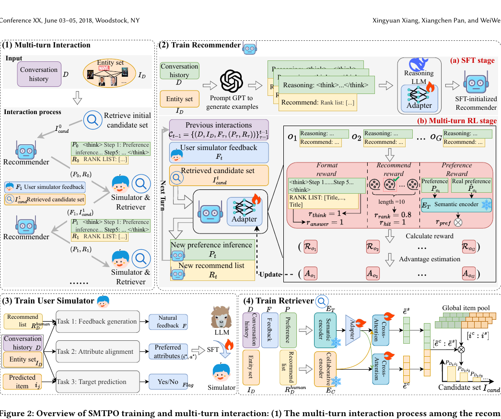

# Recommend-arxiv-2026-User Simulator-Guided Multi-Turn Preference Optimization for Reasoning LLM-based Conversational Recommendation
> 说明：本文档内容默认使用中文生成（论文标题与必要专有名词除外）。

*论文下载地址：未提及*

*代码是否开源：未提及*

*分享人：马明晖*

## 一句话总结内容
> 本文提出SMTPO框架，借助用户模拟器、检索器与推理型LLM推荐器的协同训练，在多轮对话推荐中持续优化偏好建模与排序效果。

## 一句话总结创新贡献
> 作者将推荐器的SFT与多轮RL联合引入LLM对话推荐，并通过多任务模拟器训练和双视图检索器缓解偏差反馈与候选集失控问题。

## 举一个例子说明这篇文章的创新点
> 例如在每轮对话中，用户模拟器先生成自然语言反馈，检索器再结合当前反馈与历史偏好从全局物品池中召回候选集，最后推理LLM推荐器按“偏好推断→属性匹配→打分→排序→解释”的链式过程重排Top-10列表。

## 框架图

**框架工作流描述**：
> 整体流程分为三部分：首先，用户模拟器通过多任务SFT学习生成高质量反馈，包括反馈生成、属性对齐和目标预测；其次，双视图检索器分别从语义与协同过滤角度编码对话和物品，并通过交叉注意力融合后召回候选集；最后，推理LLM推荐器先用SFT学习推理与推荐格式，再通过多轮RL和细粒度奖励逐轮对齐真实用户偏好并输出重排序结果。

## 本文挑战及已有工作不足
> 1. LLM推荐器可能生成超出全局物品空间的结果，需要候选集约束
> 2. 模拟器无法访问真实偏好标签，生成反馈可能偏离用户真实兴趣并造成误差累积
> 3. 单轮交互难以充分刻画复杂多样的用户偏好
> 4. 偏差或不完整的反馈会干扰多轮偏好优化，使推荐器难以稳定学习真实偏好

## 印象最深刻的点
> 1. 在ReDial和INSPIRED上取得了优于多种强基线的结果
> 2. 在推荐器端采用先SFT后多轮RL的两阶段训练，并结合细粒度奖励提升偏好对齐能力
> 3. 构建了同时包含用户模拟器、检索器和推理LLM推荐器的多轮交互式CRS框架SMTPO
> 4. 通过双视图检索器融合语义信息与协同过滤信息，增强候选召回稳定性

## 对我们的启发
> 1. 借鉴强化学习在策略优化中的有效性，将其用于多轮偏好优化
> 2. 受到LLM多步推理能力的启发，将推理LLM作为推荐器骨干
> 3. 参考LLM-based agents的闭环交互范式，将模拟器、检索器与推荐器联动起来

## Idea是否好想
> 这篇工作的核心思路是把对话推荐从“单轮预测”提升为“多轮偏好修正”。其关键不在于简单扩大模型规模，而在于用模拟器提供反馈、用检索器控制候选空间、用RL让推荐器在偏差反馈下逐步逼近真实偏好。方法设计较完整，尤其是奖励函数同时覆盖格式、命中与偏好理解，能较好约束LLM在推荐任务中的行为。不过整体效果仍依赖模拟器质量与构造数据的真实性，且训练链路较复杂。

## 是否有开创性
> 创新点主要体现在三方面：一是将推荐器的SFT和多轮RL联合用于LLM对话推荐；二是提出标签自由的用户模拟器，并用多任务SFT提升反馈质量；三是构建语义-协同双视图检索器，以稳定候选召回并抑制越界生成。

## 是否属于热点
> LLM驱动的对话推荐、用户模拟器、多轮偏好优化、强化学习、推理型推荐

## 其他需要补充的点（可选）
> 1. 实验使用了ReDial和INSPIRED两个公开CRS数据集
> 2. 推荐器输出采用Top-10排序列表，并要求显式推理链
> 3. 奖励设计包括format reward、recommend reward和preference reward

## 与其他论文的关联（可选）
> 1. 与强化学习用于LLM后训练和推理优化的工作相关，如GRPO类方法
> 2. 与基于用户模拟器的对话推荐研究相关，如GRSU等工作
> 3. 与LLM-based CRS研究相关，如零样本推荐、检索重排和记忆增强推荐等方向

## 还有哪些不足的地方（未来工作）
> 1. 未提及
