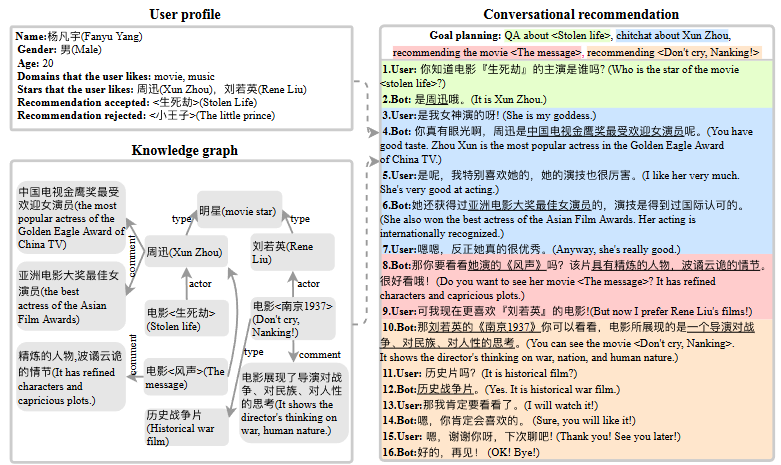

# Recommned-ACL-2020-Towards Conversational Recommendation over Multi-Type Dialogs
> 说明：本文档内容默认使用中文生成（论文标题与必要专有名词除外）。

*论文下载地址：https://github.com/PaddlePaddle/models/tree/develop/PaddleNLP/Research/ACL2020-DuRecDial*

*代码是否开源：是 https://github.com/PaddlePaddle/models/tree/develop/PaddleNLP/Research/ACL2020-DuRecDial*

*分享人：马明晖*

## 一句话总结内容
> 该论文提出多类型对话下的主动推荐任务，并发布包含用户画像的中文数据集DuRecDial。

## 一句话总结创新贡献
> 提出多目标驱动框架MGCG并构建首个支持多类型对话转换与主动推荐的中文数据集。

## 举一个例子说明这篇文章的创新点
> 通过显式用户画像与知识图谱，设计目标规划模块使机器人能从问答等场景自然过渡至推荐。

## 框架图

**框架工作流描述**：
> 构建含用户画像与知识图谱的数据集，设计多目标驱动生成框架进行目标预测与回复生成，并通过自动及人工评估验证效果。

## 本文挑战及已有工作不足
> 1. 如何在初始推荐后维持迭代交互
> 2. 如何在单一对话中处理多种类型的子对话
> 3. 如何主动且自然地引导对话以接近推荐目标

## 印象最深刻的点
> 1. 首次将多目标规划机制应用于多类型对话建模
> 2. 引入显式用户画像动态更新机制以模拟真实场景
> 3. 构建涵盖10k对话、156k语句的多领域DuRecDial数据集

## 对我们的启发
> 1. MultiWOZ 数据集中的任务模板标注方法
> 2. Xu et al. (2020) 的多目标对话生成工作
> 3. 文档 grounded conversation 中的知识图谱应用

## Idea是否好想
> 文章核心在于利用‘目标序列’打破单类型对话限制，将对话管理转化为多目标规划问题，增强系统在无明确意图时的主动性与可控性。

## 是否有开创性
> 首次定义跨多类型对话的主动推荐任务，并提供基准数据集与模型框架填补领域空白。

## 是否属于热点
> 多模态/多类型对话系统、主动式推荐、基于目标的对话生成

## 其他需要补充的点（可选）
> 1. 模型结合检索式与生成式两种响应策略
> 2. 引入BOW Loss和KL散度优化知识选择
> 3. 数据集包含1362个寻求者与丰富的实体推荐记录

## 与其他论文的关联（可选）
> 1. 相比Li et al. (2018)，增加明确推荐目标与规划机制
> 2. 相比Wu et al. (2019) DuConv，更侧重主动引导与多类型混合
> 3. 相比Christakopoulou et al. (2016)，强调多类型对话切换

## 还有哪些不足的地方（未来工作）
> 1. 提升话题预测准确率以解决候选过多问题
> 2. 探索多样化交互行为与复杂用户心理建模
> 3. 改进生成模型在适当性与目标达成率上的表现
