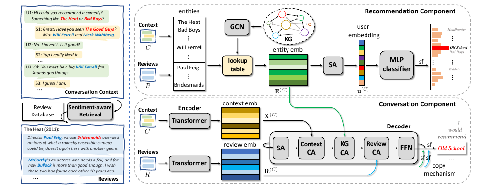

# Recommned-ACL-2021-RevCore- Review-augmented Conversational Recommendation
> 说明：本文档内容默认使用中文生成（论文标题与必要专有名词除外）。

*论文下载地址：https://aclanthology.org/2021.findings-acl.104/*

*代码是否开源：是 https://github.com/JD-AI-Research-NLP/RevCore*

*分享人：马明晖*

## 一句话总结内容
> 本文提出RevCore框架，通过情感感知检索融合外部评论数据，有效增强短对话历史下的物品表示与回复生成质量。

## 一句话总结创新贡献
> 首次利用外部评论解决短对话信息缺失问题，显著提升了推荐准确率及回复的多样性与信息丰富度。

## 举一个例子说明这篇文章的创新点
> 设计情感感知检索模块，依据对话情感极性匹配并嵌入相关评论，协同优化推荐精度与回复生成。

## 框架图

**框架工作流描述**：
> 系统先预测情感并检索一致评论，再利用评论增强实体构建用户画像以提升推荐，最后结合知识图谱与评论注意力机制生成连贯回复。

## 本文挑战及已有工作不足
> 1. 传统知识图谱方法构建成本高且与回复生成整合不足
> 2. 生成包含具体物品描述的具信息量回复极具挑战性
> 3. 典型对话历史过短，难以捕捉用户偏好所需的关键物品信息

## 印象最深刻的点
> 1. 情感感知检索机制有效过滤无关评论，保障了对话连贯性
> 2. 无知识图谱仅依赖评论数据的变体仍具备强劲竞争力
> 3. 在推荐准确率、困惑度及人工评估的信息性指标上全面优于现有基线

## 对我们的启发
> 1. 以情感一致性作为筛选标准可显著提升推荐与生成的协同效果
> 2. 外部评论比知识图谱更易获取且内容更丰富，适合解决冷启动与信息稀疏问题
> 3. 评论中的详细用户经验能大幅增加回复的信息密度与语言多样性

## Idea是否好想
> 核心在于将非结构化评论结构化融入对话流程，通过情感匹配消除外部噪声，并利用注意力机制将评论信息注入解码过程，实现推荐与生成的协同优化。

## 是否有开创性
> 首创基于情感感知的评论检索与融合技术，突破传统知识图谱依赖，证实了评论数据在缓解信息不足和提升回复质量上的独特价值。

## 是否属于热点
> Conversational Recommendation Systems, External Knowledge Integration, Sentiment Analysis in Dialogue, Review-based Recommendation

## 其他需要补充的点（可选）
> 1. 消融实验证实复制机制、评论注意力层及情感编码器的有效性
> 2. 实验基于REDIAL数据集进行验证
> 3. 从IMDb构建包含高帮助分数电影评论的专用数据库

## 与其他论文的关联（可选）
> 1. KBRD：基于知识图谱的对话推荐方法
> 2. KGSF：利用知识图谱对齐用户嵌入的方法
> 3. Transformer：模型的基础架构支撑

## 还有哪些不足的地方（未来工作）
> 1. 探索更多样化的外部评论来源与检索策略
> 2. 研究评论增强技术在多领域及多模态场景下的适用性
> 3. 优化评论句子的长度阈值以平衡信息量与生成流畅度
