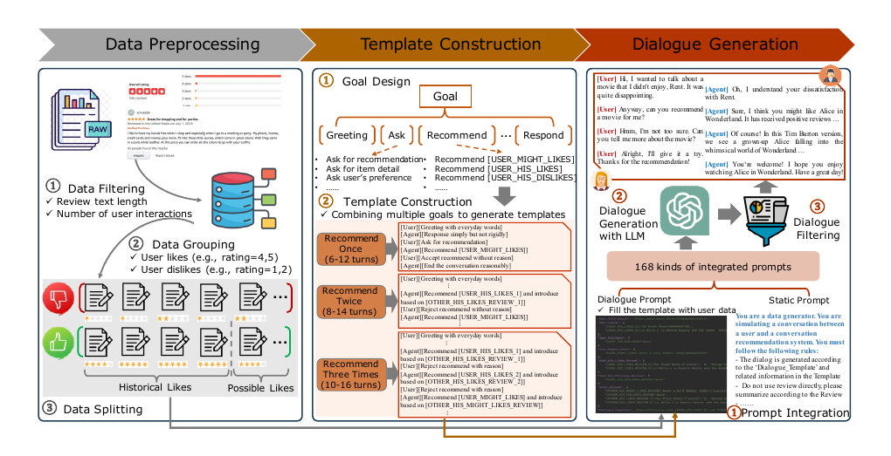

# Recommned-ACL-2024-LLM-REDIAL: A Large-Scale Dataset for Conversational Recommender Systems Created from User Behaviors with LLMs
> 说明：本文档内容默认使用中文生成（论文标题与必要专有名词除外）。

*论文下载地址：未提及*

*代码是否开源：是 https://github.com/LitGreenhand/LLM-Redial*

*分享人：马明晖*

## 一句话总结内容
> 本文提出LLM-REDIAL，利用大语言模型与真实用户历史行为数据构建大规模多领域对话推荐数据集。

## 一句话总结创新贡献
> 构建了史上最大规模多领域对话推荐数据集（4.76万轮对话、48.26万句话），实现了对话语义与用户历史交互的高度一致。

## 举一个例子说明这篇文章的创新点
> 设计结合预定义目标的对话模板，将用户真实评分与评论填入其中，指导LLM生成既符合流程又忠实于历史行为的自然对话。

## 框架图

**框架工作流描述**：
> 预处理Amazon评论获取用户历史行为；设计包含8种子目标的168种多轮对话模板；整合提示词、用户信息与模板输入GPT-3.5-turbo生成对话并过滤无效数据。

## 本文挑战及已有工作不足
> 1. 生成内容常无法准确反映用户真实历史行为与偏好，存在语义不一致问题
> 2. 现有数据集依赖人工标注，扩展性差且规模受限
> 3. 缺乏用户历史交互信息关联，导致推荐效果评估困难

## 印象最深刻的点
> 1. 引入真实用户评论与评分作为依据，显著提升对话丰富度及与用户行为的语义一致性
> 2. 首创用户中心构建方式，每个对话均关联特定用户ID及其完整历史交互记录
> 3. 人类评估显示，其在流畅度、逻辑性及连贯性上优于REDIAL等现有主流数据集
> 4. 规模空前，含47.6k轮对话与482.6k句话，覆盖电影、书籍、体育等多领域

## 对我们的启发
> 1. 多领域数据融合有助于提升模型在复杂场景下的泛化能力
> 2. 基于ISO标准设计的细粒度对话目标能有效控制流程多样性
> 3. 利用LLM生成能力可有效突破传统数据集质量低、规模小的瓶颈
> 4. 显式融入用户历史行为（评分、评论）是保证推荐系统语义一致性的关键

## Idea是否好想
> 该研究核心在于打破仅关注文本或简单模拟的局限，将‘用户历史行为’作为核心约束嵌入LLM生成过程，既解决规模问题，更攻克‘语义一致性’痛点，为训练精准推荐模型提供高质量基础。

## 是否有开创性
> 首次构建大规模、多领域且严格对齐用户历史行为的用户中心型对话推荐数据集，填补了规模与语义一致性的空白。

## 是否属于热点
> 利用大语言模型生成高质量合成数据以解决垂直领域稀缺问题，以及构建用户中心型对话推荐基准。

## 其他需要补充的点（可选）
> 1. 实验表明，引入用户历史交互信息能显著提升推荐模型的Recall与NDCG指标
> 2. 平均每位用户拥有约2.5个会话，书籍与电影领域用户对话数量较多
> 3. 构建成本约750美元，主要消耗于调用GPT-3.5-turbo API

## 与其他论文的关联（可选）
> 1. 在电影领域上与ChatGPT、Vicuna、Baize及Guanaco等基线模型进行了性能对比
> 2. 对比分析了REDIAL、TG-REDIAL、DuRecDial、INSPIRED及OpenDialKG等主流数据集

## 还有哪些不足的地方（未来工作）
> 1. 进一步探索利用该数据集优化对话推荐系统的个性化与上下文感知能力
> 2. 计划扩展至更多领域（原始数据含24个，目前仅用4个）生成更多对话
