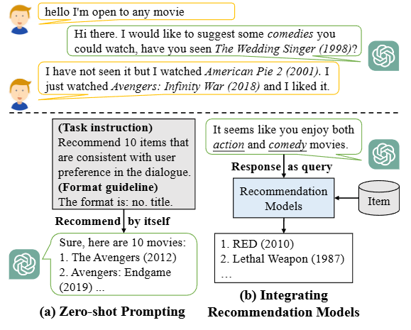

# Recommned-EMNLP-2023-Rethinking the Evaluation for Conversational Recommendation in the Era of Large Language Models
> 说明：本文档内容默认使用中文生成（论文标题与必要专有名词除外）。

*论文下载地址：未提及*

*代码是否开源：是 https://github.com/RUCAIBox/iEvaLM-CRS*

*分享人：马明晖*

## 一句话总结内容
> 本文指出传统对话推荐评估协议忽视交互本质，提出基于LLM用户模拟器的交互式框架iEvaLM以更真实地评估ChatGPT等模型的推荐能力。

## 一句话总结创新贡献
> 首创针对ChatGPT对话推荐任务的系统性评估，构建了结合LLM角色扮演的新型交互式评估框架iEvaLM。

## 举一个例子说明这篇文章的创新点
> 利用LLM角色扮演构建支持自由闲聊与属性问答的用户模拟器，突破了传统评估中对话流程固定且缺乏主动澄清的局限。

## 框架图

**框架工作流描述**：
> 先通过零样本提示或集成外部模型让ChatGPT生成推荐；随后利用LLM构建用户人设模拟多轮偏好表达与反馈；最后由LLM评分器自动评估推荐准确性及解释可信度。

## 本文挑战及已有工作不足
> 1. 固定对话流设计不支持系统主动澄清用户潜在需求
> 2. 现有评估过度依赖物品匹配，忽视了对话推荐的动态交互本质
> 3. 传统数据集偏好模糊且多为闲聊形式，导致难以精准匹配地面真值
> 4. LLM生成的推荐物品常超出评估数据集范围，导致直接评估失效

## 印象最深刻的点
> 1. ChatGPT生成的推荐理由具有高度说服力，解释质量远超传统模型
> 2. ChatGPT在电影、书籍等多领域场景下展现出强大的通用推荐潜力
> 3. LLM用户模拟器在自然度、有用性及与真人评估一致性上均优于DialoGPT
> 4. iEvaLM使ChatGPT在REDIAL数据集上的Recall@10从0.174显著提升至0.570

## 对我们的启发
> 1. 利用LLM替代高昂成本的人工用户研究是实现高效评估的有效路径
> 2. LLM卓越的指令遵循能力使其成为构建高保真用户模拟器的理想工具
> 3. 传统文本生成指标无法反映大模型在复杂交互中的真实能力，需转向交互式评估

## Idea是否好想
> 文章核心在于重构LLM时代的对话推荐评估标准，发现传统静态指标因忽略交互性和动态偏好获取而低估了模型能力；引入LLM驱动的动态用户模拟器后，不仅更贴近真实场景，还揭示了ChatGPT在交互推理与解释生成上的巨大潜力，同时暴露了基线模型在非自由对话场景下的短板。

## 是否有开创性
> 首次大规模系统性检验ChatGPT在对话推荐任务的能力，并首创基于LLM用户模拟器的交互式评估框架，有效解决了传统方法无法捕捉主动澄清和自由交互的关键问题。

## 是否属于热点
> 大语言模型在对话推荐系统中的应用与评估范式革新

## 其他需要补充的点（可选）
> 1. 评估推荐理由的可信度是提升用户接受度的关键因素
> 2. ChatGPT在偏好缺失时倾向于主动询问而非盲目推荐
> 3. 相比传统系统，ChatGPT在处理复杂的属性问答任务时表现更为出色

## 与其他论文的关联（可选）
> 1. 对比分析了KBRD、KGSF、CRFR等传统对话推荐模型的性能差异
> 2. 借鉴了Fu et al. (2023)关于LLM角色扮演的理论成果
> 3. 呼应了Bang et al. (2023)与Qin et al. (2023)关于文本生成评估局限性的观点

## 还有哪些不足的地方（未来工作）
> 1. 将iEvaLM框架推广至其他领域的对话系统评估中
> 2. 研究知识图谱与大语言模型的深度融合以提升推荐精度
> 3. 探索更多样化的用户模拟器策略以覆盖更广泛的交互场景
