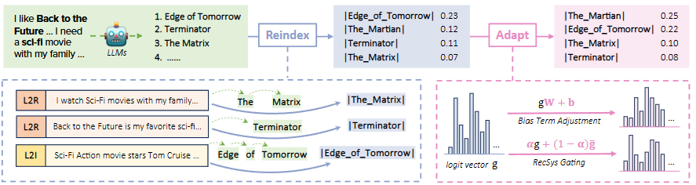

# Recommned-arXiv-2024-Reindex-Then-Adapt- Improving Large Language Models for Conversational Recommendation
> 说明：本文档内容默认使用中文生成（论文标题与必要专有名词除外）。

*论文下载地址：https://arxiv.org/abs/2405.12119*

*代码是否开源：未提及*

*分享人：马明晖*

## 一句话总结内容
> 论文提出RTA框架，通过将多令牌物品标题压缩为单令牌，解决LLM在对话推荐中的分布控制难题并提升准确率。

## 一句话总结创新贡献
> 通过重索引与适配机制，有效解决了LLM难以动态调整推荐物品分布的问题，显著提升了推荐性能。

## 举一个例子说明这篇文章的创新点
> 将“Edge of Tomorrow”等多词物品名压缩为单标记|Edge_of_Tomorrow|，实现高效获取全量物品logit向量及偏差校正。

## 框架图

**框架工作流描述**：
> 首先将LLM视为可微搜索索引（DSI），聚合多令牌嵌入为单令牌；随后通过调整Logit偏差或结合协同过滤门控，使推荐分布与目标数据对齐。

## 本文挑战及已有工作不足
> 1. 目标平台的数据分布随时间快速动态变化，静态LLM难以捕捉
> 2. LLM自回归生成导致全量物品概率计算成本高昂且难以精确控制
> 3. 训练数据中的物品流行度分布与推理平台实际分布存在静态不匹配

## 印象最深刻的点
> 1. 聚合器方法空间效率极高，比OOV嵌入表小10倍，比基座模型小233倍
> 2. 基于Llama2-7b，Top-10命中率提升59.37%，超越所有开源基线
> 3. 变长令牌压缩后仅需一步解码即可排名全量物品，速度比生成式检索快约100倍

## 对我们的启发
> 1. 简单的偏差项调整即可有效缓解物品流行度分布不匹配问题
> 2. 利用LLM作为DSI模型，挖掘其内置内容知识辅助推荐
> 3. 传统RecSys在捕捉协同信号与分布调整上的优势可与LLM互补

## Idea是否好想
> 核心洞察在于LLM虽具备强索引能力但参数固定的分布无法适应动态偏好；通过重索引打破多令牌限制，将推荐转化为类似传统RecSys的单步评分任务，实现高效可控的分布适配。

## 是否有开创性
> 首次提出针对LLM对话推荐分布控制的“重索引-适配”框架，创新压缩多令牌表示并结合偏差调整与RecSys门控机制进行分布对齐。

## 是否属于热点
> 大语言模型在推荐系统中的应用及分布校准

## 其他需要补充的点（可选）
> 1. 对比分析了加权、TRM及RNN等不同聚合器在重索引中的表现
> 2. 探讨了小样本与大样本场景下偏差调整与RecSys门控的最佳策略
> 3. 在INSPIRED、ReDIAL及Reddit-V1.5三个数据集上验证了有效性

## 与其他论文的关联（可选）
> 1. Large Language Models (LLMs)
> 2. Differentiable Search Index (DSI)
> 3. Conversational Recommender Systems (CRS)

## 还有哪些不足的地方（未来工作）
> 1. 探索多样化适配策略，如通过MLP动态预测权重系数以平衡LLM与传统RecSys
> 2. 微调LLM以覆盖更多冷启动物品
