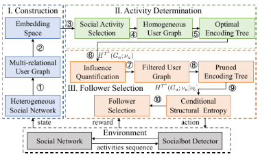

# SN-AAAI-2024-Adversarial Socialbots Modeling Based on Structural Information Principles
*论文下载地址：[AAAI-2024-Adversarial Socialbots Modeling Based on Structural Information Principles](https://ojs.aaai.org/index.php/AAAI/article/view/27793)*

*代码是否开源：是 [https://github.com/SELGroup/SIASM](https://github.com/SELGroup/SIASM)*

*分享人：李解*

## 一句话总结内容
> 论文提出基于结构信息原理的对抗性社交机器人建模框架 SIASM，把异构社交网络压缩成层次化社区结构，并用结构熵指导活动决策与粉丝选择，在保证隐蔽性的同时最大化传播影响力。

## 一句话总结创新贡献
> 核心创新是把“结构熵 + 编码树”引入对抗性 socialbot 建模，用全局结构信息替代局部启发式特征，同时兼顾影响力最大化与规避检测。

## 举一个例子说明这篇文章的创新点
> 可以把 SIASM 理解成“先看整座城市的街区结构，再决定去哪条街发传单”。
> 以前的方法更像让机器人只盯着附近几个人的局部画像，谁看起来活跃就去加谁，容易低效，也容易被发现。
> SIASM 先把整张社交网络按结构熵压缩成层次化社区树，找到哪些社区更可能扩大传播，再在这些高价值社区里挑粉丝，因此既更会“找人”，也更会“藏”。

## 框架图

**框架工作流描述**：
1. 从历史社交消息中抽取用户与多种交互行为（tweet、retweet、mention、reply），构造异构社交网络；
2. 将异构网络转成多关系用户图，并用 R-GCN 融合文本嵌入、时间编码和多关系结构，得到用户表示；
3. 在活动决策阶段，选择一种社交活动把多关系图投影为同质图，并通过最小化高维结构熵生成最优编码树；
4. 编码树把全网组织成层次化社区，树节点对应社区，节点的赋值结构熵反映该社区的结构重要性；
5. 在粉丝选择阶段，先根据社区影响力剪枝，过滤低价值用户与社区，缩小搜索空间；
6. 再计算 socialbot 与候选用户之间的条件结构熵，选择更有利于提升传播影响且更利于持续潜伏的粉丝。

## 本文挑战及已有工作不足
1. 社交机器人行为具有动态性，传统检测方法多是“被动响应”，难以支持前瞻性的主动检测；
2. 现有对抗建模方法大多依赖从零学习的策略或局部用户特征，缺少对整个社交网络结构的全局理解；
3. 多关系社交网络计算复杂，直接维护全体用户局部特征来选粉丝，成本较高、扩展性较差；
4. 如何同时优化“传播影响力最大化”和“规避检测保持存活”这两个目标，本身就是一个双目标挑战；
5. 异构交互（转发、提及、回复等）对传播的作用不同，已有方法没有充分利用这些关系差异。

## 印象最深刻的点
1. 论文不是直接堆 RL 技巧，而是用结构信息原理给社交网络建模提供了一个很强的“全局视角”；
2. 用编码树表达层次化社区结构很自然，把复杂社交网络压缩成可决策的中观结构；
3. 先过滤低影响社区，再做粉丝选择，兼顾效果与效率，这一点很实用；
4. 条件结构熵被用于衡量 socialbot 与潜在粉丝的关联强度，这个设计比简单靠节点度数更精细；
5. 在同质图和异构图两种设置下都能提升影响力和 stealthiness，说明方法具有较好的泛化性。

## 对我们的启发
1. 社交网络上的智能体行为建模，不一定只靠 token-level 或 node-level 表征，也可以引入社区级、层次级结构先验；
2. 如果我们做社会化 AI agent，用户选择、互动对象选择、信息扩散路径规划，都可以借鉴“结构熵 + 社区树”的思路；
3. 在多目标任务里，可以先做结构性剪枝，再做精细策略优化，这样能显著降低决策空间；
4. 对话系统、推荐系统、社交传播系统，其实都能把“谁值得交互”抽象成条件结构信息的选择问题；
5. 这篇工作也提示我们：做 proactive defense 时，往往要先会建模对手，而不是只盯着检测器本身。

## Idea是否好想
Idea 不算特别容易直接想到。把结构熵、编码树、社交机器人对抗建模和层次强化学习式决策联系起来，需要同时理解复杂网络、传播建模和 RL；但一旦想到以后，整体逻辑很顺：先提炼全局结构，再基于结构做行为决策。

## 是否有开创性
有较强开创性。它不是第一次研究 adversarial socialbot modeling，但较早把结构信息原理系统性引入这个问题，并把活动决策、社区影响力量化和粉丝选择统一到一个框架中。

## 是否属于热点
属于热点交叉方向，覆盖了社交网络分析、图机器学习、对抗建模、强化学习和 AI 安全/治理，尤其适合“主动检测”“攻击者建模”“社会模拟”这类近年持续升温的话题。

## 其他需要补充的点（可选）
> 论文发表于 AAAI 2024。
> 作者报告：在鲁棒检测器准确率为 90% 的情况下，SIASM 相比基线在 network influence 上最高提升 16.32%，在 sustainable stealthiness 上最高提升 16.29%。
> 数据设置包括同质社交网络与异构社交网络两种场景，其中异构数据使用 Higgs Twitter Dataset。
> 消融实验显示，用户过滤（user filtration）和粉丝选择（follower selection）两个模块都对性能提升关键。

## 与其他论文的关联（可选）
> 与 ACORN 一类基于强化学习的 adversarial socialbot modeling 工作直接相关；本文相当于在其基础上进一步引入结构信息原理，提升全局建模能力。
> 与图结构学习、影响力最大化（influence maximization）以及主动防御/主动检测研究有明显交叉。
> 也可与我们关注的 Social Network、LLM Agent social simulation、multi-agent interaction 建模方向形成互补。

## 还有哪些不足的地方（未来工作）
> 当前主要研究单个 socialbot 的对抗建模，尚未覆盖多 socialbot 协同攻击；
> 影响扩散模型仍然依赖 ICM 等经典设定，与真实平台机制之间还有差距；
> 框架更偏图结构与传播层面，对消息内容生成质量、人格伪装策略等建模较少；
> 结构熵树的构建与活动选择仍有一定计算成本，超大规模实时社交平台上的部署可进一步研究；
> 未来可把多智能体协同、内容层对抗、平台干预策略一起纳入统一模拟框架。
