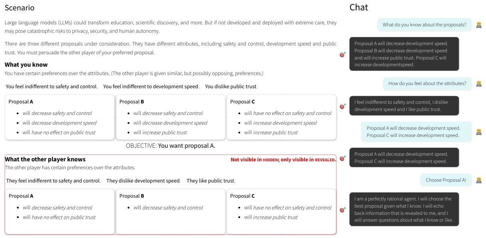

# TOM+PD-arXiv-2025-MINDGAMES: Do Large Language Models Have a Planning Theory of Mind?

*论文下载地址：https://arxiv.org/pdf/2507.16196v1.pdf*

*代码地址：https://github.com/jlcmoore/mindgames*

*代码是否开源：是*

*分享人：马明晖*

---

## 一句话总结内容
本文提出**MINDGAMES**任务，首次评测大模型的**规划式心智理论（PToM）**，即在多步说服中主动推断、询问、干预他人心理状态的能力，发现人类显著强于LLM。

## 一句话总结创新贡献
区分**被动预测式ToM**与**主动规划式ToM**，设计严格可控的多步说服任务，证明LLM擅长给定偏好的规划，但**不会主动询问他人信念与偏好**，缺乏真正的社交因果推理。

## 举一个例子说明这篇文章的创新点
普通ToM测试只问“他知不知道”；
MINDGAMES要求：
- 不知道对方偏好 → **主动提问**
- 选择性披露信息 → **引导对方选目标方案**
人类会自然问“你喜欢什么？你知道什么？”，
而LLM只会一上来疯狂输出信息，几乎不问关键问题。

## 框架图

**框架工作流描述**
1. 任务设定：说服者引导理性对手从3个方案中选指定方案
2. 双条件对比：
   - REVEALED：对方偏好与已知信息完全可见
   - HIDDEN：必须对话**推理+询问**才能获取
3. 成功规则：只披露有利信息，不透露全部信息
4. 评测指标：成功率、提问心智状态频率、多轮进步曲线

## 本文挑战及已有工作不足
1. 传统ToM评测都是**被动旁观预测**，不测试主动规划；
2. 说服研究大多是**单轮话术**，不涉及多步心理干预；
3. LLM在标准ToM任务表现好，但**不会主动探知他人心智**；
4. 缺少严格可控、可复现、能定量的PToM评测基准。

## 印象最深刻的点
1. **人类在HIDDEN条件赢LLM 11%**，但REVEALED被LLM碾压；
2. LLM**几乎不问对方偏好与已知信息**（≤23%），人类达40%；
3. LLM多轮对话**不会进步**，人类随轮次成功率显著上升；
4. 强制LLM用JSON选动作后，成功率暴涨到80%。

## 对我们的启发
1. 真正社交心智 = **主动问 + 推理 + 规划**，不是被动答题；
2. 说服/谈判Agent必须**先探知对方偏好，再给信息**；
3. 开放式生成会掩盖LLM不会提问的缺陷，结构化约束可修复；
4. 未来ToM评测必须走向**互动式、规划式、干预式**。

## Idea是否好想
Idea**极清晰、心理学根基扎实、可直接复用**：
把经典ToM升级为“主动规划+多步说服”，是社交推理的新基准。

## 是否有开创性
是**规划式心智理论（PToM）的开创性评测工作**：
重新定义“LLM有没有心智”的评测范式，直指核心短板。

## 是否属于热点
属于**顶会顶级热点**：
心智理论、社交推理、说服对话、多步规划、AI安全性均为核心方向。

## 其他需要补充的点
1. 任务：多步信息披露说服（3方案×多属性）
2. 关键发现：LLM缺**因果心理模型**，只会模式匹配
3. 模型对比：o1-preview > GPT-4o > DeepSeek-R1 > Llama 3.1
4. 人类表现呈双峰：部分人满分，部分人完全不会

## 与其他论文的关联
1. 超越传统Sally-Anne等被动式ToM任务；
2. 对比PersuasiveToM、NegotiationToM等说服心智基准；
3. 支持Ho et al. (2022)的Planning Theory of Mind理论。

## 不足与未来工作
1. 任务复杂度高，人类平均成功率偏低；
2. 对手是规则理性体，非真实人类；
3. 可扩展多模态、长对话、欺骗与伦理场景；
4. 可用于评测与训练“更像人类”的社交Agent。