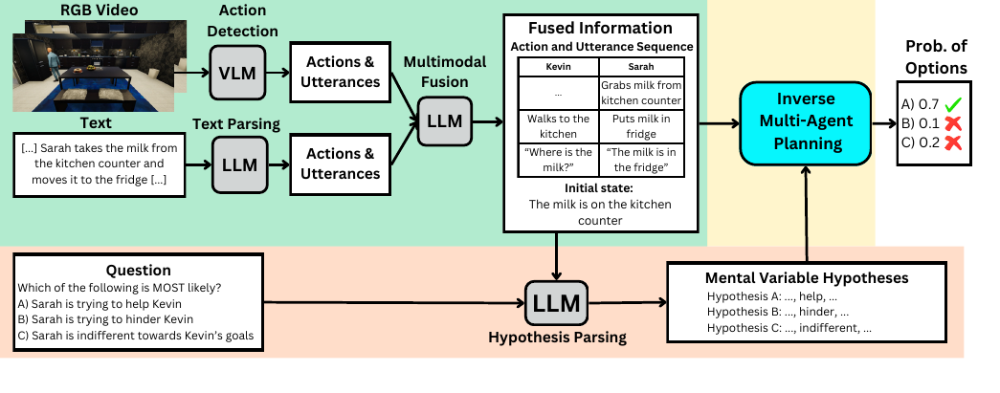

# ToM-AAAI-2025-MuMA-ToM- Multi-modal Multi-Agent Theory of Mind

*论文下载地址（可选）：https://arxiv.org/abs/2408.12574*

*代码是否开源：是 [https://scai.cs.jhu.edu/projects/MuMA-ToM/](https://scai.cs.jhu.edu/projects/MuMA-ToM/)*

*分享人：马明晖*

## 一句话总结挑战
> 如何在真实家庭场景的多模态多智能体交互中，联合推断参与者的信念、社会目标以及对他人目标的信念。

## 一句话总结创新贡献
> 本文提出 MuMA-ToM 基准和 LIMP 方法，系统评测并提升了多模态多智能体 Theory of Mind 推理能力。

## 举一个例子说明这篇文章的创新点
> 例如在“帮助/阻碍”场景中，模型需要综合视频动作、对话文本和目标约束，判断角色是在协助对方还是有意误导对方。

## 框架图

**框架工作流描述**：
> 先用 VirtualHome 生成两人家庭交互，再构造基于视频和文本的多模态问答；模型侧先融合多模态信息并补全动作与话语序列，再针对每个候选答案生成信念、社会目标及他人目标信念假设，最后通过逆多智能体规划比较各假设下动作与话语的似然并完成推断。

## 本文挑战及已有工作不足
> 1. 多模态社交线索分散在视频与文本中，需要跨模态整合才能还原完整情境
> 2. 现有 ToM 基准多偏向单智能体或单一模态，难以系统评估真实具身社交推理能力
> 3. 多智能体 ToM 不只是识别行为，还要递归推断信念、社会目标及对他人目标的信念，假设空间大且歧义强

## 印象最深刻的点
> 1. LIMP 不依赖手工符号表示，而是用自然语言表示状态、动作和话语，提升了泛化能力
> 2. 构建了首个面向具身多智能体交互的多模态 Theory of Mind 基准 MuMA-ToM
> 3. 基准包含 225 段多模态社交交互、900 道选择题，并额外提供 1030 段带动作与目标标注的训练视频
> 4. LIMP 在总体准确率上优于 GPT-4o、Gemini 1.5 Pro 等多模态模型，也优于 BIP-ALM

## 对我们的启发
> 1. 借鉴 BIP-ALM 的逆规划框架，并进一步扩展到多智能体和多模态场景
> 2. 受 I-POMDP 和逆规划思想启发，将多智能体递归心智建模形式化为规划推断问题
> 3. 结合大语言模型作为假设解析器和似然评估器，用自然语言替代手工符号表示

## Idea是否好想
> 本文将多模态 ToM 拆为三个可组合环节：先融合视频与文本补全交互事实，再为候选答案生成心理状态假设，最后用逆多智能体规划比较这些假设下动作与话语的相对可能性。这样既保留了 ToM 所需的递归推理结构，又借助语言模型降低了手工符号规划的脆弱性。

## 是否有开创性
> 创新点在于同时引入多模态、双智能体和递归心理状态三重复杂性，并提出无需手工符号的自然语言驱动逆多智能体规划框架。

## 是否属于热点
> ['多模态推理', 'Theory of Mind', '多智能体交互', '具身智能', 'LLM 与规划结合', '基准评测']

## 其他需要补充的点（可选）
> 1. 题目设计通过显式条件约束其他心理变量，降低了多重假设同时成立带来的歧义
> 2. 作者指出常见的微调和 chain-of-thought 提示并未显著提升多模态模型的 ToM 能力
> 3. 问答类型被划分为 belief inference、social goal inference 和 belief of goal inference 三类

## 与其他论文的关联（可选）
> 1. 与 MMToM-QA 相比，本文从单智能体扩展到多智能体，并强调社交目标和他人目标信念
> 2. 与 BIP-ALM 相比，LIMP 增加了多智能体规划层级，并去除了对手工符号表示的依赖
> 3. 与一般多模态 QA 基准相比，MuMA-ToM 不只是信息融合，而是要求心理状态层面的深层推理

## 还有哪些不足的地方（未来工作）
> 1. 提升在真实世界噪声、遮挡和不完整观测条件下的鲁棒性
> 2. 降低对大模型推理和多次调用的计算开销
> 3. 进一步缩小模型与人类在多智能体 ToM 推理上的差距
> 4. 扩展到更多场景、更丰富的交互模态和更复杂的群体社会关系
