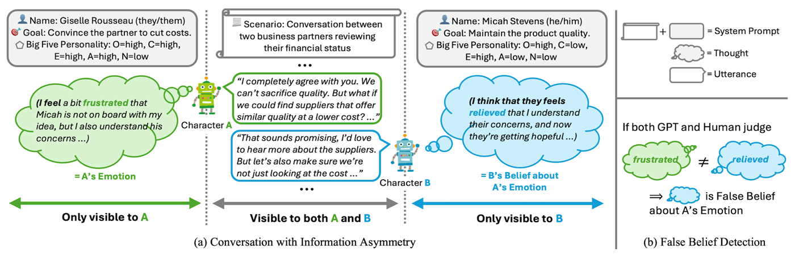

# ToM+Data-AAAI-2025-ToMATO-Verbalizing the Mental States of Role-Playing LLMs for Benchmarking Theory of Mind
> 说明：本文档内容默认使用中文生成（论文标题与必要专有名词除外）。

*论文下载地址：未提及*

*代码是否开源：是 https://github.com/nttmdlab-nlp/ToMATO*

*分享人：马明晖*

## 一句话总结内容
> 本文提出 ToMATO，通过 LLM-LLM 对话和内心独白显式标注构建 Theory of Mind 基准，用于评测角色扮演 LLM 对多类心智状态、一二阶推理、false belief 和人格鲁棒性的理解能力。

## 一句话总结创新贡献
> 作者将 LLM-LLM 对话、信息不对称、人格设定与 inner speech prompting 结合，构建了覆盖 belief、intention、desire、emotion、knowledge 五类心智状态及其 false beli。

## 举一个例子说明这篇文章的创新点
> 在每次发言前要求角色先输出括号中的“思考”，例如先生成“I think / I feel / I know ...”式的内心状态，再生成正式话语，并将这些显式化的思想直接作为问答答案。

## 框架图

**框架工作流描述**：
> 先从 SOTOPIA 抽取对话场景、角色和目标，并为角色分配不同的 Big Five 人格组合；再用 Llama-3-70B-Instruct 和 Inner Speech prompting 进行 LLM-LLM 多轮对话，让角色在信息不对称条件下先“思考”再说话，分别生成五类心智状态的一阶和二阶标注；随后将对话和思想转成多项选择题，并通过 MTurk 与 GPT-4o mini 联合质检；最后通过比较一阶与二阶心智状态构造 ToMATO-FB false belief 子集。

## 本文挑战及已有工作不足
> 1. 对 belief 以外心智状态的 false belief 研究不足，评测覆盖不完整
> 2. 多数基准忽略人格差异，而真实社交推理会受人格显著影响
> 3. 现有 ToM 基准覆盖的心智状态类型有限，往往只聚焦 belief
> 4. 直接采集人类对话及其心智状态成本高、隐私受限，而多项选择题又容易被词汇重叠等捷径利用

## 印象最深刻的点
> 1. 引入 15 种人格模式，且分析显示该基准较少词级伪相关，更难依赖捷径完成
> 2. 数据由 LLM-LLM 对话自动生成，并借助信息不对称自然诱发误解与 false belief
> 3. ToMATO-FB 系统扩展 false belief 任务，首次覆盖 belief 以外多类心智状态
> 4. ToMATO 同时覆盖 belief、intention、desire、emotion、knowledge 五类心智状态，并支持一阶和二阶 ToM 评测

## 对我们的启发
> 1. 受关于 LLM 能否模拟心理学实验参与者的讨论启发
> 2. 来自心理学 ToM 研究中对 belief、emotion、desire 等心智状态的经典划分
> 3. 借鉴 SOTOPIA 等 LLM-LLM 社交交互框架，并关注信息不对称会诱发误解与 false belief 的现象

## Idea是否好想
> 这项工作的核心思想是把原本不可观测的心智状态外显为可验证的“内心独白”，并利用对话中的信息不对称自然制造误解，从而构建更接近真实社交场景的 ToM 评测。相比以往依赖模板叙事或单一心理测试的基准，它在覆盖面、场景真实性和人格多样性上都有明显提升；同时，作者还用多重人工与模型验证来降低生成噪声。不过，这种方法仍然依赖生成模型与提示设计，可能存在模型家族偏置、生成策略耦合以及对特定 LLM 能力的依赖。

## 是否有开创性
> 首次提出由 LLM-LLM 对话生成的 ToM 基准；首次系统构建针对 belief 以外五类心智状态的 false belief 评测；首次将 inner speech prompting 用于大规模显式化心智状态标注。

## 是否属于热点
> Theory of Mind、LLM评测、社会智能、对话式数据集生成、人格建模、false belief、可解释心智状态推理

## 其他需要补充的点（可选）
> 1. 数据集包含 5.4k 问题、753 段对话，ToMATO-FB 含 806 个问题
> 2. 信息不对称能显著促进 false belief 生成
> 3. 模型在不同人格特征下表现不稳定，尤其对不尽责、内向、不宜人和高神经质角色更容易失分，尽责性人格的体现最弱

## 与其他论文的关联（可选）
> 1. 与 SOTOPIA 及心理学中的 false belief、人格特质研究相关
> 2. 与 FANToM 同样以对话为输入，但 ToMATO 由角色扮演 LLM 自动生成并显式加入人格设定
> 3. 与 ToMi、Hi-ToM、BigToM、FauxPas-EAI、FANToM、OpenToM、ToMBench 等 ToM 基准直接相关

## 还有哪些不足的地方（未来工作）
> 1. 扩展到多模态上下文中的 ToM 评测
> 2. 扩展到决策制定场景中的 ToM 评测
> 3. 扩展到多智能体设置中的 ToM 评测
