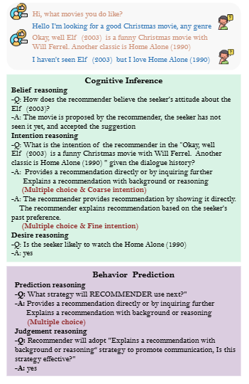

# ToM+Data-AAAI-2026-RecToM- A Benchmark for Evaluating Machine Theory of Mind in LLM-based Conversational Recommender Systems

*论文下载地址（可选）：https://arxiv.org/abs/2511.22275*

*代码是否开源：是 [https://github.com/CGCL-codes/RecToM](https://github.com/CGCL-codes/RecToM)*

*分享人：马明晖*

## 一句话总结挑战
> 如何在真实的对话推荐场景中，系统评估大语言模型对用户和推荐者心理状态的推断能力，以及基于这些推断做出后续策略判断的能力。

## 一句话总结创新贡献
> 本文提出RecToM基准，将对话推荐中的机器心智理论评估拆分为认知推断和行为预测两大维度，并覆盖意图、信念、欲望和策略有效性等任务。

## 举一个例子说明这篇文章的创新点
> 例如，在电影推荐对话中，模型不仅要判断用户是否可能接受某部影片，还要推断推荐者如何理解用户态度，并进一步判断下一步应采用何种推荐策略及其是否有效。

## 框架图

**框架工作流描述**：
> 先从REDIAL中筛选高质量电影推荐对话，再由三名受训标注员对多维心理状态进行人工精标，最终构建包含10类问题、20,524个QA对的RecToM基准，用于评估LLM在推荐对话中的ToM能力。

## 本文挑战及已有工作不足
> 1. 一段对话中常同时包含多个意图，单一标签或单选题难以覆盖真实的交互结构
> 2. 细粒度意图区分困难，模型往往能识别粗粒度类别，却难以分辨同类下的具体子意图
> 3. 行为预测不仅要理解已发生的对话，还要结合推断出的心理状态判断下一步策略及其有效性，而现有基准通常忽略这一点
> 4. 对话推荐中的心理状态是动态且多维的，涉及欲望、意图和信念及其随上下文变化的演化过程，难以用静态问答完整刻画

## 印象最深刻的点
> 1. 设计了多策略选择、多粒度意图、多维信念和多并发欲望等更贴近推荐场景的复杂设置
> 2. 同时覆盖认知推断和行为预测两类能力，更贴近真实交互需求
> 3. 基于真实人工标注的推荐对话构建，减少了对合成叙事的依赖
> 4. 首次将机器Theory of Mind系统引入LLM驱动的对话推荐评测

## 对我们的启发
> 1. 把心理状态推断与后续策略选择、有效性判断结合起来，形成从理解到行动的完整评测链
> 2. 借鉴BDI模型来组织欲望、信念和意图三类认知维度
> 3. 将ToM评估从抽象叙事迁移到真实应用场景，尤其是高交互性的对话推荐任务

## Idea是否好想
> 作者认为，对话推荐的关键不只是生成流畅回复，而是持续追踪双方心理状态并据此调整策略；因此，评测也应从理解过去扩展到预测未来行为，并在多选择、细粒度和多维心理状态条件下检验模型是否具备类人社会推理能力。

## 是否有开创性
> 创新点在于提出面向LLM对话推荐系统的ToM基准RecToM，并将评测拆分为认知推断与行为预测两条主线，同时引入多粒度意图、多维信念和多并发欲望等更复杂、更真实的心理建模维度。

## 是否属于热点
> 机器心智理论、LLM评测、对话推荐、社会推理、细粒度意图识别、偏置分析

## 其他需要补充的点（可选）
> 1. 基准包含4,583个总轮次和20,524个QA对，平均每段对话13.64轮
> 2. 数据来自REDIAL，并按IARD选择协议筛出336段满意和不满意的推荐对话
> 3. 标注由三名接受过ToM和心理学训练的博士生完成，IAA Fleiss's K为0.79

## 与其他论文的关联（可选）
> 1. 数据构建依托REDIAL和IARD的对话筛选思路
> 2. 与Hi-ToM、FANTOM、Persuasive-ToM、OpenToM、AutoToM、NegotiationToM、MumA-ToM、MMToM-QA等ToM基准相关

## 还有哪些不足的地方（未来工作）
> 1. 探索更稳定的推理提示或训练方法，以提升细粒度ToM能力
> 2. 扩展到更多推荐领域与多模态对话场景
> 3. 缓解LLM在判断任务中的肯定偏置与讨好式回应倾向
