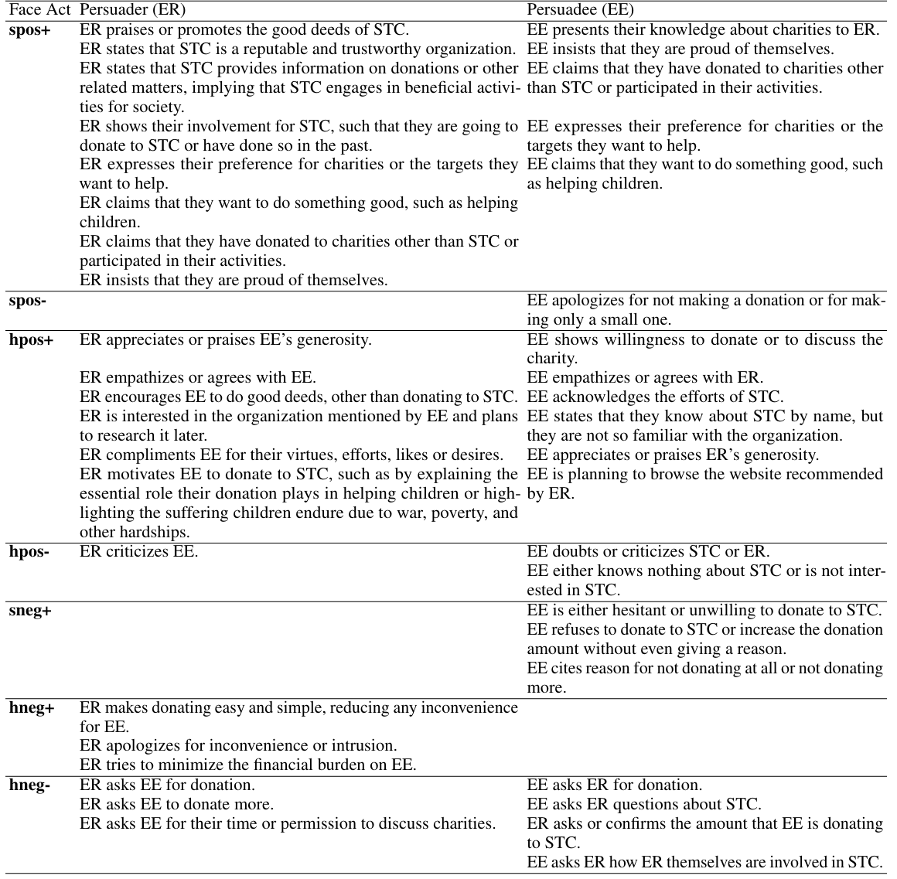

# ToM-ACL-2024-Evaluating Intention Detection Capability of Large Language Models in Persuasive Dialogues
> 说明：本文档内容默认使用中文生成（论文标题与必要专有名词除外）。

*论文下载地址：https://aclanthology.org/2024.acl-long.90.pdf*

*代码是否开源：https://github.com/Syuko4omi/LLM_intention_detection_public*

*分享人：马明晖*

## 一句话总结内容
> 本文将劝服式多轮对话中的 face act 转化为自然语言四选一题，以评测大语言模型识别对话意图的能力。

## 一句话总结创新贡献
> 本文提出了基于劝服对话的多轮意图检测评测构建流程，并系统比较了 GPT-4、ChatGPT 等模型与人类的表现。

## 举一个例子说明这篇文章的创新点
> 将原本抽象的 face act 标签转写为 42 个可读的意图描述，并结合对话历史构造成四选一阅读理解题，用于零样本/少样本评测 LLM 的意图理解能力。

## 框架图

**框架工作流描述**：
> 先从劝服式对话数据中筛选含 face act 的关键话语，再由众包标注其自然语言意图描述；随后合并连续同意图话语、为每个样本随机采样三个干扰项并生成四选一题目，最后比较不同规模 LLM 与人类的作答并按准确率分析错误类型。

## 本文挑战及已有工作不足
> 1. 话语常同时承载多重意图，客观上增加了答案歧义
> 2. hpos 类话语最难识别，小模型在这类样本上更容易失误
> 3. face act 与自然语言意图并非一一对应，标注边界容易模糊
> 4. 预定义候选标签无法完全覆盖真实话语，导致部分题目没有严格唯一的正确项

## 印象最深刻的点
> 1. 引入 face act 作为分析框架，便于对错误进行细粒度拆解
> 2. 通过人类与模型对比，揭示了“批评/施压”类话语在感知上的边界差异
> 3. 构建了面向劝服式多轮对话的意图检测评测集
> 4. GPT-4 在任务上的整体表现较强，准确率超过 90%

## 对我们的启发
> 1. 情感和礼貌等社会语用因素也应纳入意图识别分析
> 2. 对话意图判断应充分利用多轮上下文，而不是只看单句
> 3. 可将抽象标签改写为自然语言选项，降低 LLM 评测门槛

## Idea是否好想
> 本文把传统意图分类改写为更贴近 LLM 推理范式的多项选择阅读理解任务，既保留多轮上下文与细粒度语用信息，又降低抽象标签的理解门槛。其价值在于更公平地评估模型是否真正理解对话意图，并借助 face act 做误差分析；但由于标签边界不清和天然多解，这一设计更偏向评测任务工程，而非新模型方法。

## 是否有开创性
> 创新主要集中在任务定义与分析框架：将劝服对话中的 face act 转为自然语言意图描述，并结合多轮上下文设计四选一评测，用于衡量 LLM 的意图检测能力。方法上未提出新的模型结构，但在任务形式和错误分析粒度上较新。

## 是否属于热点
> 多轮对话理解、意图检测、LLM 评测、语用/礼貌策略、社会认知与对话推理。

## 其他需要补充的点（可选）
> 1. 部分被人类视为“批评”的话语，在语境中更接近劝说或激励策略
> 2. 数据来自劝服式慈善募捐对话，场景较窄但便于控制变量
> 3. 论文区分了意图推断偏差与对象选择、逻辑不一致等非意图错误

## 与其他论文的关联（可选）
> 1. 与 SNIPS 等单句意图检测任务形成对照，突出多轮上下文的重要性
> 2. 与 Cui et al. (2020) 一类对话推理/阅读理解任务相关
> 3. 与 Dutt et al. (2020) 的劝服对话 face act 标注工作直接相关

## 还有哪些不足的地方（未来工作）
> 1. 优化标签体系，减少多解与不匹配选项问题
> 2. 构建可用于微调的训练数据
> 3. 扩展到其他对话体裁和应用场景
> 4. 进一步研究劝说性情绪诉求与人类感知差异
