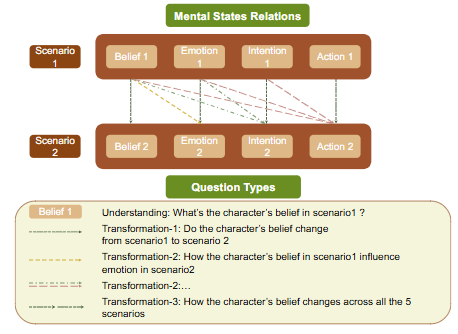

# ToM-ACL-2025-Towards Dynamic Theory of Mind- Evaluating LLM Adaptation to Temporal Evolution of Human States

*论文下载地址（可选）：https://arxiv.org/abs/2505.17663*

*代码是否开源：https://github.com/GAIR-NLP/DynToM*

*分享人：马明晖*

## 一句话总结挑战
> 如何评估LLM能否在多轮关联的社会情境中持续跟踪并推理人类心智状态的时间演化。

## 一句话总结创新贡献
> 本文提出DYNTOM动态ToM基准，通过连续社会场景与多类型问题系统评测LLM对人类心理状态变化的理解与跟踪能力。

## 举一个例子说明这篇文章的创新点
> 例如，同一社会情境中角色的情绪从“关心对方工作”逐步演化为“更强烈的担忧并提出具体建议”，问题直接判断这种状态是否发生了升级。

## 框架图

**框架工作流描述**：
> 先构建社会地点、人物画像和关系；再设计五个连续场景中的心智状态轨迹；接着生成自然对话场景；最后围绕理解与跨场景变化设计四类问题并进行人工验证。

## 本文挑战及已有工作不足
> 1. 不少评测缺少真实社会背景、连续剧情和严格质量控制，导致任务真实性或难度分布不足
> 2. 跨场景问题同时考验状态识别、变化判断和原因推断，容易暴露模型在中间时段与组合推理上的短板
> 3. 现有ToM基准多聚焦静态快照，难以覆盖真实社交互动中情绪、信念和意图随时间持续演化的过程
> 4. 动态ToM不仅要求模型识别单个场景中的心理状态，还要跨多个关联场景追踪状态变化，时序依赖强、推理链条长

## 印象最深刻的点
> 1. 将问题划分为理解、变化-1、变化-2、变化-3四类，能细粒度定位模型失败环节
> 2. 实验表明，十个代表性LLM平均比人类低44.7%，且在跨场景转变题上退化最明显
> 3. 采用四步生成与多轮人工验证，兼顾真实性、连贯性和可答性
> 4. 构建了1100个社会情境、5500个社会场景和78100道题目，规模较大

## 对我们的启发
> 1. 将信念、情绪、意图与行动之间的因果关系显式纳入数据构造
> 2. 借鉴行为模拟与对话生成思路，用LLM辅助构建高质量、可验证的动态社交数据
> 3. 从真实社交互动中“心理状态会持续变化”这一现象出发，而非只关注静态心理状态

## Idea是否好想
> 本文将ToM评测从“单点识别”推进到“时间轨迹理解”：先定义连续社会阶段，再把心智状态变化写入轨迹和问题，使评测目标从看懂某一刻的状态，升级为理解状态如何在互动中逐步演化。

## 是否有开创性
> 创新点在于提出动态ToM评测框架DYNTOM，系统覆盖跨场景的心智状态演化、变化原因推断和长程时间跨度跟踪，而不是只测试孤立场景中的静态心理推理。

## 是否属于热点
> 动态Theory of Mind、LLM社会推理评测、心理状态时序建模、长程上下文理解。

## 其他需要补充的点（可选）
> 1. 十个模型中GPT-4o表现最好，但在变换类问题上仍明显落后于人类
> 2. 基准包含261个社会地点、2200个角色，平均每个社会阶段71道题
> 3. CoT对较小模型有时有帮助，但对更强模型可能因过度分段推理而削弱跨时序依赖建模

## 与其他论文的关联（可选）
> 1. BigToM
> 2. TOMBENCH
> 3. SocialIQA

## 还有哪些不足的地方（未来工作）
> 1. 探索更适合动态ToM的提示方式与推理策略
> 2. 进一步研究模型在长上下文中维持心智状态轨迹的机制
> 3. 扩展到更长的场景序列和更多样的社会情境
