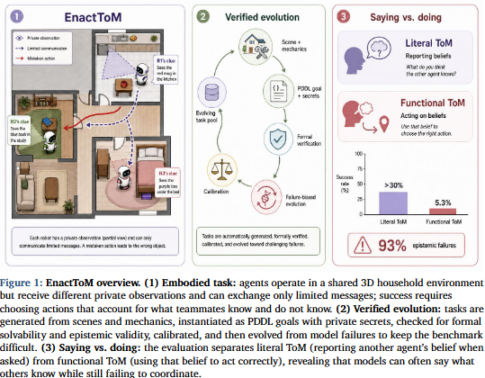

# ToM-arXiv-2026-EnactToM- An Evolving Benchmark for Functional Theory of Mind in Embodied Agents

*论文下载地址（可选）：https://arxiv.org/abs/2605.09826*

*代码是否开源：https://enact-tom.github.io/*

*分享人：马明晖*

## 一句话总结挑战
> 核心挑战是在具身多智能体环境中评测并提升智能体把“知道别人知道什么”真正用于协作决策的能力，而不只是回答信念问题。

## 一句话总结创新贡献
> 本文提出可演化的具身多智能体ToM基准EnactToM，同时评测功能性ToM与字面ToM，并通过形式化验证和失败驱动生成持续保持任务难度。

## 举一个例子说明这篇文章的创新点
> 例如在3D家庭环境中，不同智能体拥有各自的私有观察和受限通信，任务要求它们根据队友可见与不可见的信息决定先告诉谁、说什么以及何时行动。

## 框架图

**框架工作流描述**：
> 先由生成代理在3D家庭场景中编写PDDL任务和私有秘密，再经过PDDL结构校验、K深度校验、LLM裁判打分和基线可执行性校准；通过后加入基准池，并从前沿模型失败样本中继续演化生成更难任务。

## 本文挑战及已有工作不足
> 1. 静态基准容易被模型能力提升迅速饱和，难以持续区分不同系统的水平
> 2. 现有基准多只考察“别人相信什么”，难以检验智能体是否真正把这些信念用于决策与协作
> 3. 不少相关工作缺少形式化保证，无法同时验证任务可解性、ToM深度和对知识依赖的真实性
> 4. 具身环境中的ToM更复杂，部分可观测、空间约束、有限带宽和受限通信都会放大“知道”和“会用”之间的差距

## 印象最深刻的点
> 1. 构建了300个具身多智能体任务，覆盖协作与混合动机两类场景
> 2. 采用失败驱动的演化式生成，使基准能够随着模型变强而自动升级
> 3. 任务生成阶段引入形式验证，保证任务可解、可执行且满足指定的ToM深度
> 4. 同一基准同时评测功能性ToM和字面ToM，能直接暴露“会说不会做”的现象

## 对我们的启发
> 1. 将“ToM不只是会报告，而是会行动”作为核心评测理念
> 2. 用PDDL和验证器把语义目标、物理约束与嵌套知识统一到同一任务表示中
> 3. 借鉴Dynabench和LiveBench的动态更新思路，同时加入形式可解性和知识层级约束

## Idea是否好想
> 该工作把ToM从文本问答范式推进到具身协作范式，关键在于把“信念报告能力”和“信念驱动行动能力”分开测量，并通过信息不对称、有限通信和递进式生成逼出真实协调问题。它的价值不仅在于揭示模型存在明显的act-report gap，也在于提供了一个可持续扩展、可复现、可定位失败模式的评测框架。

## 是否有开创性
> 新颖性主要体现在三点：一是定义并测量功能性ToM；二是把具身多智能体、私有信息和受限通信结合起来；三是用验证过的演化生成对抗基准饱和。

## 是否属于热点
> ToM、具身多智能体、动态基准、部分可观测协作、信念-行动鸿沟

## 其他需要补充的点（可选）
> 1. 作者将该基准定位为测量仪器，而不是固定排行榜
> 2. 基准包含standard和hard两个划分，hard通过更高的失败种子比例生成

## 与其他论文的关联（可选）
> 1. 与OpenToM、FANToM、Hi-ToM等字面ToM基准相关，但更强调行动而非问答
> 2. 与Dynabench、LiveBench的动态演化基准思想相关，但本工作加入了形式化可解性与知识层级约束
> 3. 与PARTNR、Hanabi等具身或部分信息协作环境相关，但本工作显式要求epistemic reasoning并验证ToM深度

## 还有哪些不足的地方（未来工作）
> 1. 扩展到更大规模的团队和更多样的具身领域
> 2. 将演化式任务生成推广到更多真实交互场景
> 3. 支持更深层递归信念推理，超出当前的3层上限
