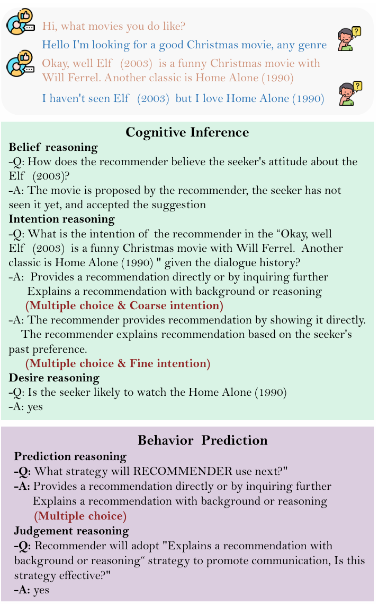

# ToM+Data-AAAI-2026-RecToM- A Benchmark for Evaluating Machine Theory of Mind in LLM-based Conversational Recommender Systems
> 说明：本文档内容默认使用中文生成（论文标题与必要专有名词除外）。

*论文下载地址：https://arxiv.org/pdf/2511.22275*

*代码是否开源：是 https://github.com/CGCL-codes/RecToM*

*分享人：马明晖*

## 一句话总结内容
> RecToM 是面向 LLM 驱动对话式推荐系统的 ToM 评测基准，用于检验模型对用户与推荐者心理状态及后续策略的推断能力。

## 一句话总结创新贡献
> 论文构建了首个面向真实推荐对话的人类标注 ToM 基准，并同时评估认知推断与行为预测两类能力。

## 举一个例子说明这篇文章的创新点
> 例如在“Elf (2003) is a funny Christmas movie...”这类对话中，同一句话可能同时包含推荐、解释和意图表达，RecToM 通过多选题分别考察粗粒度/细粒度意图、信念以及后续策略预测。

## 框架图

**框架工作流描述**：
> 作者从 REDIAL 电影推荐对话中筛选出 336 段高质量多轮对话，人工补充标注信念、欲望和意图等心理状态，构建 20,524 个 QA 对；随后用 5 个 SOTA LLM 在 zero-shot 与 CoT 两种提示下评测，并分析准确率、偏置与细粒度错误。

## 本文挑战及已有工作不足
> 1. 行为预测不仅要理解当前对话，还要判断下一步策略及其有效性，推理链更长
> 2. 细粒度意图区分比粗粒度分类更容易出错
> 3. 多选题扩大了候选空间，心理状态推断难度明显上升
> 4. 对话中的信念、欲望和意图会随轮次动态演化，模型难以持续跟踪

## 印象最深刻的点
> 1. 引入粗细粒度意图、信念和欲望等多维标注，问题设计更细致
> 2. 同时覆盖认知推断与行为预测，更贴近真实社交推理需求
> 3. 首次将机器理论心智评测系统引入 LLM-based 对话式推荐场景
> 4. 由 3 名博士生完成人工标注，Fleiss's K 达到 0.79，并提供 20,524 个 QA 对和 10 类问题类型

## 对我们的启发
> 1. 受 BDI 框架启发，将心理状态拆解为信念、欲望和意图
> 2. 受现有 ToM 基准偏重合成叙事、缺少真实对话复杂性的启发
> 3. 受 REDIAL 电影推荐对话语料及 IARD 筛选协议启发，构建真实推荐场景数据

## Idea是否好想
> 这项工作把 ToM 从一般叙事理解推进到真实推荐对话中的动态心理建模，强调“理解对方在想什么”和“下一步应该怎么做”两种能力的统一；这种拆分方式契合对话式推荐的交互本质，也揭示了当前 LLM 在多选推理、细粒度意图区分和策略判断上仍存在明显短板。

## 是否有开创性
> 首次提出面向 LLM-based conversational recommender systems 的人类标注 ToM 基准，并将评测扩展到动态对话中的心理状态推断与策略预测。

## 是否属于热点
> LLM-based CRS、Theory of Mind 评测、对话策略预测、心理状态推断、sycophancy 偏置

## 其他需要补充的点（可选）
> 1. CoT 提示在该任务中收益有限，部分设置下甚至会退化
> 2. 数据基于电影推荐对话，场景自然且具有真实的角色不对称性
> 3. 模型在判断题上存在明显的 affirmative bias，对 No 类别召回较低

## 与其他论文的关联（可选）
> 1. 数据来源于 REDIAL 电影推荐语料，并参考 IARD 筛选协议
> 2. 与 BDI 心智建模框架及 LLM-based conversational recommender systems 研究直接相关
> 3. 与 Hi-ToM、FANTOM、OpenToM、AutoToM、NegotiationToM、MumA-ToM、MMToM-QA 等 ToM 基准相关

## 还有哪些不足的地方（未来工作）
> 1. 结合更强的动态心智状态建模方法，提升对信念和策略的持续跟踪能力
> 2. 针对 affirmative bias 和细粒度混淆设计更稳健的评测与训练方法
> 3. 将评测扩展到更多推荐领域和更复杂的真实对话场景
