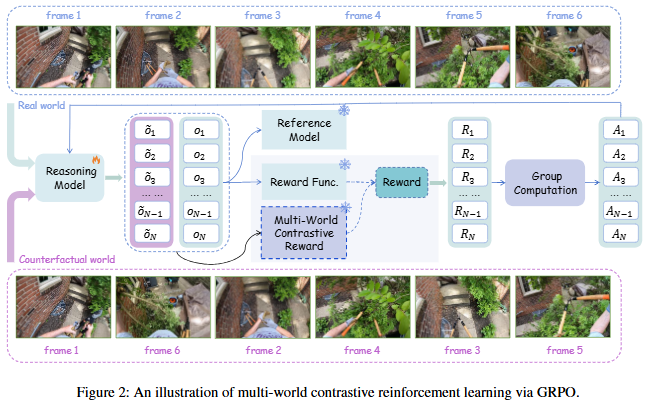

# ToM-AAAI-2026-Reality vs Counterfactual- Multi-World Contrastive Reinforcement Learning for Enhancing MLLM’s Theory of Mind in Egocentric Videos

*论文下载地址（可选）：https://ojs.aaai.org/index.php/AAAI/article/view/37162*

*代码是否开源：未提及*

*分享人：马明晖*

## 一句话总结挑战
> 如何让多模态大模型仅凭第一视角视频中的动作序列，稳定推断人的目标、信念及后续行为。

## 一句话总结创新贡献
> 提出多世界对比强化学习 MWCRL，通过真实世界与反事实世界的对比奖励，增强 MLLM 在第一视角视频中的 ToM 推理能力。

## 举一个例子说明这篇文章的创新点
> 将同一 ToM 问题分别输入真实动作序列和打乱后的反事实序列，只有当真实序列组的正确率显著高于反事实组时才给予额外奖励，从而迫使模型利用时序与因果演化信息推理。

## 框架图

**框架工作流描述**：
> 以 EgoToM 数据进行后训练，采用 GRPO 框架并结合格式奖励、答案奖励、长度奖励和多世界对比奖励；训练时为每个问题生成真实世界与反事实世界两组响应，比较两组正确率后决定是否施加对比奖励；最终在域内与跨域的多种 ToM 问题上进行评测。

## 本文挑战及已有工作不足
> 1. 第一视角视频中的目标、信念等心理状态不可直接观测，只能从动作序列中间接推断
> 2. 现有 ToM 研究多面向文本叙事或对话，与具身智能中的多模态第一视角场景存在模态错配
> 3. 通用 MLLM 缺少面向心理状态推理的专门训练信号，容易依赖孤立动作而非时序因果关系
> 4. 仅用 SFT 或 vanilla GRPO 难以稳定提升跨任务、跨域的 ToM 泛化能力，尤其是信念与动作推断

## 印象最深刻的点
> 1. OOD 评测仍带来 5.83% 的相对提升，说明方法具备一定跨域泛化能力
> 2. 论文还区分了目标、信念、下一动作三个子任务，揭示信念和动作推断是主要瓶颈
> 3. 能诱导更明确的自我验证式推理轨迹，如“Let’s verify”“Oh, I know”等
> 4. 域内综合性能达到 84.67%，较 backbone 提升 30.00%，较 vanilla GRPO 提升 2.00%

## 对我们的启发
> 1. 在 GRPO 这类组相对优化框架上加入面向序列因果推理的奖励设计，提升训练信号密度
> 2. 用真实世界与反事实世界构造对照信号，借鉴对比学习思想强化训练约束
> 3. 将具身智能中的 physical world model 扩展为 mental world model，把“理解物理环境”进一步延伸到“理解人的心理状态”

## Idea是否好想
> 这篇工作把 ToM 能力的核心困难从“识别单个动作”转向“识别动作序列背后的时序和因果规律”。其关键不在于增加更多监督样本，而在于通过真实/反事实的对比奖励压制捷径学习，让模型只有真正利用序列演化信息时才获得更高回报，因此更适合第一视角视频中的心理状态推理。

## 是否有开创性
> 首次将多世界对比强化学习用于增强第一视角视频中的 MLLM ToM 能力，并将真实序列与反事实序列的相对表现显式纳入奖励函数。

## 是否属于热点
> Theory of Mind, embodied AI, multimodal large language model, reinforcement learning, GRPO, egocentric video

## 其他需要补充的点（可选）
> 1. 作者指出多世界对比奖励更适合作为辅助信号，系数过大可能削弱答案奖励的作用
> 2. OOD 评测使用 EgoTaskQA 的四类问题：动作因果依赖、下一步动作、信念和多跳推理
> 3. 以 EgoToM 进行后训练，骨干模型为 Qwen2.5-VL-7B-Instruct，并在 VeRL 框架中实现 RL 训练

## 与其他论文的关联（可选）
> 1. 与 DeepSeek-R1、Video-R1 等 RL 式后训练工作在方法上相近，都强调用强化学习提升推理能力
> 2. 与 MMToM-QA、EgoToM、EgoTaskQA 等 ToM 数据集和基准直接相关
> 3. 与 TimeToM 相关，二者都关注 LLM/MLLM 的 ToM 建模，但本文面向第一视角视频而非纯文本

## 还有哪些不足的地方（未来工作）
> 1. 研究自适应奖励权重或课程式训练策略，降低对比奖励过强带来的性能波动
> 2. 设计更细粒度的反事实构造与奖励机制，覆盖更复杂的因果干预和长时序行为
> 3. 进一步扩展到更多具身任务与多模态场景，验证 ToM 能力的迁移性
