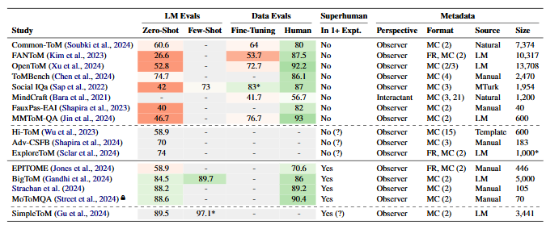

# ToM-ACL-2025-Machine Theory of Mind Needs Machine Validation

*论文下载地址（可选）：[https://aclanthology.org/2025.findings-acl.951.pdf](https://aclanthology.org/2025.findings-acl.951.pdf)*

*代码是否开源：未提及*

*分享人：马明晖*

## 一句话总结挑战
> 如何可靠评估语言模型的心理理论能力，并避免模型借助机器可利用的表面模式而非真实推理取得高分。

## 一句话总结创新贡献
> 作者综述16篇近期ToM评测研究，指出多数工作缺少针对机器可利用模式的验证，并通过小模型微调基线证明部分高分基准可能过于容易且存在虚假相关。

## 举一个例子说明这篇文章的创新点
> 提出“machine validation”这一面向机器主体的验证思路，并结合BERT、GPT-2和Flan-T5在多个ToM基准上的微调结果反向检验数据集难度。

## 框架图

**框架工作流描述**：
> 先在数据设计阶段加入噪声、干扰句、改写和对抗样本，尽量削弱表面线索；再在构建后训练简单微调基线，并检查词汇重叠、可解释性和异常高性能，以判断基准是否被机器捷径利用。

## 本文挑战及已有工作不足
> 1. 许多研究缺少人类基线或简单微调基线，难以定位任务难度与数据偏差
> 2. ToM基准通常按人类直觉设计，但模型可能借助人类不易察觉的表面模式取巧
> 3. 不同ToM数据集之间性能差异很大，使模型是否真正具备ToM能力难以判断
> 4. 现有工作多做“人类可识别”的数据检查，较少系统验证“机器可利用”的伪相关

## 印象最深刻的点
> 1. 在多个数据集上的微调实验表明，简单模型在部分基准上可达到异常高的准确率
> 2. 发现报告超人类性能的ToM基准普遍缺少机器验证
> 3. 对16篇近期ToM评测论文做了系统性综述，覆盖数据构建、验证与评估方式
> 4. 提出并强化了machine validation概念，明确区分人类验证与机器验证的作用

## 对我们的启发
> 1. 简单微调基线不仅是模型评估工具，也可以作为数据集诊断工具
> 2. 在数据设计阶段加入噪声、对抗样本和改写，有助于暴露伪相关
> 3. 评测基准不应只验证人类是否认为任务合理，还要验证模型是否在利用捷径

## Idea是否好想
> 本文的核心观点是：ToM研究的争议主要不在于模型是否真正拥有“心智理论”，而在于评测是否足够稳健。作者认为，许多ToM数据集只经过人类层面的合理性检查，却没有验证模型是否能利用词汇重叠、模板痕迹等表面规律，因此高分未必代表真正的心理状态推理。通过对已有工作和微调基线的分析，论文将“基准是否被机器捷径污染”提升为评测可信度的关键问题。

## 是否有开创性
> 新意在于将“machine validation”系统化地引入ToM评测综述，并用简单模型微调结果作为数据集诊断证据，形成了从数据设计、后验检查到基线验证的一套建议流程。

## 是否属于热点
> ToM评测、基准可信度、伪相关检测、数据集诊断、机器验证。

## 其他需要补充的点（可选）
> 1. 作者指出，仅凭人类基线不足以判断ToM任务难度，因为模型可能使用人类不会使用的线索
> 2. 论文强调评测应更贴近ToM实际使用条件，例如交互式、适应式或模拟环境式任务

## 与其他论文的关联（可选）
> 1. 与FANToM、Common-ToM、SimpleToM、BigToM等ToM基准直接相关
> 2. 与基准诊断和反捷径评测思路一致，如SQuAD不可回答问题、NLI中的启发式诊断、multi-hop QA中的对抗评测

## 还有哪些不足的地方（未来工作）
> 1. 将简单微调基线、统计分析和可解释性工具结合起来定位数据问题
> 2. 扩展到更多ToM相关数据集和更多类型的简单基线，以提高结论稳健性
> 3. 设计更具交互性、适应性和环境化的ToM评测，而不仅是静态观察者问答
> 4. 开发更系统的机器验证指标，用于检测ToM数据中的词汇重叠、模板痕迹和其他伪相关
