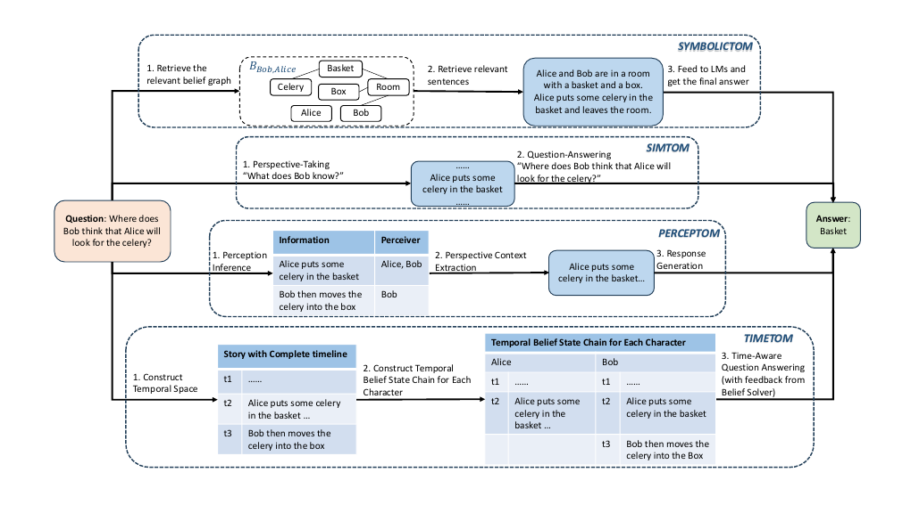

# ToM-ACL-2025-Theory of Mind in Large Language Models- Assessment and Enhancement

*论文下载地址（可选）：[https://aclanthology.org/2025.acl-long.1522.pdf](https://aclanthology.org/2025.acl-long.1522.pdf)*

*代码是否开源：未提及*

*分享人：马明晖*

## 一句话总结挑战
> 文章聚焦于如何更全面地评估并增强大语言模型对他人心理状态的稳定推理能力，尤其是在复杂且接近真实场景的ToM任务中。

## 一句话总结创新贡献
> 本文系统梳理了大语言模型ToM能力的评测基准与增强方法，并归纳了该方向的关键问题与未来研究路径。

## 举一个例子说明这篇文章的创新点
> 将2023年后新提出且高频使用的故事型ToM基准与最新增强方法进行系统整合和对比，补足了现有综述对最新研究覆盖不足的问题。

## 框架图

**框架工作流描述**：
> 文章沿评测与增强两条主线展开：先梳理文本与多模态故事型基准的演进、心理状态覆盖范围及其局限，再归纳提示驱动、微调和逆向规划等增强策略，最后总结共性不足并提出未来方向。

## 本文挑战及已有工作不足
> 1. 现有基准多聚焦belief相关问题，对其他心理状态覆盖不足，难以全面刻画LLM的ToM能力
> 2. 许多方法停留在被动观察式评测，难以检验模型作为主动交互体时的动态ToM能力
> 3. 不少评测依赖合成故事或合成视频，文本和场景都较简化，与真实社交互动仍有明显差距
> 4. ToM任务要求模型从故事、对话或视频中推断信念、意图、欲望和情绪等隐含心理状态，推理链条长且易出错

## 印象最深刻的点
> 1. 同时总结了评测基准演进与增强方法发展，形成了较完整的研究全景
> 2. 明确区分了文本型与多模态基准，并对心理状态覆盖范围进行了对比分析
> 3. 指出了开放式问答、真实场景迁移和主动交互评测中的关键缺口
> 4. 覆盖了2023—2025年间多个新提出且广泛使用的ToM评测基准，信息较新

## 对我们的启发
> 1. 探索更少依赖高成本符号标注和微调数据的增强策略
> 2. 设计从被动理解走向主动交互的动态ToM评测任务
> 3. 构建同时覆盖文本、视频和多轮交互的ToM评测体系
> 4. 将心理状态覆盖从单一belief扩展到更丰富的ATOMS维度

## Idea是否好想
> 本文属于综述与分析工作，不提出单一新模型，而是从评测与增强两个层面抽象ToM研究的主流路线。其核心价值在于把分散的基准、任务设置和增强方法放到统一框架中比较，揭示当前研究主要围绕belief展开、对真实交互与多模态推理关注不足，以及开放式和主动式ToM评测仍存在空缺等问题。

## 是否有开创性
> 新颖性主要体现在对2023年后的ToM研究进行了更系统、更及时的整合，并同时深入分析故事型基准演进与增强策略谱系，而不只是单一基准回顾。

## 是否属于热点
> ToM、LLM能力评估、心理状态推理、故事型基准、多模态ToM、提示工程、主动交互评测

## 其他需要补充的点（可选）
> 1. 部分自动评测工具依赖模型自身的ToM能力，可能引入评估偏差
> 2. 作者指出当前多模态ToM基准主要集中在家庭场景和合成视频，向真实场景迁移仍是难点
> 3. 文中将MMToM-QA和MuMA-ToM中的goals视为与ATOMS框架中的intentions等价

## 与其他论文的关联（可选）
> 1. 与情感对话和共情任务有交叉，但本文更关注信念、意图和知识推断
> 2. 与用户心智建模、个性化对话存在关联，但本文不以个性化建模为主
> 3. 与理论心智ToM任务直接相关，属于心理状态推断和社会认知评测方向

## 还有哪些不足的地方（未来工作）
> 1. 扩展ToM评测与增强所覆盖的心理状态范围，不再局限于belief
> 2. 探索更适合开放式问答的ToM增强方法，并降低对合成数据和家庭场景的依赖
> 3. 引入更多真实多模态内容，如短片、漫画和更丰富的视觉场景
> 4. 从被动故事理解转向主动交互式ToM评测，检验模型作为智能体时的动态推理能力
