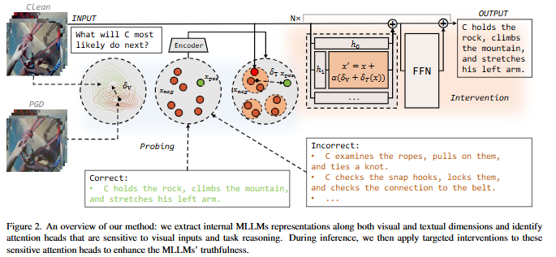

# ToM-CVPR-2026-Video-Only ToM- Enhancing Theory of Mind in Multimodal Large Language Models

*论文下载地址（可选）：未提及*

*代码是否开源：未提及*

*分享人：马明晖*

## 一句话总结挑战
> 如何让多模态大语言模型在仅依赖视频和问题输入、且易受语言先验与幻觉干扰的情况下，稳定推断人物的意图、信念和目标等心理状态。

## 一句话总结创新贡献
> 本文提出 VisionToM，通过对注意力头进行可解释探测与定向干预，联合增强视觉注意和 ToM 推理，从而提升视频场景下的心理理论问答能力。

## 举一个例子说明这篇文章的创新点
> 在 EgoToM 的 future goal 问题中，模型可能受语言先验影响给出错误答案；VisionToM 先定位对视觉输入和 ToM 推理敏感的注意力头，再注入对应干预向量，将预测拉回到与视频证据一致的目标推断。

## 框架图

**框架工作流描述**：
> 先用正负样本探测多层注意力头，筛选出对视觉注意和 ToM 推理最敏感的头；再对 ToM 负样本做聚类，学习各类错误到正确表示的校正方向；最后在推理时将干预向量加到选定注意力头上，以提升视频仅输入场景下的回答准确性。

## 本文挑战及已有工作不足
> 1. 现有 ToM 评测大量依赖文本，忽视了真实交互中更常见的视觉主导场景
> 2. 许多多模态 ToM 基准依赖模拟环境，缺少真实世界视频的感知复杂性与生态有效性，泛化性有限
> 3. 多模态大语言模型容易受语言先验和幻觉影响，在多项选择式 ToM 问答中给出与视频证据不一致的答案
> 4. 视频仅输入的 ToM 任务需要从动态且不完全可见的视觉信息中推断他人的信念、意图和目标，推理难度高

## 印象最深刻的点
> 1. 方法可直接适配多类别任务，不局限于二分类 ToM 设置
> 2. 只使用原始视频和问题输入，不依赖手工提示或外部语言标注
> 3. 在 EgoToM 的 goal、belief、action 三项任务上均带来提升
> 4. 在冻结骨干模型的前提下完成探测与干预，训练和推理开销较低

## 对我们的启发
> 1. 先用可解释性分析定位模型内部的敏感注意力头，再进行定向编辑，而不是直接端到端微调
> 2. 通过对负样本聚类，显式刻画同一任务中不同类型的推理失败，从而获得更细粒度的校正方向
> 3. 将 ToM 视为与认知科学中的因果推理一致的过程，围绕环境、信念、目标和行动之间的关系设计干预

## Idea是否好想
> 本文将 ToM 能力不足拆解为两类内部问题：视觉注意不稳定和 ToM 推理表征混杂。作者先用探测器定位对这两类信息最敏感的注意力头，再分别学习视觉增强向量和 ToM 推理校正向量，并在推理时直接注入注意力层。相比黑盒提示或整体微调，这种方式更可解释，也更适合视频-only 条件下抑制语言偏置与幻觉。

## 是否有开创性
> 创新主要体现在三点：用跨任务一致的视觉注意头做统一增强；对 ToM 推理部分通过聚类后的负样本原型学习多种校正方向；并将两类干预合并到注意力头级别的推理阶段，实现冻结骨干的轻量编辑。

## 是否属于热点
> 多模态大语言模型的可解释干预、视频 Only ToM、幻觉抑制、注意力头编辑、心理理论评测

## 其他需要补充的点（可选）
> 1. PGD 生成的对抗样本比随机噪声更适合作为视觉注意增强的负样本
> 2. 作者观察到视觉注意具有跨任务一致性，而 ToM 内部表征在不同任务间分化、在单任务内较一致
> 3. 实验覆盖 EgoToM 的 goal、belief、action 三项子任务，并加入开放式生成任务补充评估

## 与其他论文的关联（可选）
> 1. 与仅做提示工程或黑盒评测的 ToM 方法相比，本文强调内部机制分析与可解释干预
> 2. 与以文本为主的机器 ToM 工作相比，本文聚焦真实世界视频中的视觉主导推理
> 3. 与 GridToM 相比，本文不再直接用二分类逻辑回归系数作为干预方向，而是对负样本表示聚类并学习更细粒度的校正向量

## 还有哪些不足的地方（未来工作）
> 1. 探索更自动化的注意力头选择与校正向量学习机制，降低人工分析依赖
> 2. 评估该干预框架与其他多模态架构的兼容性，以及对长视频推理的适应性
> 3. 扩展到更多视频 ToM 数据集和更复杂的开放场景，验证方法的泛化能力
