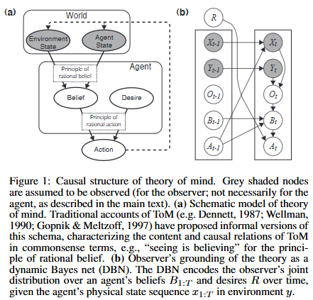

# ToM-CogSci-2011-Bayesian Theory of Mind- Modeling Joint Belief-Desire Attribution

*论文下载地址（可选）：https://www.semanticscholar.org/paper/Explore-Theory-of-Mind%3A-Program-guided-adversarial-Sclar-Yu/3c52a1e1c3dc0ef5e1e638e11bbc3a2f09900dc6*

*代码是否开源：未提及*

*分享人：马明晖*

## 一句话总结挑战
> 如何仅依据可观察行为序列，在环境信息不完整且同一行为可由多种心智状态解释时，推断个体的信念与欲望。

## 一句话总结创新贡献
> 本文将ToM形式化为对POMDP的贝叶斯逆推断，并联合预测被试对代理人信念与欲望的判断。

## 举一个例子说明这篇文章的创新点
> 在“先查看被遮挡区域、发现不是目标后再返回次优目标”的轨迹中，模型能够推断代理人更偏好未显式出现的目标，而不只是其当前看到的目标。

## 框架图

**框架工作流描述**：
> 先将环境状态、代理位置、可见性和奖励偏好形式化为POMDP，再基于观察到的动作轨迹对候选信念分布与奖励函数做贝叶斯反演，最终得到各可能世界及目标偏好的联合后验。

## 本文挑战及已有工作不足
> 1. 已有方法多侧重目标或偏好推断，较少统一刻画信念更新与行动规划
> 2. 仅凭行为反推信念和欲望是欠定问题，同一行为可由多种心智状态组合解释
> 3. 信念与欲望彼此耦合，强欲望可能掩盖弱信念，反之亦然，增加了联合推断难度
> 4. 代理人的观察与信息获取过程通常不可直接观测，却会显著影响信念更新和后续行动

## 印象最深刻的点
> 1. 实验表明，模型在信念和欲望判断上都优于简化基线，尤其对欲望判断拟合更好
> 2. 将ToM统一表述为POMDP上的逆规划与贝叶斯推断
> 3. 同时建模代理人的主观信念、欲望及其随观察变化的更新过程
> 4. 设置去除真实世界知识和去除信念更新的对照模型，用于检验完整表示的必要性

## 对我们的启发
> 1. POMDP提供了统一表示观察、信念更新和规划的形式化框架
> 2. 逆规划和逆决策理论为从行为反推目标提供了基础
> 3. 贝叶斯推断适合处理心智状态推断中的不确定性和上下文依赖性

## Idea是否好想
> 本文的核心思想是把“看见什么、相信什么、想要什么、会怎么做”放进同一个生成式模型中，再从行为序列反向推断隐藏心智状态。这样做的关键优势在于，它不再把信念推断和欲望推断分开处理，而是让两者在同一后验中相互约束；同时，观察过程被显式建模，使错误信念、部分可见和探索行为都能自然解释。本质上，这是一种带部分可观测性的意图识别。

## 是否有开创性
> 相较于仅推断目标或仅处理错误信念的早期模型，本文显式反演POMDP，联合推断信念与欲望，并将信念更新与行动规划纳入统一的贝叶斯框架。

## 是否属于热点
> 心理理论、贝叶斯推断、逆规划、POMDP、社会认知建模

## 其他需要补充的点（可选）
> 1. 实验采用简单空间场景和食物车路径任务，便于控制可见性和推断线索
> 2. 模型无需显式拆解成子目标序列，也能解释部分带有信息搜寻特征的行为
> 3. 被试对欲望判断通常强于对信念判断，符合“从动作到欲望更直接、到信念更间接”的不对称性

## 与其他论文的关联（可选）
> 1. Baker et al., 2009 的 inverse planning 为本文的目标和偏好推断提供了直接基础
> 2. Goodman et al., 2006 的 false belief 模型处理了信念与欲望交互，但更依赖任务特定参数
> 3. Zettlemoyer et al., 2009 的 belief filtering 与本文的信念更新推断在形式上相关

## 还有哪些不足的地方（未来工作）
> 1. 引入中间层表示，用于建模目标序列和子目标分解
> 2. 进一步区分代理人的一般欲望与特定时刻的目标或意图
> 3. 扩展到更复杂的任务空间以及更一般的状态和动作结构
> 4. 研究在更自然场景下对观察噪声和行为不理性的鲁棒推断
