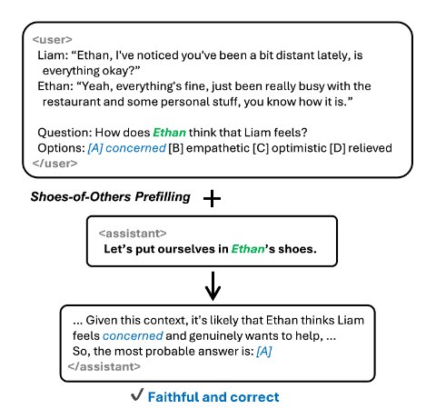

# ToM-EACL-2026-Lets-Put-Ourselves-in-Sallys-Shoes-Shoes-of-Others-Prefilling-Improves-Theory-of-Mind-in-LLMs.md
*论文下载地址（可选）：[https://aclanthology.org/2026.findings-eacl.6/]*
*代码是否开源：否*
*分享人：马明晖*

## 一句话总结内容
> 本文提出**SoO（Shoes-of-Others）prefilling**推理时间优化方法，通过在模型输出开头固定加入“Let’s put ourselves in A’s shoes.”引导视角切换，显著提升LLM在信念、意图、欲望、情绪、知识五类心智理论（ToM）任务的表现。

## 一句话总结创新贡献
> 提出极简通用的输出前缀引导法SoO prefilling，无需微调、不依赖场景假设，通过强制视角切换提升推理忠实度，在一阶/二阶ToM任务全面优于CoT，且不依赖延长思考长度。

## 举一个例子说明这篇文章的创新点
> 传统CoT会让模型“一步步想”，但容易出现推理与答案不一致；SoO直接让模型站在角色视角思考：“Let’s put ourselves in Ethan's shoes.”，模型会更忠实从角色所知、所感出发推理，正确率更高且不瞎编理由。

## 框架图
`
> 
> **框架工作流描述**：1. 从问题中提取目标角色名；2. 在模型输出开头固定前缀：“Let’s put ourselves in {name}’s shoes.”；3. 模型继续生成推理与答案；4. 因强制视角切换，提升ToM推理忠实度与准确率。

## 本文挑战及已有工作不足
1. 现有ToM推理方法多针对“物体位置改变”类场景，无法通用。
2. 微调ToM数据集会导致过拟合、泛化下降。
3. CoT容易出现**推理不忠实**（思考与答案矛盾）。
4. 缺少简单、零训练、全场景通用的ToM增强方法。
5. 多数方法无法同时提升信念/意图/情绪/知识等多维度心智能力。

## 印象最深刻的点
> 只用一句固定输出前缀，不训练、不修改模型，就能全面提升一阶、二阶心智理论，且效果来自**更忠实的视角推理**，不是靠把思考变长。

## 对我们的启发
1. 输出前缀（prefilling）比提示词（prompting）更能强制模型思维方向。
2. 视角切换是提升ToM最简单有效的核心开关。
3. 忠实推理比长推理更关键，可显著提升社会认知能力。
4. 推理期优化可替代微调，避免泛化丢失。

## Idea是否好想
> Idea极简、极优雅、零成本、全场景通用，是典型“小改动、大提升”的高质量工作。

## 是否有开创性
> 是开创性工作；首次将prefilling用于视角切换与ToM增强，建立“忠实推理→ToM提升”的明确路径。

## 是否属于热点
> 属于顶级热点：心智理论（ToM）、推理忠实度、推理期优化、共情对话、社会智能。

## 其他需要补充的点（可选）
> 支持5类心理状态：信念、意图、欲望、情绪、知识。
> 验证数据集：ToMATO（对话）、ToMBench（叙事）。
> 关键结论：必须指定角色名才有效；效果来自忠实度，非长度；对真假信念均有效。

## 与其他论文的关联（可选）
> 基于视角切换理论、ToM评测、prefilling机制、CoT；区别于传统场景限定方法，SoO无假设、全场景通用。

## 还有哪些不足的地方（未来工作）
1. 无法用于闭源模型（不支持输出前缀指定）。
2. 可扩展到多角色、高阶ToM、动态对话。
3. 可与CoT、Self-Consistency结合进一步提升。
4. 可应用于共情对话、劝说、谈判等社交任务。
5. 可探究神经与注意力机制解释SoO生效原因。