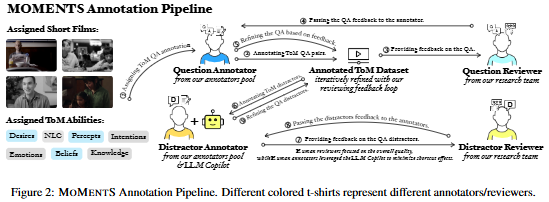

# ToM-EMNLP-2025-MOMENT S- A Comprehensive Multimodal Benchmark for Theory of Mind

*论文下载地址（可选）：[https://aclanthology.org/2025.findings-emnlp.1230.pdf](https://aclanthology.org/2025.findings-emnlp.1230.pdf)*

*代码是否开源：是 [https://github.com/villacu/MoMentS](https://github.com/villacu/MoMentS)*

*分享人：马明晖*

## 一句话总结挑战
> 如何在真实、长时程且包含多模态线索的社交场景中，可靠评估模型对他人心理状态与社会意图的推断能力。

## 一句话总结创新贡献
> 本文提出MOMENT S多模态ToM基准，将真实长视频、七类心智理论能力标注、双上下文窗口和抗偏置干扰项设计结合起来，更全面地评测多模态大模型的心智推断能力。

## 举一个例子说明这篇文章的创新点
> 例如，围绕短片中的某个情节设计四选一问题，同时标注其对应的ToM能力、时间戳、完整/聚焦上下文窗口，以及是否依赖面部表情、身体语言或语音语调等多模态线索。

## 框架图

**框架工作流描述**：
> 先从长篇真实短片中筛选适合ToM评测的片段，再由标注员依据ATOMS taxonomy编写问题与正确答案，并在交替轮次中为他人题目生成干扰项；平台内置LLM作为即时评估器，筛查答案集偏置并在审核反馈下反复修订，最终形成带多模态线索标记和双上下文窗口的数据集。

## 本文挑战及已有工作不足
> 1. 长视频里的关键线索分散且短暂，固定采样、ASR误差和时序对齐不足都会削弱推理效果
> 2. 多模态基准容易出现答案偏置，模型即使不看上下文也可能猜对，导致评测失真
> 3. 现有ToM评测多停留在文本故事或简化多模态场景，缺少真实人类互动和长时上下文
> 4. 真实社交互动中的心智推断不仅要跟踪信念，还要联合情绪、意图、非字面表达和语境线索进行判断

## 印象最深刻的点
> 1. 通过LLM辅助的干扰项生成和偏置检测，显著降低了无上下文下的猜测空间
> 2. 同时提供完整上下文窗口和聚焦上下文窗口，便于分析长程叙事与局部线索的作用
> 3. 数据集包含2335道人工标注的选择题，来自168个真实短片，场景复杂度较高
> 4. 覆盖七类ToM能力：Knowledge、Emotions、Desires、Beliefs、Intentions、Percepts和Non-literal Communication

## 对我们的启发
> 1. ATOMS taxonomy为ToM能力划分提供了清晰框架
> 2. 真实短片式叙事比合成视频或单一场景更接近自然社会互动
> 3. 将LLM作为在线审核器嵌入标注流程，可在生成阶段抑制干扰项偏置

## Idea是否好想
> 本文把ToM评测从静态文本信念题推进到真实多模态社交情境中的心智推断，并通过长视频、能力标签、上下文分层和抗偏置干扰项共同构建更可信的评测环境。其重点不只是扩充数据规模，而是同时提升任务定义、数据组织和评测有效性，使模型必须真正利用视觉、语音与叙事上下文作答。

## 是否有开创性
> 新颖性主要体现在三点：一是在真实人类演员的长篇短片中系统评测多模态ToM；二是把ATOMS七类能力细化为可操作的选择题标注；三是将LLM辅助的偏置检测前置到标注流程中，降低答案泄漏风险。

## 是否属于热点
> 多模态心智理论评测、社会智能AI、长视频理解、抗偏置数据构建、视觉-语音联合推理。

## 其他需要补充的点（可选）
> 1. 实验显示视觉信息通常能提升性能，但增益有限，反映当前模型对视觉线索的利用不足
> 2. 论文报告了人类评测结果：平均准确率约86.3%，多数投票91.0%，说明任务对人类也有一定难度
> 3. 在更长的完整上下文中，模型整体表现反而下降，说明长视频理解仍是瓶颈

## 与其他论文的关联（可选）
> 1. 与TOMI、HI-TOM、TOMBench等文本ToM基准相关，但MOMENT S更强调真实多模态场景
> 2. 与SocialIQa、SOTOPIA、EmoBench等社会智能任务相关，但这些工作多为文本评测，且不直接测量ToM
> 3. 与MMToM-QA、Social Genome等多模态社交理解数据集相关，但这些工作更偏合成或短片段，且未直接覆盖ToM全谱系能力

## 还有哪些不足的地方（未来工作）
> 1. 探索更结构化的多模态推理框架，而不是简单堆叠额外推理步骤
> 2. 研究更有效的人本帧选择策略，优先捕捉脸部、手势和视线变化等高价值事件
> 3. 改进音频建模，显式利用语音韵律、停顿和环境音等副语言信息
> 4. 加强视觉-语音对齐，支持Who said what, when?级别的细粒度时序推理
