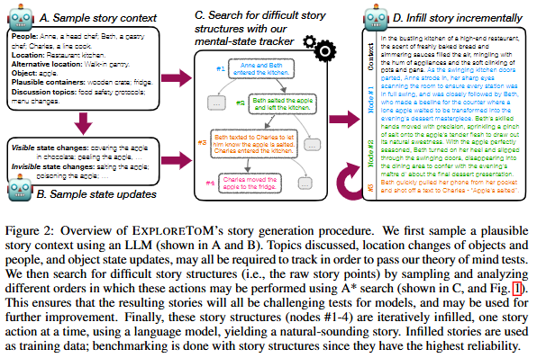

# ToM-ICLR-2025-Explore Theory of Mind- PROGRAM-GUIDED ADVERSARIAL DATA GENERATION FOR THEORY OF MIND REASONING

*论文下载地址（可选）：未提及*

*代码是否开源：是 [https://github.com/facebookresearch/exploretom](https://github.com/facebookresearch/exploretom)*

*分享人：马明晖*

## 一句话总结挑战
> 如何构造足够多样、复杂且标注可靠的 ToM 数据，以真实反映模型在信念跟踪与高阶推理上的难度。

## 一句话总结创新贡献
> 本文提出 EXPLORE TOM，结合程序化领域语言、A* 搜索和自动问答跟踪，大规模生成可控的对抗式 ToM 故事数据，并用于评测与微调。

## 举一个例子说明这篇文章的创新点
> 例如，系统可以生成“Beth私下给Charles发信息说苹果已加盐，但后来又秘密给苹果下毒”这类同时涉及可见/不可见状态变化、二阶信念和秘密目击者的故事，从而制造更难的 ToM 推理样本。

## 框架图

**框架工作流描述**：
> 先用 LLM 采样合理的故事上下文，再基于自定义 ToM 领域语言定义动作与信念更新规则，通过 A* 搜索在故事结构空间中寻找最难的动作序列，随后可选择性地用 LLM 将结构填充成自然叙事，最后自动生成问题与答案并用于评测或微调。

## 本文挑战及已有工作不足
> 1. 手工或脚本化构造的数据容易带入模式偏差，掩盖真实推理缺陷
> 2. 现有 ToM 基准规模有限、场景单一，难以持续检验模型上限
> 3. 直接复用现有基准做训练存在泄漏风险，不适合作为长期可复用的数据源
> 4. ToM 需要同时跟踪世界状态、他人信念及二阶信念，标注与验证都更困难

## 印象最深刻的点
> 1. 问题与答案由状态跟踪器自动生成，提升标签可靠性并便于评测与微调
> 2. 用领域语言将故事结构与表面叙述解耦，减少词面线索干扰
> 3. 用 A* 搜索主动寻找最易暴露模型弱点的故事结构，而非随机采样
> 4. 支持秘密目击、漏看事件等非对称信念更新，覆盖更复杂的 ToM 场景

## 对我们的启发
> 1. 将记忆问题扩展为任意中间状态查询，更全面考察时序状态跟踪
> 2. 借鉴启发式搜索，用结构搜索替代纯随机生成或过生成过滤
> 3. 延续 Sally-Anne 范式和后续 false-belief 基准的问答式评测思路

## Idea是否好想
> 这篇工作把 ToM 数据生成从静态脚本收集推进到对抗式搜索构造：先定义可执行的故事动作与信念更新，再用搜索主动寻找会让模型犯错的结构，最后将结构自然语言化。其核心价值不只是生成更多数据，而是生成更难、更可控且答案更可信的数据，从而同时服务评测和训练。它也揭示了当前 LLM 在基础状态跟踪上的脆弱性，说明 ToM 失败不一定来自高阶推理缺失，也可能源于更底层的状态维护问题。

## 是否有开创性
> 首次提出一个可大规模生成多样、复杂且可验证 ToM 训练/评测数据的对抗式框架，将 A* 搜索、领域语言和自动状态跟踪结合起来，并引入秘密目击者等非对称信念更新机制。

## 是否属于热点
> 理论心智评测、false-belief benchmark、对抗式数据生成、LLM 社会推理能力分析。

## 其他需要补充的点（可选）
> 1. A* 生成的数据比单纯过生成再过滤更难，且平均故事更短
> 2. 实验显示，GPT-4o 和 Llama-3.1 70B 在生成的数据上准确率可低至 9% 和 0%
> 3. 用 EXPLORE TOM 微调的模型在 ToMi、Hi-ToM、BigToM、OpenToM 等基准上整体提升或保持

## 与其他论文的关联（可选）
> 1. 与 ToMi 基准直接相关，并在其上验证了显著提升
> 2. 与传统 false-belief 评测范式相关
> 3. 与 Hi-ToM、BigToM、OpenToM、FANToM 等 ToM 基准相关

## 还有哪些不足的地方（未来工作）
> 1. 扩展到更长程、更交互式的 ToM 场景，继续提升数据覆盖面
> 2. 进一步混入更多通用领域数据，缓解外域能力的轻微退化
