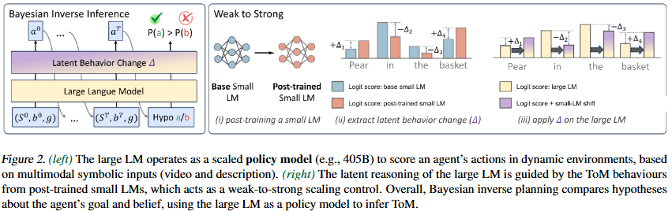

# ToM-ICML-2025-Overcoming Multi-step Complexity in Multimodal Theory-of-Mind Reasoning- A Scalable Bayesian Planner

*论文下载地址（可选）：https://arxiv.org/abs/2506.01301*

*代码是否开源：未提及*

*分享人：马明晖*

## 一句话总结挑战
> 如何在多模态场景中稳定、可扩展地完成多步Theory-of-Mind推理，并避免随着任务步数增加而出现性能快速退化。

## 一句话总结创新贡献
> 提出一种可扩展的贝叶斯ToM规划框架，通过逐步贝叶斯更新与弱到强控制，将小模型学到的ToM偏好迁移到大模型上，从而增强复杂多模态ToM推理能力。

## 举一个例子说明这篇文章的创新点
> 将ToM推理拆解为状态转移、信念更新和动作似然估计等逐步贝叶斯更新过程；再用经过ToM后训练的小模型调控更大的语言模型，使大模型在推理时继承ToM特化行为。

## 框架图

**框架工作流描述**：
> 先将多模态输入统一表示为场景、动作和心智状态假设，再通过Bayesian inverse planning逐步更新目标与信念；随后对小模型进行指令微调和偏好优化以学习ToM特化行为，最后在推理阶段用弱到强控制机制把这些行为转移到大模型上完成动作似然估计和心智状态推断。

## 本文挑战及已有工作不足
> 1. 任务通常包含多步规划与长链条信念更新，步数增加时误差容易累积并放大
> 2. 现有CoT、o1类推理增强和小规模微调方法在复杂度上升时容易出现性能平台或快速退化
> 3. 多模态ToM推理需要同时整合视觉、文本和上下文信息，难度显著高于单一模态推理
> 4. 仅靠直接后训练大模型或只做推理时扩展，难以同时兼顾稳定性、可扩展性和ToM特化能力

## 印象最深刻的点
> 1. 实验系统分析了模型规模、后训练、控制器缩放以及跨场景迁移的影响
> 2. 在多模态ToM基准上取得了4.6%的准确率提升，并在未见场景中保持较强泛化
> 3. 给出了将复杂ToM推理显式分解为逐步贝叶斯更新的形式化建模方式
> 4. 通过弱到强控制，把小模型学到的ToM偏好迁移到更大的语言模型上，兼顾专门性与通用知识

## 对我们的启发
> 1. POMDP中的信念更新思想
> 2. Bayesian inverse planning
> 3. 大模型承载通用知识、小模型提供任务特化偏置的分工思路
> 4. 弱到强迁移与行为控制

## Idea是否好想
> 本文的核心思路不是简单堆叠推理步骤，而是把ToM任务中的多步复杂性显式建模为Bayesian更新过程，再用后训练得到的小模型作为控制器去重定向大模型的输出分布。这样既利用大模型的世界知识，又利用小模型对ToM场景的特化学习，缓解了多步推理边界和规模不足两个瓶颈。

## 是否有开创性
> 将多模态ToM推理、Bayesian inverse planning和弱到强控制结合成一个可扩展框架，并用大模型作为主策略模型、小模型作为行为调制器来实现推理能力转移。

## 是否属于热点
> 多模态Theory-of-Mind、Bayesian规划、弱到强对齐、长链推理可扩展性

## 其他需要补充的点（可选）
> 1. 将弱控制器规模缩小到4B后仍能保持较好性能，说明控制器本身也具有较强压缩潜力
> 2. 实验使用MMToM和MMToM-QA等数据，并在VirtualHome模拟环境上构造训练与评测样本
> 3. 作者观察到模型规模提升对belief inference尤其关键，而goal inference更依赖场景适配和动态环境理解

## 与其他论文的关联（可选）
> 1. 与CoT、o1/r1类推理时扩展方法形成对比
> 2. 继承并扩展了Bayesian inverse planning框架
> 3. 与BIPALM、SimToM、SymbolicToM等ToM推理方法直接相关

## 还有哪些不足的地方（未来工作）
> 1. 进一步探索更大规模或更高效的控制器缩放策略
> 2. 探索减少后训练成本、提升推理效率的实现方式
> 3. 研究该Bayesian ToM框架在更多真实世界多模态场景中的泛化能力
