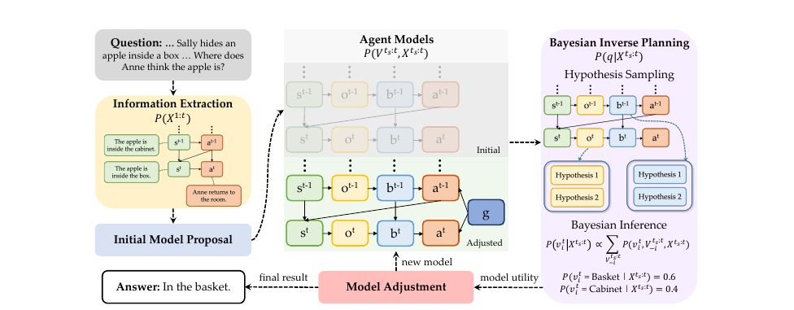

# ToM-NeurIPS-2025-AutoToM- Scaling Model-based Mental Inference via Automated Agent Modeling

*论文下载地址（可选）：未提及*

*代码是否开源：未提及*

*分享人：马明晖*

## 一句话总结挑战
> 如何在不预设人工代理模型的前提下，稳定地从复杂行为与长上下文中推断任意心理变量。

## 一句话总结创新贡献
> 本文提出AutoToM，通过自动代理建模结合贝叶斯逆规划的迭代推断，实现了可扩展、稳健且可解释的心智推断。

## 举一个例子说明这篇文章的创新点
> 在错误信念场景中，AutoToM先依据上下文生成最小初始模型，再根据不确定性自动补充信念变量和额外时间步，最终将模糊判断收敛为高置信度后验。

## 框架图

**框架工作流描述**：
> 系统先从题目与上下文中抽取相关状态、动作和话语，再自动提出初始代理模型；随后借助LLM进行假设采样、筛除与贝叶斯逆规划；若置信度不足，则继续调整变量与时间步，直到模型效用满足要求并输出最终心理推断结果。

## 本文挑战及已有工作不足
> 1. 现有提示式LLM方法在复杂场景中容易出现系统性错误，稳定性不足
> 2. 现有模型化ToM方法依赖人工指定心理变量、因果结构和推断流程，通用性与扩展性有限
> 3. 长上下文、多角色、多模态输入与高阶递归推理会进一步放大建模和推断难度
> 4. 不同任务、领域和递归层级所需的代理模型差异很大，难以用单一固定模板覆盖

## 印象最深刻的点
> 1. 提出统一的模型化ToM推断框架，可覆盖多类贝叶斯逆规划实现
> 2. 实现自动代理模型发现，显著减少对人工模型规格的依赖
> 3. 将LLM嵌入贝叶斯逆规划流程，自动完成假设提出、筛除与后验推断
> 4. 通过效用驱动的变量与时间步调整，在置信度和计算成本之间取得平衡

## 对我们的启发
> 1. 参考主动模型选择思想，用推断不确定性与模型复杂度共同衡量模型效用
> 2. 利用LLM进行自动假设提出与模型修正，延续自动建模与归纳推理结合的思路
> 3. 借鉴贝叶斯逆规划和贝叶斯心智理论，将行为解释为由潜在心理状态生成的概率过程

## Idea是否好想
> 这项工作把ToM从直接提示式问答推进到先自动生成并修正代理模型、再进行推断的范式。其核心不是预先固定信念、目标或时间深度，而是让系统根据问题和不确定性自动选择需要哪些心理变量、要看哪些时间步，以及需要多复杂的因果结构。这样既保留了模型化方法的可解释性和鲁棒性，也缓解了人工建模成本高、跨域泛化弱的问题。

## 是否有开创性
> 创新点主要在于将自动代理模型发现与自动化贝叶斯逆规划结合起来，形成面向心智推断的端到端自动化框架，而非单点提示改进。

## 是否属于热点
> 理论心智、自动建模、贝叶斯逆规划、LLM与符号/概率推理结合、复杂推理与可解释AI

## 其他需要补充的点（可选）
> 1. 方法支持开放域ToM，目标是适配任意心理变量、任意上下文、任意数量代理和任意递归层级
> 2. 模型效用通过推断置信度与计算复杂度的权衡来定义，鼓励简洁且有效的模型
> 3. 作者强调AutoToM对LLM后端不敏感，更换后端后仍能显著优于原始LLM表现

## 与其他论文的关联（可选）
> 1. 与BIP-ALM、LIMP等模型化ToM方法相关，但AutoToM摆脱了手工模型结构与变量定义
> 2. 与SimToM、PercepToM、TimeToM、SymbolicToM等提示式ToM方法相关，但AutoToM更偏向显式模型化推断
> 3. 与thought-tracing相近，都维护假设，但AutoToM进一步显式建模因果结构并自适应调整模型复杂度

## 还有哪些不足的地方（未来工作）
> 1. 进一步提升多模态输入下的推断鲁棒性与效率
> 2. 结合人类反馈持续修正模型结构与假设空间
> 3. 将自动代理模型发现扩展到更复杂、更开放的现实交互场景
