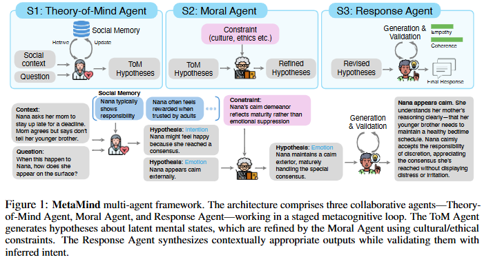

# ToM-NeurIPS-2025-MetaMind- Modeling Human Social Thoughts with Metacognitive Multi-Agent Systems

*论文下载地址（可选）：[https://arxiv.org/abs/2505.18943](https://arxiv.org/abs/2505.18943)*

*代码是否开源：是 [https://github.com/XMZhangAI/MetaMind](https://github.com/XMZhangAI/MetaMind)*

*分享人：马明晖*

## 一句话总结挑战
> 如何让大模型在含蓄、歧义且受文化规范约束的社交语境中，准确推断他人未明说的意图、情绪与信念，并给出恰当回应。

## 一句话总结创新贡献
> 本文提出 MetaMind，通过“心智状态假设生成—道德/规范约束修正—响应生成与验证”的三阶段多智能体框架，系统增强大模型的 ToM 推理与社交理解能力。

## 举一个例子说明这篇文章的创新点
> 例如面对“房间里很冷”这类含蓄表达时，系统会先推断其可能是请求关窗或表达不适，再结合文化规范与场景约束修正判断，最后生成兼具共情和上下文一致性的回复。

## 框架图

**框架工作流描述**：
> 输入用户话语、社交上下文和社交记忆后，ToM Agent 先生成多个潜在心智状态假设；Moral Agent 基于文化规范、伦理约束和角色期望筛选并重写假设；Response Agent 在选定假设和记忆条件下生成回复，并通过自我验证检查共情性与上下文一致性，必要时触发重生成。

## 本文挑战及已有工作不足
> 1. 社交理解依赖上下文与历史记忆，模型在多轮互动中的一致性和跨场景泛化仍然不足
> 2. 现有提示式、角色扮演式或偏好对齐方法多停留在表层，对复杂社交推理缺少可解释的分层过程
> 3. 现实交流常伴随歧义、讽刺、间接请求和文化差异，单步预测往往难以稳定处理
> 4. 社交对话中大量关键信息是隐含的，模型需要从字面语义之外推断意图、情绪、信念和需求

## 印象最深刻的点
> 1. 在三个社交智能基准上取得新的最优结果，并在真实社交场景任务中带来明显提升
> 2. 消融实验表明三阶段结构、社交记忆和响应验证都不可或缺，并提升了共情性与上下文一致性
> 3. 在 ToM 相关任务上提升显著，部分关键维度接近人类平均水平
> 4. 框架对多种 LLM 骨干都有效，开源与闭源模型都能受益，通用性较强

## 对我们的启发
> 1. 借鉴元认知理论，把反思、修正和自我监控显式引入 LLM 推理过程
> 2. 借鉴人类社交认知的分阶段处理方式，将假设、约束和表达拆分为协作模块
> 3. 借鉴 Theory of Mind 理论，将社交理解建模为对他人不可观测心智状态的推断

## Idea是否好想
> 本文的核心思路不是直接让模型给出答案，而是先像人一样对社交语句进行多假设推断，再用规范与伦理进行二次筛选，最后对输出进行一致性验证。这样把原本单步的社交理解问题改造成可迭代、可约束、可回溯的认知流程，更适合处理含蓄表达和复杂社会情境。

## 是否有开创性
> 创新点在于将 ToM、道德/规范约束和响应验证统一进一个三阶段多智能体元认知架构，并把社交记忆纳入推理与生成过程。与常见的角色扮演、CoT 或 RLHF 式对齐不同，它显式建模“先推断、再修正、后验证”的社交认知链条。

## 是否属于热点
> Theory of Mind、多智能体协作、元认知推理、社交智能、共情对话、文化与伦理约束

## 其他需要补充的点（可选）
> 1. 作者通过人类对比实验说明 MetaMind 能缩小模型与人类在关键社交推理维度上的差距
> 2. 文章强调该框架是模型无关的，可插拔增强不同 LLM 的社交推理能力
> 3. 实验覆盖 ToM 推理、社交认知和开放式社交模拟三类任务，评价维度较全面

## 与其他论文的关联（可选）
> 1. 与一般多智能体系统相比，MetaMind 面向的是社交理解与社交回应的协同，而不是通用任务分解
> 2. 与 RLHF 或指令微调相比，MetaMind 不是主要依赖偏好数据对齐，而是显式引入认知分工与规范约束
> 3. 与 Chain-of-Thought 相比，MetaMind 更强调社交推理的分阶段结构，而不只是展开中间步骤

## 还有哪些不足的地方（未来工作）
> 1. 探索更轻量的多智能体协作与验证机制，降低推理开销并提升部署效率
> 2. 进一步扩展到更多文化背景、语言和社会角色设定，检验跨文化泛化能力
> 3. 结合更长期的社交记忆与个性化建模，增强多轮互动中的稳定性和一致性
