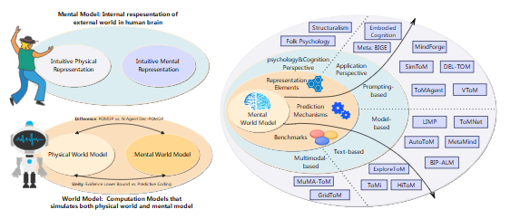

# ToM-arXiv-2025-Modeling the Mental World for Embodied AI- A Comprehensive Review

*论文下载地址（可选）：[https://arxiv.org/pdf/2601.02378](https://arxiv.org/pdf/2601.02378)*

*代码是否开源：未提及*

*分享人：马明晖*

## 一句话总结挑战
> 具身智能代理需要在多模态、实时交互中准确理解人类的意图、信念与情绪，但现有理论框架、推理路径和评测基准彼此割裂，难以支撑真实社会交互。

## 一句话总结创新贡献
> 本文从心理世界模型出发，系统整合ToM的表示、推理与评测脉络，为具身AI中的心智建模研究提供了统一框架和选型参考。

## 举一个例子说明这篇文章的创新点
> 例如，文章将“由行动反推信念/意图”和“结合记忆状态做决策”统一纳入心理世界模型，并对提示式ToM与模型式ToM的适用边界和取舍进行对比。

## 框架图

**框架工作流描述**：
> 先区分物理世界模型与心理世界模型，再梳理心理元素的表示方式与ToM推理范式，随后按静态文本、高阶文本到多模态动态场景的脉络总结评测基准，最后归纳挑战与未来方向。

## 本文挑战及已有工作不足
> 1. 现有心理世界模型的理论框架较为碎片化，物理世界模型与心理世界模型的边界及统一关系仍不清晰
> 2. 心理元素在心理学与计算建模中的表示方式不一致，缺少统一的可计算建模范式
> 3. 具身AI的需求已从环境交互扩展到对人类意图、信念和情绪等心智状态的准确理解
> 4. 现有评测基准多偏向静态文本，难以反映多模态、实时、交互式具身场景的真实性与复杂性

## 印象最深刻的点
> 1. 系统综述了100余篇代表性研究，覆盖理论框架、表示、推理与基准四个层面
> 2. 构建了心理世界模型的完整理论框架，并明确其与物理世界模型在状态、观测和动作空间上的差异
> 3. 梳理了19种典型ToM方法，并总结出神经生成+符号验证、符号引导+神经微调两类融合路径
> 4. 从预测编码视角给出物理世界模型与心理世界模型的统一解释

## 对我们的启发
> 1. 在具身智能中，心智建模应被视为与物理建模同等重要的核心能力
> 2. ToM系统可考虑神经与符号混合架构，以兼顾可解释性、鲁棒性和效率
> 3. 对他人行为的推断应与记忆、外部观察和自我内省联合建模，而不是仅依赖静态文本

## Idea是否好想
> 本文不提出单一新模型，而是从认知科学、计算建模和评测三个层面搭建统一视角：将心理状态形式化为可计算结构，用预测编码解释物理与心理世界模型的共性，并把ToM方法与基准放到具身AI需求中系统比较，强调从静态测评走向动态社会交互评测。

## 是否有开创性
> 主要新意在于面向具身AI系统化定义心理世界模型，并贯通表示、推理与基准三部分，同时明确物理世界模型与心理世界模型的区别、联系及可融合路径。

## 是否属于热点
> 具身智能、Theory of Mind、心理世界模型、社会智能、多模态交互、预测编码、神经符号融合

## 其他需要补充的点（可选）
> 1. 文中将记忆检索视为一种认知动作，并纳入心理世界模型的动作空间
> 2. 文章强调心理世界模型关注的不只是“世界是什么样”，更是“别人认为世界是什么样”

## 与其他论文的关联（可选）
> 1. 与传统Physical World Model相关，但重点是其在社会交互中的扩展
> 2. 与Embodied AI、LLM/VLM agent和social intelligence研究密切相关
> 3. 与Theory of Mind研究直接相关，尤其是ToM prompting和model-based inference两类范式

## 还有哪些不足的地方（未来工作）
> 1. 研究心理状态的动态更新机制
> 2. 提升多模态信息对齐与实时交互能力
> 3. 增强高阶推理的鲁棒性与可解释性
> 4. 构建更贴近真实具身场景的在线交互评测基准
