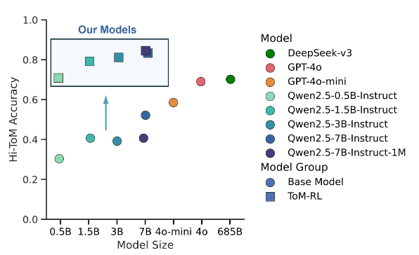

# ToM-arXiv-2025-ToM-RL-Reinforcement-Learning-Unlocks-Theory-of-Mind-in-Small-LLMs.md
*论文下载地址（可选）：[https://arxiv.org/abs/2504.01698]*

*代码是否开源：(https://github.com/bigai-ai/ToM-R)*

*分享人：马明晖*

## 一句话总结内容
> 本文提出 ToM-RL 方法，使用规则化强化学习（GRPO）在仅 3200 条数据上微调小参数 LLM，显著解锁心智理论（ToM）能力，7B 模型在高阶信念推理任务上超越 GPT-4o 与 DeepSeek-v3。

## 一句话总结创新贡献
> 首次证明轻量强化学习可在小参数量 LLM（0.5B–7B）上激活并增强高阶心智推理能力，用极少数据实现强泛化，同时揭示小模型易推理坍塌、7B 模型可稳定信念追踪的规律。

## 举一个例子说明这篇文章的创新点
> 传统 Sally-Anne 任务中，基线小模型只会按最后位置回答；ToM-RL 训练后 7B 模型能逐层推理：Ella 离开早→相信番茄在红信封→Gracie 不知道后续变动→因此认为 William 认为 Benjamin 认为 Ella 认为番茄在红信封，完成四阶信念追踪，而小模型会偷捷径直接输出结果。

## 框架图
`
> 
> **框架工作流描述**：1. 构建 3200 条多阶 ToM 问答数据，覆盖 0–4 阶错误信念；2. 设计格式奖励+答案正确奖励；3. 采用 GRPO 强化学习算法训练 Qwen2.5 系列模型；4. 模型输出必须包含  推理链与  结果；5. 在 Hi-ToM、ToMi、ExploreToM 等集测试泛化能力。

## 本文挑战及已有工作不足
1. 现有 LLM 高阶心智理论（ToM）推理能力差，四阶任务几乎失效。
2. 大模型才有 ToM 能力，小模型完全不足，成本高难以落地。
3. 监督微调无法激发社会认知与信念追踪能力。
4. 小模型易学习捷径而非真正推理，出现“推理坍塌”。
5. 缺乏轻量、数据高效、可泛化的 ToM 能力激发方案。

## 印象最深刻的点
> 7B 小模型用 3200 条数据+RL 即可在四阶心智推理上超过 GPT-4o，证明 RL 能激发生成式模型隐藏的社会认知能力，而非只靠规模堆出 ToM。

## 对我们的启发
1. 社会推理能力不靠模型大小，靠强化学习+合适奖励即可激发。
2. 小模型落地社交对话、共情交互、心智理解完全可行。
3. 结构化推理链（）能显著稳定高阶推理。
4. 强化学习可作为通用“推理激活器”，不只用于数学与代码。

## Idea是否好想
> Idea 简洁、强动机、易复现，基于成熟 GRPO 与 ToM 基准，数据量小、训练稳定，是典型的“简单方法解决重要问题”的优质工作。

## 是否有开创性
> 是开创性工作；首次用轻量 RL 解锁小模型高阶心智理论，推翻“只有超大模型才有 ToM”的结论，开创小模型社交推理新方向。

## 是否属于热点
> 属于顶级热点：心智理论、社会推理、小模型能力激发、RL 增强推理、LLM 社交认知均为当前核心方向。

## 其他需要补充的点（可选）
> 模型规模阈值：≤3B 会出现推理坍塌（回答变短、偷捷径），7B 可保持完整推理链。
> 泛化极强：未训练四阶任务仍能高分；可迁移到陌生数据集与更生动的叙事文本。
> 训练不影响数学能力，GSM8K 几乎无下降。

## 与其他论文的关联（可选）
> 基于 GRPO（DeepSeekMath）、Hi-ToM、ToMi、ExploreToM；延续 Logic-RL、DeepSeek-R1 范式，但首次用于社会推理；区别于 SFT，RL 能真正激发信念追踪。

## 还有哪些不足的地方（未来工作）
1. 只在静态 QA 任务验证，未在真实对话/交互场景测试。
2. 未探究 RL 激发 ToM 的内部机制与注意力变化。
3. 只实验了 Qwen 系列，通用性需更多模型验证。
4. 未做多模态与动态场景下的心智推理。
5. 可结合共情、劝说、道德判断等更复杂社会任务。
