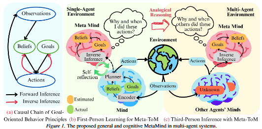

# ToM-arXiv-2026-MetaMind- General and Cognitive World Models in Multi-Agent Systems by Meta-Theory of Mind

*论文下载地址（可选）：https://arxiv.org/abs/2603.00808*

*代码是否开源：未提及*

*分享人：马明晖*

## 一句话总结挑战
> 在缺乏中心化监督和显式通信的多智能体环境中，如何仅依据可观测行为理解他人意图、预测交互演化并支撑长时域规划。

## 一句话总结创新贡献
> 本文提出 MetaMind 与 Meta-ToM 框架，通过自监督的逆向心智推断、类比泛化和集体信念建模，实现多智能体世界模型的零样本心智推理与规划。

## 举一个例子说明这篇文章的创新点
> 智能体先从自身行为轨迹中反推“为何这样行动”，再将这种逆向推理通过类比迁移到其他智能体，从而在没有显式通信的情况下估计对方目标与信念。

## 框架图

**框架工作流描述**：
> 先用目标条件世界模型进行前向预测和 MPC 规划，再由 Meta-ToM 从行为轨迹中逆推目标与信念；随后通过自我反思的循环一致性约束修正推断结果，并将第一人称心智建模类比到第三人称，最终聚合为顺序不变的集体信念，用于长时域协同规划。

## 本文挑战及已有工作不足
> 1. 现有 ToM 方法往往依赖监督、中心化训练或固定伙伴设定，零样本泛化能力不足
> 2. 单智能体世界模型难以处理他人策略变化带来的闭环分布偏移、长时域误差累积和因果混淆
> 3. 多智能体环境具有非平稳、部分可观测、目标异质和交互耦合等特点，状态演化难以稳定建模
> 4. 同一观测变化可能对应多种多智能体解释，因而难以从行为中唯一识别各智能体的意图与责任

## 印象最深刻的点
> 1. 提出 Meta-ToM，将逆向心智推断、循环一致性自检和类比泛化统一到一个自监督框架中
> 2. 通过顺序不变的集体信念聚合支持长时域协同规划
> 3. 能够将第一人称的心智推断零样本迁移到第三人称多智能体推理
> 4. 无需显式通信或中心化监督，即可从可观测行为中推断目标与信念

## 对我们的启发
> 1. 循环一致性有助于让逆向推断具备可检验性和自我修正能力
> 2. 类比推理可以把自我行为中学到的心智建模能力迁移到他人
> 3. 集合不变聚合适合表达多智能体中的集体意图与互动上下文
> 4. ToM 可将其他智能体视为具有目标和信念的意向主体，而非背景动态的一部分

## Idea是否好想
> 本文的核心思路是把多智能体世界模型从纯动态拟合转向意向驱动的因果建模：先从行为反推隐藏目标与信念，再用这些心智变量驱动前向预测和规划。其优势在于降低多智能体交互中的非平稳性与歧义性，并通过类比泛化把个体级心智推断扩展到群体协作场景。理论部分尝试说明，只要行为残差足够区分目标，逆推就具有可识别性。

## 是否有开创性
> 新颖性主要体现在将显式 ToM 引入多智能体世界模型与模型式规划，并设计自监督的 Meta-ToM 框架来完成逆向心智推断、反思修正和第三人称泛化。

## 是否属于热点
> 多智能体世界模型、ToM、零样本泛化、自监督逆向推断、长时域协同规划。

## 其他需要补充的点（可选）
> 1. 论文强调该方法对不同参数规模和多地图训练具有扩展性
> 2. 实验主要在 SMAC 上验证，覆盖同质与异质编队任务
> 3. 作者分析了想象长度对性能的影响，指出过长会带来模型误差累积

## 与其他论文的关联（可选）
> 1. 与去中心化多智能体世界模型相关，如 DCWMC
> 2. 与 CTDE 类多智能体世界模型相关，如 MARIE
> 3. 与 ToM 和逆向规划相关的经典工作有关，如 Bayesian ToM 和 inverse planning

## 还有哪些不足的地方（未来工作）
> 1. 缓解长时域想象中的误差累积，提升跨任务和跨伙伴泛化的稳定性
> 2. 进一步扩展到更复杂、更大规模的交互图，以验证方法在更强部分可观测场景下的稳健性
