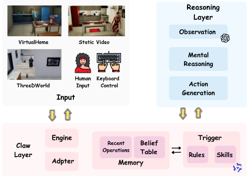

# ToM-arXiv-2026-MindClaw- Closed-Loop Embodied Mental-State Reasoning for Precision Intervention

*论文下载地址（可选）：[https://arxiv.org/abs/2606.01063](https://arxiv.org/abs/2606.01063)*

*代码是否开源：未提及*

*分享人：马明晖*

## 一句话总结挑战
> 如何让具身智能体在动态交互中持续追踪他人的心智状态，并准确判断何时介入、何时保持沉默。

## 一句话总结创新贡献
> 本文提出 MindClaw，将机器人中心的 ToM 推理扩展到闭环实时场景，并通过触发式认知技能实现精确介入。

## 举一个例子说明这篇文章的创新点
> 系统观察到物体位置变化后，不直接输出动作，而是先判断是否需要更新信念表、是否需要启动心智推理，只有确认错误信念会影响任务时才执行最小帮助动作，否则输出 none。

## 框架图

**框架工作流描述**：
> 系统接收视频、仿真器或人类输入后，先进行结构化观察；随后由 Trigger 结合当前观察、信念记忆、历史操作和候选槽位，选择更新信念、启动推理、生成动作或 noop；若需要帮助，再经过心智推理生成并执行最小干预动作，并将结果回写到闭环状态。

## 本文挑战及已有工作不足
> 1. 现有方法往往缺少面向闭环交互的在线控制、演员特定信念表和细粒度触发机制
> 2. 具身 ToM 不仅要识别他人的信念、目标和意图，还要在动态环境中持续维护并更新状态
> 3. 真实辅助场景中，错误或过度介入会带来干扰，因此系统必须实现精确介入而非始终输出动作
> 4. 现有基准多把 ToM 设为离线问答或最终动作预测，难以检验智能体在交互过程中何时触发推理、何时行动、何时不行动

## 印象最深刻的点
> 1. 结合强规则匹配与技能增强模型推理，在精度和灵活性之间取得平衡
> 2. 把触发器设计为具身认知技能，清晰区分观察、记忆更新、心智推理和动作生成
> 3. 将 ToM 任务从静态推理推进到实时闭环具身辅助，更贴近真实机器人协助场景
> 4. 显式引入 precision intervention，将 none/noop 作为一等输出，强调“该帮时帮、不该帮时沉默”

## 对我们的启发
> 1. MindPower 的机器人中心 ToM 分层推理框架
> 2. OpenClaw、RoboClaw、ABotClaw 等可执行交互框架
> 3. 通过规则与技能集合进行中间决策控制的思路
> 4. BDI 视角下的信念-欲望-意图推理，用于连接感知与行动

## Idea是否好想
> 本文的核心不是单纯增强 ToM 识别能力，而是把 ToM 重构为在线控制问题：系统必须在每个时间步决定是否更新信念、是否进行心智推理、是否输出帮助动作，或者是否保持沉默。这样的设计将“是否介入”提升为与“推断他人心智”同等重要的目标，更适合人类中心的具身辅助场景。触发器提供了中间操作空间，使错误更可诊断、可控制，避免端到端直接映射带来的过度介入。

## 是否有开创性
> 将机器人中心 ToM 从静态决策和动作生成推进到闭环精确介入；提出以认知技能形式实现的触发器；引入演员特定信念表和 noop 机制；采用规则与技能增强预测结合的方式控制内部认知操作。

## 是否属于热点
> 具身智能、Theory of Mind、闭环机器人辅助、精确介入、心智状态推理。

## 其他需要补充的点（可选）
> 1. 实验指标关注 TA、PIA 和 CS，强调既要理解任务，也要把握介入时机
> 2. 方法支持多种输入源，包括静态视频、VirtualHome、ThreeDWorld 和人类控制事件
> 3. 作者指出仅靠视觉识别并不能决定是否应该帮助，这也是与直接 VLM 基线的关键差别

## 与其他论文的关联（可选）
> 1. 相对于传统 ToM 基准：从离线问答转向在线介入控制
> 2. 相对于 OpenClaw、RoboClaw、ABotClaw：保留可执行交互框架，但显式加入人类心智状态建模
> 3. 相对于 MindPower：继承其机器人中心 ToM 目标，但从最终决策和动作生成扩展到实时闭环交互

## 还有哪些不足的地方（未来工作）
> 1. 扩展到更长时序、更多参与者的开放式交互，以检验信念维护和介入策略在复杂社会场景中的稳定性
> 2. 进一步降低规则依赖，探索更自适应的学习式介入策略，并在真实机器人平台上验证安全性与泛化性
> 3. 增强触发器对感知噪声、歧义观察和部分可见信息的鲁棒性，减少误触发与漏触发
