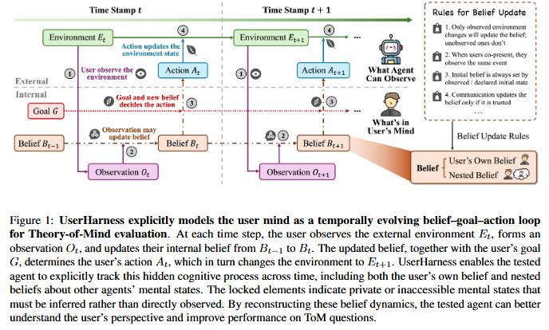

# ToM-arXiv-2026-UserHarness- Harnessing User Minds for Stronger Agent Theory-of-Mind

*论文下载地址（可选）：https://arxiv.org/abs/2605.27721*

*代码是否开源：未提及*

*分享人：马明晖*

## 一句话总结挑战
> 如何让智能体摆脱对故事表面和全局真相的直接推断，准确还原用户在有限视角下的观察、信念、意图及其随情境变化的心理状态。

## 一句话总结创新贡献
> 本文提出 UserHarness，将 ToM 求解重构为基于观察-信念-行动循环的用户心理状态重建框架，并在多个基准上提升推理准确率。

## 举一个例子说明这篇文章的创新点
> 在“物体被移动但角色未看到”的假信念场景中，UserHarness先恢复角色只观察到旧位置，再推断其仍持有过时信念，最后据此判断其会去错误地点寻找物体，而不是按真实世界状态作答。

## 框架图

**框架工作流描述**：
> 先将故事拆成事件序列，再为目标用户构建可见观察、信念更新和行动决策轨迹；随后把问题映射为对轨迹的查询，并通过一致性检查在候选答案中选择最符合用户心理轨迹的选项。

## 本文挑战及已有工作不足
> 1. ToM问题的关键不是理解长上下文，而是从用户视角恢复其私有信念、意图和行动依据
> 2. 嵌套信念和社会推理需要追踪“谁知道谁知道什么”，比单层信念建模更困难
> 3. 真实世界状态、用户可见信息和主观信念常常不一致，直接从故事映射到答案容易出错
> 4. 许多现有方法依赖复杂提示或行为启发式，却没有显式重建用户心理状态，容易产生 perspective leakage

## 印象最深刻的点
> 1. 在多种模型上都能稳定提升表现，弱模型和强模型均受益
> 2. 相较现有模型推断方法提升超过 15% 的相对性能，相较最强 prompt-only harness 提升约 20% 的相对性能
> 3. 在五个 ToM 基准上取得最高 95.94% 的 macro accuracy
> 4. 不同 backbone 之间的性能差距从直接提示下的 26.75 分缩小到 3.65 分，说明框架对模型能力的依赖更低

## 对我们的启发
> 1. 结构化外部脚手架可以把开放式推理转化为可检查、可审计的一致性验证过程
> 2. 将心理状态显式拆解为环境、观察、信念、意图和行动循环，有助于减少隐式推理中的信息泄漏
> 3. ToM 任务应从用户的 epistemic position 出发，而不是从模型的全知叙事视角出发

## Idea是否好想
> 本文的核心思路是把 ToM 从“直接回答问题”改造成“先重建用户心理轨迹，再基于轨迹作答”。它抓住了 ToM 中最本质的困难：模型往往知道故事全貌，但题目要求的是站在角色的有限视角进行推断，因此如果不显式区分真实环境、可见信息和主观信念，就容易把答案建立在违规信息上。UserHarness 通过观察-信念-行动循环，把原本模糊的叙事推理变成可分步验证的结构化推断，既降低了自由生成带来的漂移，也让多步社会推理更容易审计。它的价值不仅在于提升分数，更在于提供了一种更接近认知建模的 ToM 求解范式。

## 是否有开创性
> 将 ToM 评测重构为用户心智重建与一致性证明，而不是文本到答案的直接映射。

## 是否属于热点
> Theory-of-Mind、用户视角推理、嵌套信念、结构化推理脚手架、智能体认知建模

## 其他需要补充的点（可选）
> 1. 错误主要集中在更难的高阶信念、未来动作预测和社会目标推断上
> 2. prompt-only 方法即使更长、更复杂，也不能稳定表示用户视角状态
> 3. 算力分析显示，UserHarness 在较低输出 token 预算下即可达到高精度

## 与其他论文的关联（可选）
> 1. 与 BIP-ALM、LIMP、AutoToM 等心智状态推断方法相关
> 2. 与用户中心智能体、个性化助手和社会推理评测工作相关
> 3. 与 SimToM、PercepToM、Time-ToM、SymbolicToM、Thought-Tracing 等 ToM 增强方法相关

## 还有哪些不足的地方（未来工作）
> 1. 提升翻译、验证与符号表示接口的鲁棒性
> 2. 跟踪用户不断演化的信念、意图与社会目标
> 3. 扩展到开放域用户交互场景，而不只是在受控 ToM 基准上评测
