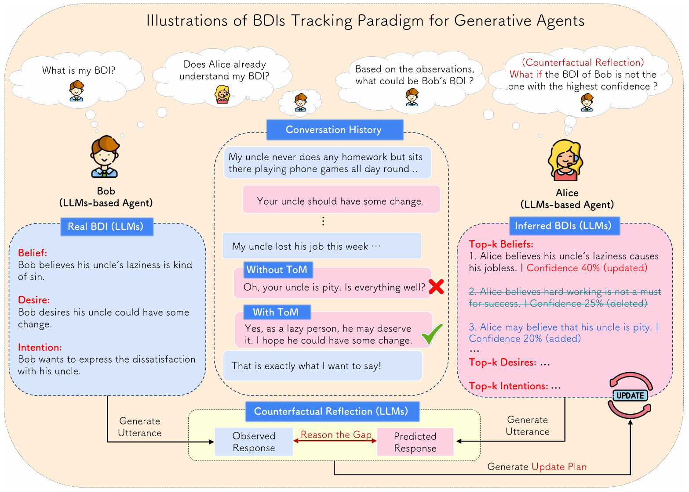

# ToM-arxiv-2025-ToM-agent-Large Language Models as Theory of Mind Aware Generative Agents with Counterfactual Reflection
> 说明：本文档内容默认使用中文生成（论文标题与必要专有名词除外）。

*论文下载地址：https://arxiv.org/abs/2501.15355*

*代码是否开源：否，论文说明代码将在论文接受后公开*

*分享人：马明晖*

## 一句话总结内容
> 本文提出 ToM-agent 框架，使大语言模型生成式智能体在开放域对话中基于 BDI 与置信度追踪对话对象的心智状态，并通过反事实反思持续修正推断。

## 一句话总结创新贡献
> 作者将 ToM 从真假信念和封闭任务扩展到开放域对话，提出信念与置信度解耦及反事实反思机制，并验证了其对一阶和二阶 ToM 的提升。

## 举一个例子说明这篇文章的创新点
> 例如，系统先根据对话历史预测对方下一轮回复，再将预测回复与真实回复的差异作为反事实反思信号，用于调整对对方 BDI 候选及其置信度。

## 框架图

**框架工作流描述**：
> 首先，智能体用零样本方式初始化自身 BDI；随后依据自身 BDI 和对话历史生成回复。另一方智能体一方面基于历史推断对方的 top-k BDI 及置信度，另一方面预测对方下一轮回复；在观察到真实回复后，系统比较预测与真实回复的差异，生成更新计划并通过反事实反思修正 BDI 候选和置信度，最后用更新后的最高置信 BDI 继续生成下一轮回复，同时还可判断二阶 ToM，即推断对方是否理解了自己的 BDI。

## 本文挑战及已有工作不足
> 1. 仅用预测回复与真实回复的差异难以直接映射真实心智状态，需要间接更新机制
> 2. 对话中的 BDI 属于不可观测隐变量，难以直接监督和评估
> 3. 传统 ToM 研究多聚焦真假信念或固定任务，难以覆盖开放域对话中的动态心智变化

## 印象最深刻的点
> 1. 提出反事实反思机制，借助预测-观察差异更新 BDI 推断
> 2. 将信念与置信度解耦，用于开放域对话中的 ToM 建模
> 3. 同时支持一阶和二阶 ToM，并在同理心与说服对话上优于无 ToM、普通 ToM 和仅反思版本

## 对我们的启发
> 1. 生成式智能体中的记忆、规划与反思框架
> 2. 反事实思维在解释他人行为中的作用
> 3. 心理学中的 Theory of Mind 与 BDI 模型

## Idea是否好想
> 该工作的核心思想是把 ToM 从静态的“是否相信”扩展为动态的“相信什么、愿意什么、打算什么以及有多确定”，并把这些心智状态表示成可随对话演化的候选集合。其关键难点在于 BDI 不可观测，因此作者没有直接去对齐真实心智状态，而是通过预测回复与真实回复的差异来构造反事实反思信号，把不可见的心智偏差映射到可见的行为差异上，再据此更新置信度。这种设计形成了一个可迭代闭环，使生成式智能体能够更稳健地模拟人类社交互动中的心智推断过程。

## 是否有开创性
> 创新点在于将开放域 ToM 建模与 BDI+置信度联合追踪结合起来，并引入基于预测-观察差异的反事实反思作为更新机制，从而突破了传统 ToM 对真假信念或固定场景的限制。

## 是否属于热点
> 大语言模型智能体、Theory of Mind、开放域对话、BDI建模、反思/反事实推理、情感支持与说服对话

## 其他需要补充的点（可选）
> 1. 观察到置信度通常随对话推进上升并趋于稳定
> 2. 三位标注者对推断 BDI 与真实 BDI 的相似度进行人工评估
> 3. 实验使用 GPT-4 和 GPT-3.5，在 Empathetic Dialogue 与 Persuasion Dialogue 上进行验证

## 与其他论文的关联（可选）
> 1. 与 Generative Agents 中的记忆、规划和反思机制相关
> 2. 与机器 ToM、心智状态建模和 BDI 推断研究相关

## 还有哪些不足的地方（未来工作）
> 1. 可进一步扩展到更多开放域社交任务，检验方法的泛化性
> 2. 可探索更细粒度的心智状态表示与更新策略，减少对回复相似度的依赖
> 3. 可加强二阶 ToM 与置信度估计的稳定性，并提升推断过程的可解释性
