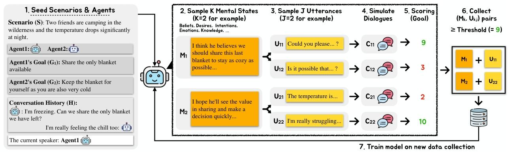

# ToM-arxiv-2026-Infusing Theory of Mind into Socially Intelligent LLM Agents
> 说明：本文档内容默认使用中文生成（论文标题与必要专有名词除外）。

*论文下载地址：https://arxiv.org/abs/2509.22887*

*代码是否开源：是*

*分享人：马明晖*

## 一句话总结内容
> 本文提出ToMAgent，通过显式建模对话中的心理状态并结合对话前瞻筛选训练样本，提升LLM社交代理在Sotopia中的目标达成、关系维护和长程适应能力。

## 一句话总结创新贡献
> 作者将Theory of Mind引入社交对话训练，构建“心理状态—话语—短程模拟评分”的前瞻筛选框架，并在多种模型与评测设置中验证了其有效性。

## 举一个例子说明这篇文章的创新点
> 在“只剩一条毯子”的露营场景中，模型先生成“对方可能很冷、应尽量共享”的心理状态，再生成“建议轮流使用或协商共享”的发言，并通过短程模拟保留最能同时提升双方目标分数的状态-话语对。

## 框架图

**框架工作流描述**：
> 先从Sotopia-Pi采样场景、角色目标和对话历史；再让模型生成多个心理状态假设及其对应话语；随后用伙伴模型进行短程对话模拟，并按目标达成和关系分数筛选高分状态-话语对；最后用这些样本对LLM进行监督微调，使其同时学习生成心理状态和后续发言。

## 本文挑战及已有工作不足
> 1. 开放式多轮对话需要前瞻评估，数据构造和模拟带来的成本较高
> 2. 社交对话不仅要完成个人目标，还要兼顾关系维护、知识获取和社会规范，单靠一般推理能力往往不够
> 3. 如何把抽象的Theory of Mind转化为真正有助于目标达成的训练信号，而不是只提升问答式ToM测试分数

## 印象最深刻的点
> 1. TOMA生成更多一阶心理状态，说明其更擅长推断他人心智
> 2. 随着对话轮数增加，TOMA的目标完成分数仍持续上升，体现出更强的长程适应能力
> 3. 在Sotopia的all和hard集合上，TOMA在关系、知识和目标三项指标上都稳定优于基线
> 4. 相较最佳基线，Qwen2.5-3B/7B和Llama3.1模型的综合分数提升明显，最高可达18.9%

## 对我们的启发
> 1. 把心理状态建模与对话策略生成联合起来，而不是只优化最终回复文本
> 2. 将认知科学中的Theory of Mind显式注入LLM社交代理
> 3. 借鉴look-ahead和规划式训练思想，用短程模拟评估中间心理状态是否真正有助于最终目标

## Idea是否好想
> 这项工作的关键价值在于，把“理解他人心理”从单纯的评测能力转变为可用于训练的中间变量。其核心假设是，更好的ToM不只是更会回答问题，而是能在互动中选择更合适的意图、策略和措辞。作者通过生成多个心理状态假设、为每个假设生成话语，再用模拟对话打分，近似搜索“对目标最有用的心智表示”。这种做法把ToM、规划和目标导向对话统一起来，也解释了为何模型在关系维护和目标达成上能同时受益。

## 是否有开创性
> 把ToM作为对话训练中的显式潜变量，并通过“心理状态-话语-模拟评分”筛选高价值样本进行微调，是区别于仅做ToM问答或仅做对话生成的关键创新。

## 是否属于热点
> Theory of Mind、社交LLM代理、多轮对话规划、目标导向对话、LLM自我博弈和模拟数据构造。

## 其他需要补充的点（可选）
> 1. 作者还分析了不同对手规模、不同对话类型以及不同LLM评审器下的稳定性
> 2. 基线包括Base、Base+MS、FT+Uttr、FT+MS和完整的TOMA
> 3. 评测使用Sotopia-Eval，并关注Goal、Relationship和Knowledge三个维度

## 与其他论文的关联（可选）
> 1. 与目标导向对话训练、look-ahead planning和自博弈数据构造方法相关
> 2. 与Sotopia开放式社交推理环境直接相关
> 3. 与ToM prompting、神经符号belief tracking、Bayesian inverse planning和推理时假设生成等ToM增强方法相关

## 还有哪些不足的地方（未来工作）
> 1. 将该方法扩展到更复杂、更长程的真实社交交互场景
> 2. 探索更高效的心理状态搜索与模拟策略，降低训练数据构造成本
> 3. 研究更强的多阶ToM建模，以及对不同社会规范和文化语境的泛化能力
