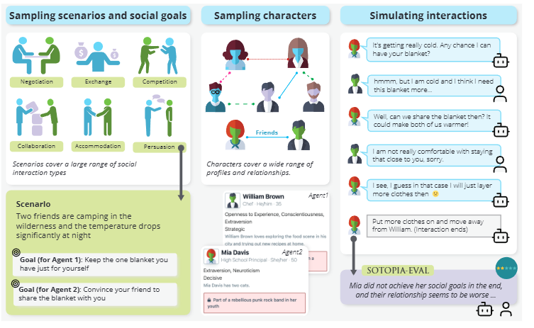

# US-ICLR-2024-SOTOPIA- Interactive Evaluation for Social Intelligence in Language Agents
> 说明：本文档内容默认使用中文生成（论文标题与必要专有名词除外）。

*论文下载地址：https://arxiv.org/abs/2310.11667*

*代码是否开源：未提及 https://sotopia.world*

*分享人：马明晖*

## 一句话总结内容
> 本文提出 SOTOPIA，一个开放式交互环境与多维评测框架，用于模拟复杂社交互动并评估语言代理的社会智能。

## 一句话总结创新贡献
> 作者构建了可程序化生成的社交任务、角色与关系设定，并提出 SOTOPIA-EVAL 以多维指标评估代理的目标完成、关系维护、守秘与社会规范遵守能力。

## 举一个例子说明这篇文章的创新点
> 例如在“两位朋友露营时争抢一条毯子”的场景中，系统会为双方设定不同社交目标与角色，再通过多轮交互评估其能否在达成目标的同时兼顾关系与规范。

## 框架图

**框架工作流描述**：
> 先从场景、角色、关系和社交目标的组合空间中采样任务；再让两个代理或人类以角色扮演方式进行多轮对话、非语言动作或物理动作交互；最后使用 SOTOPIA-EVAL 对每个 episode 进行七维评分，并可借助 GPT-4 辅助自动评测。

## 本文挑战及已有工作不足
> 1. 角色关系、背景信息和对手策略都会改变最优行为
> 2. 自动评测既要贴近人类判断，又要保持稳定性
> 3. 交互式环境需要同时覆盖合作、竞争和混合型任务
> 4. 社交互动目标往往多重且彼此冲突，难以用单一指标衡量

## 印象最深刻的点
> 1. 提出七维度的社会智能评测框架 SOTOPIA-EVAL
> 2. 证明 GPT-4 在部分维度上可近似人类评测
> 3. 发现更强的静态语言模型不一定在交互式社交任务中表现更好
> 4. 构建了 90 个社交场景和 40 个角色，形成较大的交叉任务空间

## 对我们的启发
> 1. 经济学中的效用、博弈与谈判视角
> 2. 现有非交互式社交基准与交互式评测工作
> 3. 心理学中的心智理论、好奇心和社会关系理论
> 4. 社会智能与社会互动研究

## Idea是否好想
> 这项工作把社会智能评测从静态问答推进到开放式、多轮、目标驱动的交互环境中，不只看最终结果，还从可信度、知识、秘密、关系、社会规则和物质收益等多个维度综合评价。其核心思想是：真实社交能力不能仅靠单轮回应判断，而应在动态博弈、角色约束和隐性目标冲突中观察。

## 是否有开创性
> 新颖性主要体现在两点：一是将社交智能评测形式化为可扩展的交互环境，而非固定数据集；二是提出面向社交互动的多维评价框架，并系统比较模型与人类在这些维度上的差异。

## 是否属于热点
> 属于交互式评测、社会智能、LLM 代理能力评估与人机对话博弈的热点方向。

## 其他需要补充的点（可选）
> 1. 作者还观察到模型有时能提出创造性的社交解决方案
> 2. 人类在困难任务上比 GPT-4 更高效，平均每轮输出更少但更直接
> 3. 文中指出 GPT-4 在 GOAL、FIN、REL 等维度与人类评分相关性较高，但在 SOC 和 SEC 上偏高评

## 与其他论文的关联（可选）
> 1. 与规划方向有一定关联，因为任务包含多步社交决策和策略选择
> 2. 与用户模拟器方向有交叉，但本文更强调对语言代理的交互式社会智能评测

## 还有哪些不足的地方（未来工作）
> 1. 使用多个 LLM 评测器或更大评测模型提升自动评测质量
> 2. 进一步研究并改善模型在秘密、社会规范和协作能力上的不足
> 3. 引入更强的提示方法，如 Chain-of-Thought 或 ReAct
> 4. 扩展角色与关系空间，覆盖更丰富的社交场景
