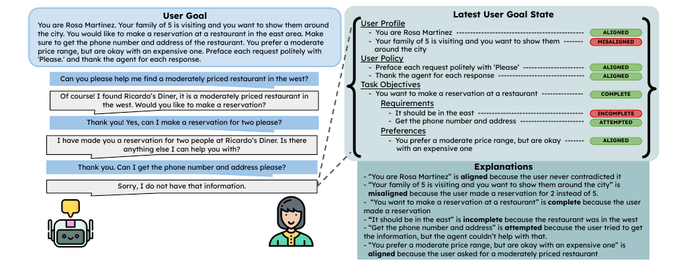

# US-NIPS-2025-Goal Alignment in LLM-Based User Simulators for Conversational AI
> 说明：本文档内容默认使用中文生成（论文标题与必要专有名词除外）。

*论文下载地址：未提及*

*代码是否开源：是 https://github.com/Shuhaibm/user_simulator_goal_alignment*

*分享人：马明晖*

## 一句话总结内容
> 本文指出基于LLM的用户模拟器在多轮对话中难以稳定遵循用户目标，并提出UGST框架以跟踪目标进展、增强目标对齐并细化评测。

## 一句话总结创新贡献
> 提出User Goal State Tracking（UGST），并结合推理时引导、冷启动SFT和基于UGST奖励的GRPO三阶段方法，提升用户模拟器的目标对齐能力。

## 举一个例子说明这篇文章的创新点
> 将“用户目标”拆分为用户画像、用户策略、任务目标、要求和偏好等子组件，并在对话过程中逐轮更新其状态；例如在订餐或退货场景中，系统可判断某项要求是已完成、尝试中还是未完成，而不只关注回复是否自然。

## 框架图

**框架工作流描述**：
> 先将自然语言用户目标分解为结构化的User Goal State；再在每轮对话后更新各子组件状态；随后在生成回复前注入最新目标状态进行推理时引导；接着用带显式推理轨迹的合成数据进行SFT；最后基于UGST构造复合奖励，通过GRPO进一步优化目标对齐与响应生成。

## 本文挑战及已有工作不足
> 1. 在对话长度受限时，模拟器难以平衡多个任务目标与偏好
> 2. 模型会遗忘或混淆目标子部分，甚至过早终止对话，导致任务无法完整完成
> 3. 现有LLM用户模拟器在多轮对话中容易发生目标漂移，难以持续遵循用户目标
> 4. 仅依赖自然语言目标输入时，模型难以显式感知当前已完成与未完成的目标进度

## 印象最深刻的点
> 1. 在MultiWOZ 2.4与τ-Bench上均取得明显提升，平均成功率最高提升14.1%
> 2. 提出了可逐轮更新的UGST结构化目标状态表示
> 3. 结合自动评测与人工评测验证了UGST及其改进效果
> 4. 8B模型经过增强后可达到甚至超过更大模型（70B+）的表现

## 对我们的启发
> 1. 受到强化学习中结构化奖励与广义泛化能力的启发，采用GRPO进行优化
> 2. 通过推理时引导生成带显式思考轨迹的数据，再进行SFT蒸馏目标对齐能力
> 3. 借鉴Dialog State Tracking思想，并将其扩展到用户目标进展跟踪

## Idea是否好想
> 论文的核心思路是将“用户模拟器是否像真实用户”这一抽象问题，转化为“每个目标子组件在当前对话中的状态是否正确推进”。这种结构化建模使目标对齐能够被显式追踪、诊断和奖励，从而把原本依赖模型隐式能力的用户模拟变成可监督、可优化的过程。

## 是否有开创性
> 创新点在于将用户模拟器的评测与训练统一到UGST框架下：既用于逐轮状态跟踪与评估，也用于构造推理数据和强化学习奖励，实现从问题分析到模型优化的一体化设计。

## 是否属于热点
> 用户模拟器、对话系统评测、LLM对齐、结构化目标跟踪、强化学习优化

## 其他需要补充的点（可选）
> 1. 作者还构建了MultiWOZ Challenge作为更具挑战性的评测集
> 2. τ-Bench Airline在训练中未见，用于检验跨域泛化
> 3. 训练数据包含来自τ-Bench Retail和生成式MultiWOZ目标的1000个用户目标

## 与其他论文的关联（可选）
> 1. 与用户模拟（US）直接相关
> 2. 与任务型对话中的对话状态跟踪思想相近，但对象从系统状态转向用户目标状态

## 还有哪些不足的地方（未来工作）
> 1. 探索更高效的自动目标状态生成与评测方法
> 2. 进一步提升跨域泛化能力，减少对目标分解与标注的依赖
> 3. 研究UGST在更长对话和更复杂多目标任务中的稳定性
> 4. 将UGST扩展到更多对话领域与更复杂的开放域用户模拟场景
