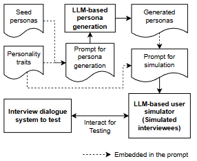

# US-SIGDIAL-2025-Generating Diverse Personas for User Simulators to Test Interview Dialogue Systems
> 说明：本文档内容默认使用中文生成（论文标题与必要专有名词除外）。

*论文下载地址：未提及*

*代码是否开源：未提及*

*分享人：马明晖*

## 一句话总结内容
> 本文提出一种基于大语言模型的用户画像生成方法，用于提升访谈式对话系统测试中的用户模拟多样性。

## 一句话总结创新贡献
> 作者在少量种子画像基础上结合人格与沟通风格提示自动扩展persona，并验证其能有效增加模拟话语的内容与风格变化。

## 举一个例子说明这篇文章的创新点
> 例如在旅行访谈系统中，先提供10个手工种子persona，再让LLM按不同沟通风格约束生成100个新persona，随后将这些persona嵌入模拟器prompt进行测试。

## 框架图

**框架工作流描述**：
> 先为目标访谈系统构建少量seed personas；再用LLM结合few-shot示例和人格特征提示生成更多persona；之后将其放入用户模拟器prompt与系统交互；最后通过utterance多样性指标评估模拟效果。

## 本文挑战及已有工作不足
> 1. 缺少无需真实用户参与的有效评估方式
> 2. 访谈式对话系统的人工测试成本高、耗时长
> 3. 手工构建大量与具体访谈主题对齐的persona负担较重
> 4. 现有用户模拟器多面向任务型对话，较少关注persona多样性

## 印象最深刻的点
> 1. 在两个日语访谈系统上验证了方法的可迁移性
> 2. 通过显式控制沟通风格，进一步提升了话语长度与表达形式的多样性
> 3. 面向访谈式对话系统测试提出了专用的用户模拟思路
> 4. 利用少量种子persona借助LLM扩展出大量新persona，降低人工成本

## 对我们的启发
> 1. 对话多样性可作为发现潜在问题的重要代理指标
> 2. LLM适合用于自动生成与领域相关的用户画像
> 3. 用户模拟可用于替代部分人工测试，从而降低开发成本
> 4. persona设计应同时覆盖内容差异和沟通风格差异

## Idea是否好想
> 本文把“测试覆盖不足”转化为“persona空间扩展”问题：先用少量领域相关种子画像保证主题对齐，再通过LLM生成更多画像扩大用户内容分布，并额外注入拟人化程度和冗余程度等风格维度增强交互可变性。实验表明，该方法能提升内容和风格多样性，但并非所有人格维度都同样有效。

## 是否有开创性
> 本文的新颖性在于面向访谈式对话系统测试自动生成领域对齐且风格可控的persona，并将沟通风格作为显式控制变量用于用户模拟多样化。

## 是否属于热点
> LLM用户模拟、persona生成、对话系统测试、访谈式对话系统、可控生成、用户行为多样性

## 其他需要补充的点（可选）
> 1. 实验覆盖两个日语访谈系统：旅行访谈与甜食偏好访谈
> 2. 结果显示冗余/直接性相关条件对utterance长度变化更明显
> 3. 使用了TTR、MTLD、MSTTR、Shannon Entropy等多种多样性指标

## 与其他论文的关联（可选）
> 1. 与对话系统测试工具和测试用例生成研究相关
> 2. 与基于LLM的user simulator研究相关
> 3. 与persona-based simulation研究相关

## 还有哪些不足的地方（未来工作）
> 1. 将方法用于识别更多访谈式对话系统中的问题
> 2. 研究哪些其他人格特征能够进一步提升多样性
> 3. 扩展到语音输入输出与多模态访谈系统
> 4. 探索在单个对话中生成更多类型的utterance变化
