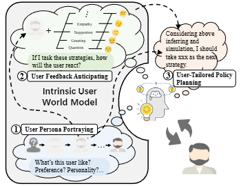

# US-SIGIR-2025-Simulating Before Planning- Constructing Intrinsic User World Model for User-Tailored Dialogue Policy Planning
> 说明：本文档内容默认使用中文生成（论文标题与必要专有名词除外）。

*论文下载地址：https://doi.org/10.1145/3726302.3730084*

*代码是否开源：未提及*

*分享人：马明晖*

## 一句话总结内容
> 本文提出UDP框架，通过内在用户世界模型在规划前模拟用户画像与反馈，从而实现面向不同用户特征的对话策略规划。

## 一句话总结创新贡献
> 提出三阶段的User-Tailored Dialogue Policy Planning框架，将扩散式用户画像推断与Brownian Bridge式用户反馈预测结合，以增强对话策略的个性化规划能力。

## 举一个例子说明这篇文章的创新点
> 在决定下一步回复策略前，模型先根据历史对话推断用户画像，再模拟不同策略下的用户反应，最后据此选择更合适的策略。

## 框架图

**框架工作流描述**：
> 先进行用户画像描绘：利用扩散过程根据历史对话逐步估计用户人格与偏好；再进行用户反馈预期：用Brownian Bridge预测不同策略下的用户反应；最后进行用户感知策略规划：融合历史、画像与反馈预测，对候选策略打分并选择下一步动作。

## 本文挑战及已有工作不足
> 1. 现有对话规划方法往往忽视用户差异，容易生成通用而非个性化的策略
> 2. 不同用户画像会显著影响对话结果，使同一策略在不同用户上的表现波动较大
> 3. 在规划前有效建模用户潜在状态及其未来反应，是个性化对话策略的关键难点

## 印象最深刻的点
> 1. 提出任务特定的用户画像评测协议，更系统地检验策略规划的用户适配能力
> 2. 引入主动学习优先训练更难的用户画像，提高了鲁棒性
> 3. 在P4G和ESConv上验证了用户画像差异会带来明显性能波动，说明用户建模具有必要性
> 4. 将扩散模型用于用户画像逐步推断、将Brownian Bridge用于用户反馈预测，思路较新

## 对我们的启发
> 1. 借鉴扩散过程的逐步去噪机制，模拟用户理解逐渐清晰的过程
> 2. 借鉴Brownian Bridge建模状态不确定性并预测中间态的能力
> 3. 借鉴模型化强化学习中显式构建内部环境模型的思想，将用户视为可预测的交互环境
> 4. 先“理解用户是谁”、再“预判用户会怎么反应”、最后“决定怎么说”的人类交互逻辑

## Idea是否好想
> 该工作将用户个性建模从附加模块提升为策略规划的前置核心步骤，先在内部模拟用户画像与反馈，再做策略决策，把对话规划扩展为“状态推断、反馈预演、策略优化”的闭环。

## 是否有开创性
> 新颖点主要在于：面向不同任务设计用户特定画像；构建内在用户世界模型；用扩散模型做画像推断、用Brownian Bridge做反馈预测；并将两者与策略规划联合成端到端的用户定制框架。

## 是否属于热点
> 用户建模、个性化对话策略规划、对话世界模型、LLM辅助规划、情感支持与说服场景。

## 其他需要补充的点（可选）
> 1. 论文强调该框架在鲁棒性、适应性和泛化性上的提升
> 2. 实验覆盖合作式与非合作式两类对话场景
> 3. 作者还分析了不同baseline在各类用户画像上的性能波动，用于问题诊断

## 与其他论文的关联（可选）
> 1. 与PPDPP、ProCoT、DPDP等规划方法相比，本文更突出用户建模而非仅策略建模
> 2. 与COLOR类似使用Brownian Bridge思想，但本文将其用于用户反馈而非系统策略轨迹
> 3. 与TRIP相比，本文更强调任务特定用户画像而非通用画像

## 还有哪些不足的地方（未来工作）
> 1. 未提及
