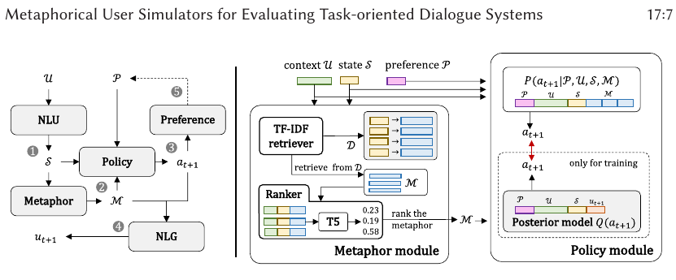

# US-TOIS-2023-Metaphorical User Simulators for Evaluating Task-oriented Dialogue Systems
> 说明：本文档内容默认使用中文生成（论文标题与必要专有名词除外）。

*论文下载地址：https://doi.org/10.1145/3596510*

*代码是否开源：是 http://github.com/sunnweiwei/MetaSim; https://github.com/Superbooming/simtester*

*分享人：马明晖*

## 一句话总结内容
> 本文提出基于隐喻式用户建模的MetaSim，并结合tester驱动的自动评测框架，更一致、高效地评估任务型对话系统。

## 一句话总结创新贡献
> 本文将历史对话策略显式建模为“隐喻”以增强用户模拟的类人性与泛化能力，并通过tester构造系统变体自动检验模拟器的评测能力。

## 举一个例子说明这篇文章的创新点
> 在酒店预订对话中，如果系统提出“是否需要WIFI”等初始偏好之外的新问题，MetaSim会将用户对新属性的回答纳入偏好集合，并结合相似历史对话策略生成更连贯的后续回复。

## 框架图

**框架工作流描述**：
> 先从数据库初始化用户偏好并与系统多轮交互；NLU模块追踪对话状态，隐喻模块检索相似历史对话策略，策略模块联合偏好、上下文和隐喻预测用户满意度与下一步动作，NLG模块生成自然语言回复；同时，tester通过配置基座系统的不同变体，让模拟器与这些变体交互并比较排序一致性，从而自动评估模拟器能力。

## 本文挑战及已有工作不足
> 1. 传统模拟对话在面对新实体或新知识时容易失真，真实性不足
> 2. 用户模拟器的真实性与评测能力缺少稳定、可复现的自动评估方法
> 3. 现有用户模拟器主要服务于对话策略优化，难以直接作为任务型对话系统的评测工具
> 4. 依赖人工评测成本高、耗时，且难以规模化

## 印象最深刻的点
> 1. 将历史对话策略检索引入用户推理过程，增强了类人模拟能力
> 2. 设计了tester-based框架，可自动比较系统变体并评估模拟器的判别能力
> 3. 提出了面向任务型对话系统评估的隐喻式用户模拟器MetaSim
> 4. 在三个基准数据集上，相比agenda-based和seq2seq模拟器，MetaSim与人工评测的一致性更好

## 对我们的启发
> 1. 借鉴了半参数化方法中“检索外部知识辅助推理”的思想
> 2. 受交互式信息检索中的tester评测范式启发
> 3. 受人类在交互中形成心理模型并进行类比思维的研究启发

## Idea是否好想
> 核心思路不是单纯让模拟器生成更像人的话，而是把用户的类比推理显式建模为“从历史对话策略中检索隐喻”。这样既能提升面对新实体或新情境时的响应合理性，也能通过tester构造可控系统变体，把模拟器评测能力转化为可自动比较、可重复验证的任务。

## 是否有开创性
> 相较于传统agenda-based或纯端到端模拟器，本文把历史对话记录作为可检索的策略记忆，引入隐喻模块参与决策；同时提出面向任务型对话系统评测的tester框架，直接评估模拟器是否能够区分不同系统变体。

## 是否属于热点
> 用户模拟、任务型对话评测、类人对话生成、对话系统自动评价、交互式评测框架

## 其他需要补充的点（可选）
> 1. 论文实验使用MultiWOZ、ReDial和JDDC三个基准数据集
> 2. 论文强调评测重点包括系统排序一致性和对新实体的类人反应
> 3. MetaSim基于T5实现各模块，并采用统一数据格式以支持跨任务泛化

## 与其他论文的关联（可选）
> 1. 与seq2seq用户模拟器相关，但本文通过检索历史策略提升可解释推理
> 2. 与交互式信息检索中的tester评测框架相关，并将其扩展到任务型对话系统
> 3. 与agenda-based user simulator相关，但本文更强调类人性与评测能力

## 还有哪些不足的地方（未来工作）
> 1. 未提及
