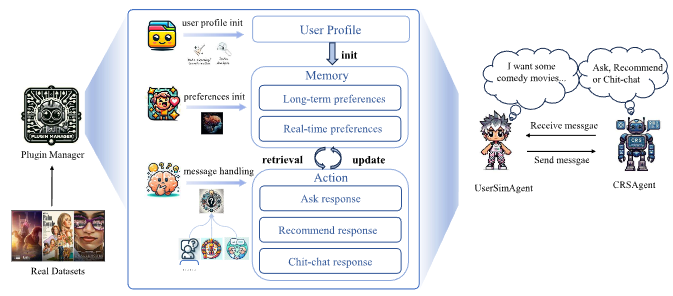

# US-WWW-2025-A LLM-based Controllable, Scalable, Human-Involved User Simulator Framework for Conversational Recommender Systems
> 说明：本文档内容默认使用中文生成（论文标题与必要专有名词除外）。

*论文下载地址：https://doi.org/10.1145/3696410.3714858*

*代码是否开源：是 https://github.com/zlxxlz1026/CSHI*

*分享人：马明晖*

## 一句话总结内容
> 本文提出CSHI，一种基于大语言模型的可控、可扩展且支持人类参与的用户模拟框架，用于更真实地模拟对话式推荐中的用户反馈与偏好变化。

## 一句话总结创新贡献
> 作者通过插件化的分阶段设计，实现了用户画像、偏好记忆和消息响应的细粒度控制，从而缓解数据泄露并提升用户模拟可控性。

## 举一个例子说明这篇文章的创新点
> 例如在电影推荐中，系统可仅暴露“喜欢喜剧、演员”等已知偏好，而不泄露目标电影名称；同时还可通过人工编辑画像，让模拟用户呈现更急躁或更耐心的对话风格。

## 框架图

**框架工作流描述**：
> 框架分为三步：先初始化用户画像，可由人工配置或由LLM生成基本信息与偏好摘要；再构建偏好记忆，将长期偏好与实时偏好写入记忆并匿名化敏感信息；最后在消息处理阶段先识别意图，再调用询问、推荐或闲聊插件，并按需更新实时偏好。

## 本文挑战及已有工作不足
> 1. 单一prompt模板难以稳定控制用户模拟器输出
> 2. 用户模拟器容易泄露目标物品信息，影响评测真实性
> 3. 仅依赖固定模板或上下文难以刻画交互性与动态偏好变化
> 4. 对话式推荐中的真实人工交互成本高，难以大规模开展评测

## 印象最深刻的点
> 1. 支持人工直接编辑用户画像，具备人类参与式调节能力
> 2. 在有标注与无标注场景下均表现出较好的适应性与稳定性
> 3. 通过插件管理器实现了用户模拟行为的分阶段、细粒度控制
> 4. 同时建模长期偏好、实时偏好并对敏感信息匿名化，增强了模拟真实性

## 对我们的启发
> 1. 参考了iEvaLM在对话式推荐用户模拟中的框架设计
> 2. 借鉴了Agent4Rec的用户偏好总结思路
> 3. 结合搜索与推荐的差异，将实时偏好细分为已知偏好与未知偏好

## Idea是否好想
> 该工作将用户模拟器从单提示词生成器升级为插件化可编排智能体。其关键不在于单次回复质量，而在于把用户画像、偏好记忆、意图识别、响应策略和偏好更新拆分为多个可组合模块，从而同时满足可控性、可扩展性和人类参与性，并通过隔离目标物品信息与匿名化敏感字段提升评测可靠性。

## 是否有开创性
> 新颖性主要体现在：用插件化框架替代单提示模板；引入人类参与式画像编辑；将实时偏好建模为可细分、可匿名化的结构；在对话式推荐评测中显式处理数据泄露问题。

## 是否属于热点
> 该工作位于对话式推荐与用户模拟交叉方向，紧贴大语言模型驱动的交互式评测、可控生成、仿真环境构建和高质量数据生成等热点。

## 其他需要补充的点（可选）
> 1. 论文发表于WWW 2025
> 2. 作者提供了Web demo和开源代码

## 与其他论文的关联（可选）
> 1. 与Agent4Rec在偏好总结上存在方法关联
> 2. 与iEvaLM有直接对比关系，并在其基础上改进

## 还有哪些不足的地方（未来工作）
> 1. 探索更复杂的偏好演化与多轮交互控制机制
> 2. 将插件框架推广到更多推荐领域与多样化场景
> 3. 构建更多高质量的对话式推荐数据集
> 4. 进一步增强用户模拟器的人类行为真实性
