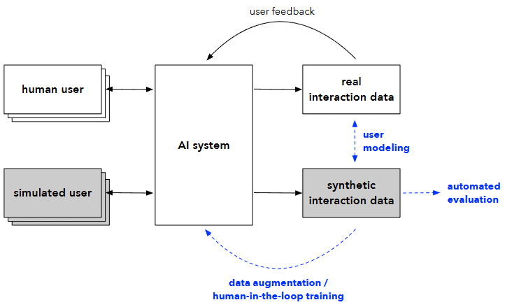

# US-arXiv-2026-User Simulation in the Era of Generative AI- User Modeling, Synthetic Data Generation, and System Evaluation
> 说明：本文档内容默认使用中文生成（论文标题与必要专有名词除外）。

*论文下载地址：未提及*

*代码是否开源：未提及*

*分享人：马明晖*

## 一句话总结内容
> 本文系统综述生成式AI时代的用户模拟，指出其可用于用户建模、合成数据生成与交互式系统评测，并强调LLM推动了用户模拟从传统预测式方法向开放式生成式方法转变。

## 一句话总结创新贡献
> 本文的核心贡献是对用户模拟研究进行系统梳理，构建统一框架连接多学科相关工作，并总结其应用场景、关键挑战、伦理问题与未来方向。

## 举一个例子说明这篇文章的创新点
> 例如，使用大语言模型作为用户模拟器，可在搜索、推荐、对话或编程场景中生成更开放的交互行为，从而支持可复现评测与合成交互数据生成。

## 框架图

**框架工作流描述**：
> 先定义任务场景、系统环境和用户特征，再构建能够输出用户下一步动作的模拟策略；随后将模拟器用于三类任务：一是刻画和分析用户行为，二是生成合成交互数据用于训练，三是对交互式AI系统进行可控、可复现的评测。

## 本文挑战及已有工作不足
> 1. 如何避免合成数据多样性不足或行为幻觉带来的偏差
> 2. 如何让模拟结果符合人类认知约束而非仅停留在理想化推理
> 3. 如何在真实有效性与可解释性之间取得平衡
> 4. 如何在开放动作空间下控制生成式模拟器的行为

## 印象最深刻的点
> 1. 将用户模拟的用户建模、数据生成和系统评测三类应用统一到一个框架中
> 2. 明确提出从传统预测式用户模拟到生成式用户模拟的范式转变
> 3. 指出高质量用户模拟器是缓解数据与评测瓶颈的重要基础工具
> 4. 强调用户模拟既可能带来偏差风险，也可用于去偏、代表性保障和安全压力测试

## 对我们的启发
> 1. 可借鉴用合成交互数据缓解隐私压力和真实数据稀缺问题
> 2. 可借鉴将用户模拟与人类反馈学习、RLAIF等机制结合
> 3. 可借鉴通过可控参数开展反事实分析和用户群体分层比较
> 4. 可借鉴将模拟器作为统一中间层，服务于训练、评测和分析等多个环节

## Idea是否好想
> 这篇综述把用户模拟从单一任务预测提升为面向交互式AI的基础设施：在用户建模上，它提供可检验的行为假设；在数据层面，它充当合成交互生成器；在评测层面，它弥补静态测试集与真实用户实验在可控性、成本和可复现性上的不足。其重点不在提出新模型，而在统一问题定义、总结能力边界，并说明生成式AI使开放式交互模拟成为可行。

## 是否有开创性
> 新颖性主要体现在研究视角与框架整合：作者将分散于AI、HCI、信息检索、社会计算和心理学中的用户模拟研究重新组织为生成式AI时代的统一议题，并系统对比传统模型、数据驱动方法与LLM式生成模拟的差异。

## 是否属于热点
> 用户模拟、生成式AI、LLM、合成数据、交互式评测、用户建模、RLAIF、AGI

## 其他需要补充的点（可选）
> 1. 指出模拟器可用于回答反事实问题，如系统变量变化对用户行为的影响
> 2. 文章强调用户模拟研究具有明显的跨学科特征
> 3. 指出模拟器不必完美，只要在特定应用中足够有用即可

## 与其他论文的关联（可选）
> 1. 与交互式系统评测和在线/离线评测方法相关
> 2. 与数据增强和合成数据生成研究密切相关
> 3. 与用户建模研究密切相关

## 还有哪些不足的地方（未来工作）
> 1. 发展更符合人类认知约束的模拟方法
> 2. 探索适用于不同任务与用户群体的统一建模框架
> 3. 建立连接学术界与工业界的可持续创新生态
> 4. 构建更真实、可控且可解释的生成式用户模拟器
